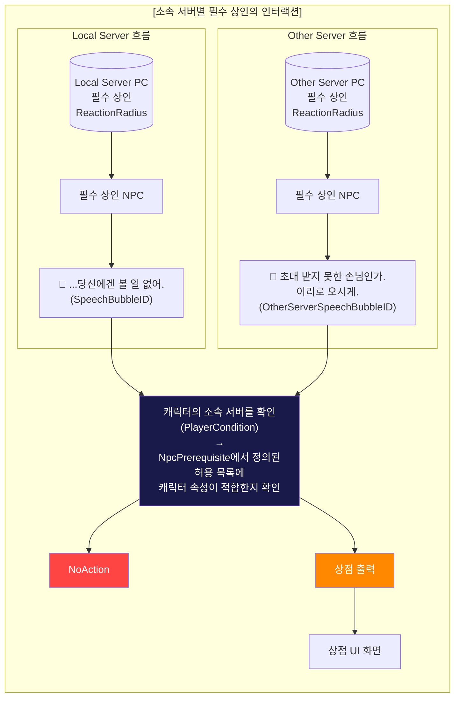

# PK_NPC 시스템 / Beta3 NPC 개선

## 1. 문서의 범주 - Beta3 NPC 개선 사항 정리
[PK_NPC 시스템 / Beta3 NPC 개선]
## 1. 문서의 범주 - Beta3 NPC 개선 사항 정리

### 개선 사항 정리
- Beta3 이후 적용 / 추가할 NPC와 관련된 미비 사항을 보완
- 총 3가지의 개선 사항
  1) NpcSubCategory 추가
  2) NPC Icon 추가 (필드 / 미니맵)
  3) NPC 인터랙션 및 말풍선 - 유저 소속 서버 구분
  4) 수정 테이블 정리

### NPC List 현황 및 요약
- 제작 진행 여부 확인 : 1종 필요 (컨텐츠 재화4 상인)
- 필드 아이콘 제작 : 8종 필요
- 월드맵 아이콘 제작 : 7종 필요

---

## 2. 개선 세부
[PK_NPC 시스템 / Beta3 NPC 개선]
## 2. 개선 세부

#### [NpcSubCategory]

| Name | Value | Comment |
|:---:|:---:|:---:|
| None | 0 | |
| Potion | 11 | 소모품 상인 |
| Magic → Skill | 12 | 마법용품 상인 → 스킬북 상인 |
| Weapon | 13 | 무기 상인 |
| Armor | 14 | [?방어구 상인?] |
| Armor | 14 | 방어구 상인 |
| Storage | 15 | 창고 관리인 |
| Guild | 16 | 길드 상인 |
| TalkDialogue | 21 | 대화 NPC |
| Named | 31 | 네임플레이트를 출력하는 연출용 NPC |
| Noname | 32 | 네임플레이트를 미출력하는 연출용 NPC |
| Captain | 41 | 대륙 대륙 이동 NPC |
| Smuggler | 42 | 밀수 상인 |
| AttackServer | 51 | 서버 침공 시 포탈 |
| ExploreServer | 52 | 서버 탐험 |
| Achievement | 61 | 일일 미션, 업적 상인 |
| InfinityTower | 62 | 무한의 탑 상인 |
| Raid | 63 | 레이드, 공성전 등 대규모 경쟁 상인 |
| Battlefield | 64 | 전장 상인 |
| Potion | 11 | 마법물을 포함하는 모든 소비품 | → 주요 변경 |
| Magic → Skill | 12 | |
| Weapon | 13 | |
| Armor | 14 | → 신설 |
| NpcDefense | 15 | → 신설 |
| Storage | 16 | → 신설 |
| Named | 21 | |
| NpcSeller | 31 | |
| ExploreSeller | [?32?] | |
| AchvtSeller | [?33?] | |
| RaidSeller | [?51?] | |
| BattleSeller | [?52?] | |
| InfinityTower | [?53?] | |
| Magic→Skill | 12 | 마법용품 상인→스킬북 상인 |
| Named | 31 | 네임플레이트를 출력하는 연출용 NPC |
| Noname | 32 | 네임플레이트를 미출력하는 연출용 NPC |
| Captain | 41 | 이동 NPC |
| AttackServer | 51 | 서버 침공 시 포탈 |
| Raid | 63 | 레이드, 공성전 등 대규모 경쟁 상인 |

### 1) NpcSubCategory 추가
- 현재 부족한 5종의 SubCategory 추가

---

### 2) NPC Icon 추가 (필드 / 미니맵)
- 미니맵 아이콘 리소스 정리

#### [미니맵 아이콘 리소스 리스트]

| 이름 | 미니맵 Icon명 | 미니맵 Icon (현재) | 미니맵 Icon 예시 (변경 및 신규) | 필드 Icon명 | 필드 Icon (현재) | 필드 Icon 예시 (변경 및 신규) | 비고 |
|:---:|:---:|:---:|:---:|:---:|:---:|:---:|:---:|
| 밀수 상인 | HUD_Minimap_SmugglerNPC | X |  | NPC_Smuggler | X |  | 후드 실루엣 + 코인 주머니로 상인임을 표기 |
| 길드 상인 | HUD_Minimap_GuildNpc |  |  | NPC_Guild | X |  | 기존 길드 아이콘 + 코인 주머니 |
| 컨텐츠 재화1 상인 | HUD_Minimap_AchievementNPC | X |  | NPC_Achievement | X |  | 일일 미션, 업적 등의 업적을 알리는 메달 아이콘 + 코인 주머니 |
| 컨텐츠 재화2 상인 | HUD_Minimap_InfinityTowerNPC | X |  | NPC_InfinityTower | X |  | 무한의 탑 아이콘 + 코인 주머니 |
| 컨텐츠 재화3 상인 | HUD_Minimap_RaidNPC | X |  | NPC_Raid | X |  | 레이드 대상인 용의 아이콘 + 코인 주머니 |
| 컨텐츠 재화4 상인 | HUD_Minimap_BattlefieldNPC | X |  | NPC_Battlefield | X |  | 전투를 알리는 전투 뿔나팔 아이콘 + 코인 주머니 |
| 자원 이동 관리인 | HUD_Minimap_ExploreServerNPC |  |  | NPC_ExploreServer | X |  | 서버 이동을 알리는 아이콘은 1종으로 통일 |
| 포탈 (서버 침공용) | HUD_Minimap_TeleportNPC |  |  | NPC_Teleport | X |  | |
| 대륙 이동 관리인 | HUD_Minimap_CaptainNPC |  |  | NPC_Captain | X |  | 해상 이동을 표현하는 닻 아이콘 |

---

## 2. 개선 세부 > 3) NPC 인터랙션 및 말풍선 - 유저 소속 서버 구분
[PK_NPC 시스템 / Beta3 NPC 개선]
## 2. 개선 세부

### 3) NPC 인터랙션 및 말풍선 - 유저 소속 서버 구분
- NPC 인터랙션 중 소속 서버별 행동 차등
  1) NPC 인터랙션 서버 구분의 필요성
     - 밀수 상인의 경우, 필수적인 소모품을 고비용으로 **"타 서버 유저에게만"** 판매하는 NPC
     - → 해당 NPC 식별을 위한 적용 구분자가 필요
  2) NPC 인터랙션 서버 구분의 기준
     - → **(Ver 1.2 수정)** Player의 상태를 정의하는 PlayerCondition 테이블을 활용하는 NpcPrerequisite를 추가

---

#### [소속 서버별 밀수 상인의 인터랙션]

> **참고**: 이 이미지는 문서나 슬라이드의 일부가 잘려서 캡처된 것으로 보이며, 플로우차트 다이어그램이 포함되어 있지 않습니다.
> **[LocalServerPC → C1 → E1 경로]**: 로컬 서버 PC는 밀수 상인과 인터랙션 실패
> **[OtherServerPC → D1 → F1 → G1 → H1 경로]**: 타 서버 PC는 조건 확인 후 상점 이용 가능
#### NPC 말풍선의 차등 출력
- 밀수,밀입국 상, 기능성 서버이동 다양하게 유저와의 인터랙션 표시를 위한 연산기 (eReactionRadius)거리 말풍선으로 타입 설정
  - 타입
    - ① ReactionRadius의 PC가 진입
    - ② 밀수 상인의 경우
      - a) NPC 말단 상호 판매하는 범위 PC도 동일 출력(=스마일)
      - b) 구 소속 서버이어 외 다른 말풍선이 뜸)
    - ③ 기능성 NPC의 경우
      - 타 서버 말풍선은 a. OtherServerSpecificBubble이 말풍선이 출력 (=기능 기능)

#### NPC 인터랙션의 차등 출력
- 중심: NPC의 소속 서버에서만 가능 개별을 가짐
  - 밀수 가능 NPC는 상점 UI 등은 활성화되어 가능 적용
  - 전 상품 NPC 소 모든 NPC 말풍선만 기능)
- 적용:
  - 중심: The NPC와 인터랙션 시도 NPC 이름 출력, NPC 기능 등의 후 적용 여부 표시 출력(표)
    - ① 유저의 소속 서버를 활인한
    - a) NPC 말단 값을 점검하게 PC도 동일 활성(=스마일)
    - b) 시버 점검 값을 읽고 서버와 다를경우 PC는 미 사용 기능 (=사용불가)
  - → 이를 위해선 2개의 이벤트가 동시 동작하게 되어야 함 (인터랙션/떨리 적용은 가능)
    - LocalServerSpecificInteraction(= 로컬 서버 게이트웨이)function 적용
    - ① ReactionRadius와 동일한 값을 가지는 가능 (=LoadRadius))
    - ② 밀수 상인 NPC의 경우
      - LocalServer = 타 서버 침입하고, "시버 이동을 유도 기능이네요!!"
      - OtherServer = 활성화하고, "밀수 가능한 상점을 열 수 있습니다!"

---

## 2. 개선 세부 > 4) 수정 테이블 정리
[PK_NPC 시스템 / Beta3 NPC 개선]
## 2. 개선 세부

### 4) 수정 테이블 정리
- 수정 테이블의 용도와 데이터를 정리
- 근본은 데이터 변경 및 행동의 데이터를 유

---

#### [PlayerConditionEnum]

| Name | Value | Arg1 | Arg2 | Arg3 |
|:---:|:---:|:---:|:---:|:---:|
| None | 0 | | | |
| InvenFreeSlot | 1 | Empty_Cnt(int, slotid) | NPC_check | |
| InvenItemStack | 2 | NPC_Check | volume_id | |
| LocalServerForOnly | [?3?] | 로컬 서버 전용 체크 | | |
| ConditionFunc | [?4?] | 가능 설정 상호 체크 | | |
| ConditionProt | [?5?] | | | |
| OtherServerForOnly | [?6?] | | | |
| Local_Server | [?7?] | NPC_Usable | size2 | (str)arg |
| Other_Server | [?8?] | | szie2 | (str)arg |

---

#### [NpcClass]

**Ver 1.2**

| idx | SubType (type=eNpcString) | Category (type=NpcCategory) | SubCategory (type=NpcSubCategory) | FunctionLimit (type=int32) | CutSceneIdx (type=int32) | InteractionType (type=int32) | SpecificServerType (type=int32) | NPCPrerequisite (type=int32) |
|:---:|:---:|:---:|:---:|:---:|:---:|:---:|:---:|:---:|
| | | | | | ↓신설 → NpcPrerequisite으로 이전 | | | |

---

#### [NpcPrerequisite] - 신규 테이블

**Ver 1.2**

| idx | PrerequisiteName (type=eNpcString) | Comment | Type | Arg1 | Arg2 | Arg3 |
|:---:|:---:|:---:|:---:|:---:|:---:|:---:|
| | | | @DataEnum= type=PlayerConditionEnum | @DataEnum= type=int32 | @DataEnum= type=int32 | @DataEnum= type=int32 |
| | 자원 교역의 가능함을 정의 | | | | | |
| | 동일 서버에서만 사용가능으로 체크 | PlayerConditionEnum값 입력 | PlayerCondition Enum argument | 김무명= PlayerConditionEnum argument | 김무명= PlayerConditionEnum argument | |

---

**-- End of Sheet --**

#### NPC 인터랙션 서버 구분의 필요성
- 밀수 상인의 경우, 필수적인 소모품을 고비용으로 **"타 서버 유저에게만"** 판매하는 NPC
  → 해당 NPC 작동을 위해 작동 구분자가 필요

#### NPC 인터랙션 서버 구분의 개요
- ~~(Ver1.1) 기존의 데이터는 'NpcClass'의 'FunctionLimit'을 추가~~
- → **(Ver 1.2 수정)** Player의 상태를 정의하는 **PlayerCondition 테이블**을 활용하는 **NpcPrerequisite를 추가**
- 동일 서버 / 타 서버 중 어떤 유형의 PC와 인터랙션 할 지를 정의

#### NPC 말풍선 서버 구분의 개요
- NPC 기능 연결을 제어하는 "NpcClass"에 "OtherServerSpeechBubbleId"를 추가
- 동일 서버 / 타 서버 유저에게 각기 다른 말풍선을 출력

---

#### [소속 서버별 밀수 상인의 인터랙션]

> **[Local Server PC] 주석**: 서버 탐험, 점령 등을 행하지 않은 PC = 로컬 플레이어 (=원주민)
> **[Other Server PC] 주석**: 서버 탐험, 점령 등으로 서버가 이동된 PC = 타 서버 플레이어 (=이방인)
> **[SpeechBubbleID] 주석**: 로컬 플레이어 → SpeechBubbleID의 말풍선이 출력 (=기존과 동일)
> **[OtherServerSpeechBubbleID] 주석**: 타 서버 플레이어 → OtherServerSpeechBubbleID의 말풍선이 출력 (=신규 기능)
> **[서버 이용 후 사용 가능합니다] 주석**: 우측 상단 빨간색 텍스트 - NoAction 결과 시 표시되는 메시지
> **L3 주석**: SpeechBubbleID
> **O3 주석**: SpeechBubbleID
> **L4/O4 주석**: (PlayerCondition) → NpcPrerequisite에서 정의된 허용 목록에 캐릭터 속성이 적합한지 확인
#### NPC 말풍선의 차등 출력
- **밀수 상인**의 경우, 기능이 서버마다 다르기에 무의미한 인터랙션 최소화를 위해 먼거리 (=ReactionRadius)에서 말풍선으로 1차 알림

##### 작동 Flow
1. ReactionRadius에 PC가 충돌
2. 해당 PC의 소속 서버 상태를 확인
   - 서버 탐험, 점공 등을 행하지 않은 PC = 로컬 플레이어 (=원주민)
   - 서버 탐험, 점공 등으로 서버가 이동된 PC = 타 서버 플레이어 (=이방인)
3. 각 소속 서버에 따라 2가지 다른 말풍선이 출력
   - 로컬 플레이어 = SpeechBubbleID의 말풍선이 출력 (=기존과 동일)
   - 타 서버 플레이어 = **OtherServerSpeechBubbleID**의 말풍선이 출력 **(=신규 기능)**

---

#### NPC 인터랙션의 차등 출력
- 모든 NPC는 소속 서버에 따라 기능을 차등
  - 일반 기능 NPC (=일반 상인 등) = 로컬 플레이어에게만 기능 작동
  - 밀수 상인 NPC = 타 서버 플레이어에게만 기능 작동

##### 작동 Flow
1. 기능 NPC와 인터랙션 시도 (NPC 이중 클릭, NPC 1차 클릭 후 메인 액션 버튼 클릭)
2. 해당 PC의 소속 서버 상태를 확인
   - 서버 탐험 점공 등을 행하지 않은 PC = 로컬 플레이어 (=원주민)

---

**-- End of Sheet --**

   - 서버 탐험, 점공 등으로 서버가 이동된 PC = 타 서버 플레이어 (=이방인)
3. FunctionLimit에 적합한 경우, 기능 작동 (=eFunctionUI)
   - 그렇지 않은 경우 별도 행동 없이 아래 메세지만 출력
   - LocalServer ↔ 타 서버 플레이어 = **"서버 이용 후 사용 가능합니다."**
   - OtherServer ↔ 로컬 플레이어 = **"서버 이용 중에는 사용이 불가합니다."**

> **Ver 1.2 수정**: NpcPrerequisite에서 해당 NPC와 동일 ID의 기능 제한을 확인
> - 이후 퀘스트 완료 이후, 레벨 등의 추가 조건을 참조하여 인터랙션의 제한이 가능
> - LocalServer = 로컬 플레이어에게만 Function 작동
> - OtherServer = 타 서버 플레이어에게만 Function 작동

---

## 2. 개선 세부 > 4) 수정 테이블 정리
[PK_NPC 시스템 / Beta3 NPC 개선]
## 2. 개선 세부

### 4) 수정 테이블 정리
: 2종의 테이블 변경 및 1종의 테이블 신설
→ 2종의 테이블 변경 및 1종의 테이블 신설

> **이름 변경**: Magic→Skill (마법슬롯 상인→스킬북 상인)

> **신설**: Smuggler(42), AttackServer(51), ExploreServer(52), Achievement(61), InfinityTower(62), Raid(63), Battlefield(64)

---

#### [PlayerConditionEnum]

| Name | Value | Comment | Arg0 | Arg1 | Arg2 |
|------|-------|---------|------|------|------|
| None | 0 | | | | |
| QuestComplete | 1 | 특정 퀘스트 완료 상태 | quest_class_id array | min_count | |
| Level | 2 | 레벨 상태 | level_min | level_max | |
| ItemPossession | 3 | 아이템 소속 상태 | item_class_id | count | |
| LocatedAtVolume | 4 | 특정 볼륨에 위치하는 상태 | world_class_id | volume_id | |
| CharacterClass | 5 | 캐릭터 클래스 | class_enum_name | | |
| EnteredWorld | 6 | 특정 필드 진입 | world_class_id | | |
| CombatPoint | 7 | 전투력 지수 | min | max | |
| GuildLevel | 8 | 가입한 길드 레벨 체크(GE) | guild_level | | |
| GuildPosition | 9 | 길드 내에서 등급 체크(or) | rank1 | rank2 | rank3 |
| Local Server | 10 | 캐릭터 소속 서버가 현 서버와 동일 | | | |
| Other Server | 11 | 캐릭터 소속 서버가 현 서버와 다름 | | | |

---

#### [NpcClass]

| Id | TextKeyTitle | Category | SubCategory | FunctionId | | CollisionRadius | InteractionRadius | InteractionType | IsCollision | ReactionRadius | SpeechBubbleId | OtherServerSpeechBubbleId |
|---|---|---|---|---|---|---|---|---|---|---|---|---|
| domain=cs type=int32 | domain=c type=string | type=NpcCategoryEnum | type=NpcSubCategoryEnum | domain=cs type=int32 | **Ver 1.2 삭제 → NpcPrerequisite으로 이전** | domain=cs type=int32 | domain=cs type=int32 | domain=cs type=int32 | domain=cs type=bool default=true | domain=c type=int32 | domain=c type=int32 | domain=c type=int32 |

> **Ver 1.2 삭제**: FunctionId 다음 컬럼 삭제 → NpcPrerequisite으로 이전

> **OtherServerSpeechBubbleId 주석**: 말풍선 출력 조건 달성 시, 해당 PC가 현 서버 플레이어가 아닐 것을 충족하는 말풍선

---

#### [NpcPrerequisite] - 신규 테이블

| Id | Disable | Comment | Type | Arg0 | Arg1 | Arg2 |
|---|---|---|---|---|---|---|
| domain=cs type=int32 | | | domain=cs type=PlayerConditionEnum | domain=cs type=string | domain=cs type=string | domain=cs type=string |
| 제약 조건이 적용될 NPC 아이디 | | | PlayerConditionEnum값 입력 | 입력된 PlayerConditionEnum 관련 Argument | 입력된 PlayerConditionEnum 관련 Argument | 입력된 PlayerConditionEnum 관련 Argument |
| 동일 ID를 입력하여 복수조건 처리 | | | | | | |

---

**-- End of Sheet --**

## NPC 목록 테이블
[PK_NPC 시스템 / Beta3 NPC 개선]
## NPC 목록 테이블

| 번호 | 이름 | 관련 콘텐츠 | 판매 품목 | 거래 재화 | 아이콘 | 배치 | 스펙 | 완료 여부 | NpcCategory | NpcSubCategory | 개선 필요 사항 |
|:---:|:---:|:---:|:---:|:---:|:---:|:---:|:---:|:---:|:---:|:---:|:---:|
| 1 | 잡화 상인 | - | 음악, 주문서, 상자 등 | 골드 | Npc_Grocery | 마을, 항구, 거점 | 런칭 | O | Merchant | Potion | - |
| 2 | 스킬북 상인 | 스킬 | 스킬북 | 골드 | Npc_Magic | 마을, 항구 | 런칭 | △ | Merchant | Magic → Skill | SubCategory명 변경 |
| 3 | 무기 상인 | 무기 | 일반 등급 장비 (파산 유저 보호용) | 골드 | Npc_Weapon | 마을, 항구 | 런칭 | O | Merchant | Weapon | - |
| 4 | 방어구 상인 | 방어구 | 일반 등급 장비 (파산 유저 보호용) | 골드 | Npc_Armor | 마을, 항구, 시작 필드 (시그라진 성터) 거점 | 런칭 | O | Merchant | Armor | - |
| 5 | 밀수 상인 | 서버 탐험 | 음악, 주문서, 요리 등 | 골드 | Npc_Smuggler | 점령한 서버의 어딘가 (미정) | 런칭 | X | Merchant | Smuggler | Icon 제작 필요 + 인터랙션 및 말풍선 기능 추가 |
| 6 | 길드 상인 | 길드 | 잡화 (PVE 관련 소모성 (문학주문서, 소환서, 스킬북, 성장 재료, 제작 재료 등)) | 길드 주화 | Npc_Guild | 마을 | 런칭 | X | Merchant | Guild | Icon 제작 필요 |
| 7 | 컨텐츠 재화1 상인 | 일일 미션 달성 | 잡화 (PVE 관련 소모성 (문학주문서, 소환서, 스킬북, 성장 재료, 제작 재료 등)) | 성장의 증표 | Npc_Achievement | 마을 | 런칭 | X | Merchant | Achievement | Icon 제작 필요 |
| 8 | 컨텐츠 재화2 상인 | 무한의 탑 | 잡화 (PVE 관련 - 희귀 재료, 스킬북, 성장 재료, 제작 재료 등) | 정복의 증표 | Npc_InfinityTower | 마을 | 런칭 | X | Merchant | InfinityTower | Icon 제작 필요 |
| 9 | 컨텐츠 재화3 상인 | 레이드, 공성전, 인터서버 전쟁 | 잡화 (PVP 관련 - 강화제 보구류, 고급 재료, 특수 강비 등) | 승리의 훈장 | Npc_Raid | 마을 | 런칭 | X | Merchant | Raid | Icon 제작 필요 |
| 10 | 컨텐츠 재화4 상인 | 거점 점령전, 전쟁 | 전쟁 관련 잡화 **(미정)** 언데드용 스펙트럴쉴드 | 질서의 훈장 | Npc_Battlefield | - | 업데이트 | X | Merchant | Battlefield | **(진행 여부 확인 필요)** Icon 제작 필요 |

### 기능형 NPC

| 번호 | 이름 | 관련 콘텐츠 | 판매 품목 | 거래 재화 | 아이콘 | 배치 | 스펙 | 완료 여부 | NpcCategory | NpcSubCategory | 개선 필요 사항 |
|:---:|:---:|:---:|:---:|:---:|:---:|:---:|:---:|:---:|:---:|:---:|:---:|
| 1 | 창고 관리인 | - | - | - | Npc_Storage | 마을, 항구 | 런칭 | O | Storage | Storage | - |
| 2 | 자원 이동 관리인 | 서버 탐험 | 서버 탐험 컨텐츠를 위해 캐릭터의 서버 간 이동 | - | Npc_Portal (골드맵만 존재) | 마을 | 런칭 | X | Function | ExploreServer | Icon 제작 필요 |
| 3 | 포탈 (서버 침공용) | 서버 침공 | 서버 침공이 발생한 서버로 이동 시켜주는 역할 | - | Npc_Portal (골드맵만 존재) | 필드 (필드 보스 주변 현장) | 런칭 | X | Function | AttackServer | Icon 제작 필요 |
| 4 | 다른 이동 관리인 | - | 다른 간 이동 | - | Npc_Sailor | 항구 | 런칭 | X | Transport | Captain | Icon 제작 필요 |

---

## OOXML 원본 텍스트 (OCR 보정, 셀 위치 포함)
[PK_NPC 시스템 / Beta3 NPC 개선]
## OOXML 원본 텍스트 (OCR 보정, 셀 위치 포함)

R2: C2:▶ Beta3 NPC 개선
R4: C2:1. 문서의 범주 = Beta3 NPC 개선 사항 정리
R5: C3:• 개선 사항 정리
R6: C4:∙ Beta3 이후 적용 / 추가될 NPC와 관련된 미비 사항을 보완
R7: C4:∙ 총 3가지의 개선 사항
R8: C4:1) NpcSubCategory 추가
R9: C4:2) NPC Icon 추가 (필드 / 미니맵)
R10: C4:3) NPC 인터렉션 및 말풍선-  유저 소속 서버 구분
R11: C4:4) 수정 테이블 정리
R13: C3:•NPC List 현황 및 요약
R14: C4:∙ 제작 진행 여부 확인 : 1종 필요 (컨텐츠 재화4 상인)
R15: C4:∙ 필드 아이콘 제작 : 8종 필요
R16: C4:∙ 월드맵 아이콘 제작 : 7종 필요
R18: C9:관련 콘텐츠 | C10:판매 물품 | C12:거래 재화 | C13:아이콘 | C16:완료 여부 | C17:NpcCategory | C18:NpcSubCategory | C19:개선 필요 사항
R19: C7:잡화 상인 | C10:물약, 주문서, 상자 등 | C13:Npc_Grocery | C14:마을, 항구, 거점 | C17:Merchant | C18:Potion
R20: C7:스킬북 상인 | C10:스킬북 | C13:Npc_Magic | C14:마을, 항구 | C17:Merchant | C18:Magic → Skill | C19:SubCategory명 변경
R21: C7:무기 상인 | C10:일반 등급 장비
(파산 유저 보호용) | C13:Npc_Weapon | C14:마을, 항구 | C17:Merchant | C18:Weapon
R22: C7:방어구 상인 | C9:방어구 | C10:일반 등급 장비 
(파산 유저 보호용) | C13:Npc_Armor | C14:마을, 항구, 시작 필드
(사그라진 성터) 거점 | C17:Merchant | C18:Armor
R23: C7:밀수 상인 | C9:서버 탐험 | C10:물약, 주문서, 요리 등 | C13:Npc_Smuggler | C14:침공한 서버의 어딘가 
(미정) | C17:Merchant | C18:Smuggler | C19:Icon 제작 필요
+ 인터렉션 및 말풍선 기능 추가
R24: C7:길드 상인 | C10:잡화
 (PVE 관련 소모성 강화주문서, 소환권, 스킬북, 
성장 재료, 제작 재료 등) | C12:길드 주화 | C13:Npc_Guild | C17:Merchant | C18:Guild | C19:Icon 제작 필요
R25: C7:컨텐츠 재화1 상인 | C9:일일 미션
업적 | C10:잡화
 (PVE 관련 소모성 강화주문서, 소환권, 스킬북, 성장 재료, 제작 재료 등) | C12:성장의 증표 | C13:Npc_Achievement | C17:Merchant | C18:Achievement | C19:Icon 제작 필요
R26: C7:컨텐츠 재화2 상인 | C9:무한의 탑 | C10:잡화 
(PVE 관련 노력형 재료 - 스킬북, 성장 재료, 
제작 재료 등) | C12:정령의 증표 | C13:Npc_InfinityTower | C17:Merchant | C18:InfinityTower | C19:Icon 제작 필요
R27: C7:컨텐츠 재화3 상인 | C9:레이드,
공성전,
인터서버 던전 | C10:잡화
 (PVP 관련 - 경험치 복구권, 고급 재료, 특수 장비 등) | C12:승리의 훈장 | C13:Npc_Raid | C17:Merchant | C18:Raid | C19:Icon 제작 필요
R28: C7:컨텐츠 재화4 상인 | C9:거점 점령전,
전장 | C10:전장 관련 잡화 (미정) 
- 업데이트 스펙일지도 | C12:질서의 훈장 | C13:Npc_Battlefield | C15:업데이트 | C17:Merchant | C18:Battlefield | C19:(진행 여부 확인 필요)
Icon 제작 필요
R29: C6:기능형 NPC
R30: C7:창고 관리인 | C13:Npc_Storage | C14:마을, 항구 | C17:Storage | C18:Storage
R31: C7:차원 이동 관리인 | C9:서버 탐험 | C10:서버 탐험 컨텐츠를 위해 
캐릭터의 서버 간 이동 | C13:Npc_Portal
(월드맵만 존재) | C17:Function | C18:ExploreServer | C19:Icon 제작 필요
R32: C7:포탈 (서버 침공용) | C9:서버 침공 | C10:서버 침공이 발생한 서버로 이동을 
시켜주는 역할 | C13:Npc_Portal
(월드맵만 존재) | C14:필드
 (필드 보스 주변 랜덤) | C17:Function | C18:AttackServer | C19:Icon 제작 필요
R33: C7:대륙 이동 관리인 | C10:대륙 간 이동 | C13:Npc_Sailor | C17:Transport | C18:Captain | C19:Icon 제작 필요
R35: C2:2. 개선 세부
R36: C2:1) NpcSubCategory 추가
R37: C4:∙ 현재 부족한 5종의 SubCategory 추가
R38: C6:[NpcSubCategory]
R39: C6:Name | C8:Value | C9:Comment
R40: C6:None
R41: C6:Potion | C9:소모품 상인
R42: C6:Magic → Skill | C9:마법용품 상인 → 스킬북 상인
R43: C6:Weapon | C9:무기 상인
R44: C6:Armor | C9:방어구 상인
R45: C6:Storage | C9:창고 관리인
R46: C6:Guild | C9:길드 상인
R47: C6:TalkDialogue | C9:대화 NPC
R48: C6:Named | C9:네임플레이트를 출력하는 연출용 NPC
R49: C6:Noname | C9:네임플레이트를 미출력하는 연출용 NPC
R50: C6:Captain | C9:대륙 이동 NPC
R51: C6:Smuggler | C9:밀수 상인
R52: C6:AttackServer | C9:서버 침공 시 포탈
R53: C6:ExploreServer | C9:서버 탐험
R54: C6:Achievement | C9:일일 미션, 업적 상인
R55: C6:InfinityTower | C9:무한의 탑 상인
R56: C6:Raid | C9:레이드, 공성전 등 대규모 경쟁 상인
R57: C6:Battlefield | C9:전장 상인
R59: C2:2) NPC Icon 추가 (필드 / 미니맵)
R60: C4:∙ 미비된 아이콘 리소스 정리
R61: C6:[미비 아이콘 리소스 리스트]
R62: C8:미니맵 Icon명 | C10:미니맵 Icon (현재) | C12:미니맵 Icon 예시 (변경 및 신규) | C14:필드 Icon명 | C16:필드 Icon (현재) | C18:필드 Icon 예시 (변경 및 신규)
R63: C6:밀수 상인 | C8:HUD_Minimap_SmugglerNPC | C14:NPC_Smuggler | C20:후드 실루엣 +
코인 주머니로 상인임을 표기
R64: C6:길드 상인 | C8:HUD_Minimap_GuildNpc | C14:NPC_Guild | C20:기존 길드 아이콘 + 코인 주머니
R65: C6:컨텐츠 재화1 상인 | C8:HUD_Minimap_AchievementNPC | C14:NPC_Achievement | C20:일일 미션, 업적 등의 업적을 알리는
메달 아이콘 + 코인 주머니
R66: C6:컨텐츠 재화2 상인 | C8:HUD_Minimap_InfinityTowerNPC | C14:NPC_InfinityTower | C20:무한의 탑 아이콘 + 코인 주머니
R67: C6:컨텐츠 재화3 상인 | C8:HUD_Minimap_RaidNPC | C14:NPC_Raid | C20:레이드 대상인 용의 아이콘
+ 코인 주머니
R68: C6:컨텐츠 재화4 상인 | C8:HUD_Minimap_BattlefieldNPC | C14:NPC_Battlefield | C20:전투를 알리는 전투 뿔나팔 아이콘
+ 코인 주머니
R69: C6:차원 이동 관리인 | C8:HUD_Minimap_ExploreServerNPC | C14:NPC_ExploreServer | C20:서버 이동을 알리는 아이콘은
1종으로 통일
R70: C6:포탈 (서버 침공용) | C8:HUD_Minimap_TeleportNPC | C14:NPC_Teleport
R71: C6:대륙 이동 관리인 | C8:HUD_Minimap_CaptainNPC | C14:NPC_Captain | C20:해상 이동을 표현하는 닻 아이콘
R73: C2:3) NPC 인터렉션 및 말풍선-  유저 소속 서버 구분
R74: C3:• NPC 인터렉션 중 소속 서버별 행동 차등
R75: C4:1) NPC 인터렉션 서버 구분의 필요성
R76: C5:: 밀수 상인의 경우, 필수적인 소모품을 고비용으로 "타 서버 유저에게만" 판매하는 NPC
R77: C5:→ 해당 NPC 작동을 위해 작동 구분자가 필요
R78: C4:2) NPC 인터렉션 서버 구분의 개요
R79: C5:: NPC 기능 연결을 제어하는 "NpcClass"에 "FunctionLimit"를 추가
R80: C5:→ (Ver 1.2 수정) Player의 상태를 정의하는 PlayerCondition 테이블을 활용하는 NpcPrerequisite를 추가
R81: C5:→ 동일 서버 / 타 서버 중 어떤 유형의 PC와 인터렉션 할 지를 정의
R82: C4:3) NPC 말풍선 서버 구분의 개요
R83: C5:: NPC 기능 연결을 제어하는 "NpcClass"에 "OtherServerSpeechBubbleId"를 추가
R84: C5:→ 동일 서버 / 타 서버 유저에게 각기 다른 말풍선을 출력
R115: C3:• NPC 말풍선의 차등 출력
R116: C4:: 밀수 상인의 경우, 기능이 서버마다 다르기에 무의미한 인터렉션 최소화를 위해 먼거리 (=ReactionRadius)에서 말풍선으로 1차 알림
R118: C4:∙ 작동 Flow
R119: C5:① ReactionRadius에 PC가 충돌
R120: C5:② 해당 PC의 소속 서버 상태를 확인
R121: C6:∙ 서버 탐험, 침공 등을 행하지 않은 PC = 로컬 플레이어 (=원주민)
R122: C6:∙ 서버 탐험, 침공 등으로 서버가 이동된 PC = 타 서버 플레이어 (=이방인)
R123: C5:③ 각 소속 서버에 따라 각기 다른 말풍선이 출력
R124: C6:∙ 로컬 플레이어 = SpeechBubbleID의 말풍선이 출력 (=기존과 동일)
R125: C6:∙ 타 서버 플레이어 = OtherServerSpeechBubbleID의 말풍선이 출력 (=신규 기능)
R128: C3:• NPC 인터렉션의 차등 출력
R129: C4:: 모든 NPC는 소속 서버에 따라 기능 제공을 차등
R130: C4:∙ 일반 기능 NPC (=일반 상인 등) = 로컬 플레이어에게만 기능 작동
R131: C4:∙ 밀수 상인 NPC = 타 서버 플레이어에게만 기능 작동
R133: C4:∙ 작동 Flow
R134: C5:① 기능 NPC와 인터렉션 시도 (NPC 이중 클릭, NPC 1차 클릭 후 메인 액션 버튼 클릭)
R135: C5:② 해당 PC의 소속 서버 상태를 확인
R136: C6:∙ 서버 탐험, 침공 등을 행하지 않은 PC = 로컬 플레이어 (=원주민)
R137: C6:∙ 서버 탐험, 침공 등으로 서버가 이동된 PC = 타 서버 플레이어 (=이방인)
R138: C5:③ 해당 "밀수 상인" NPC의 FunctionLimit 확인 (=신규 기능)
R139: C5:→ ③ (Ver 1.2 수정) NpcPrerequisite에서 해당 NPC와 동일 ID의 기능 제한을 확인
R140: C6:→ 이후 퀘스트 완료 여부, 레벨 등의 추가 조건을 적용하여 인터렉션의 제한이 가능
R141: C6:∙ LocalServer = 로컬 플레이어에게만 Function 작동
R142: C6:∙ OtherServer = 타 서버 플레이어에게만 Function 작동
R143: C5:④ FunctionLimit에 적합한 경우, 기능 작동 (=FunctionId)
R144: C6:↔ 그렇지 않은 경우, 별도 행동 없이 에러메시지 출력
R145: C6:∙ LocalServer ↔ 타 서버 플레이어= "서버 이동 후 사용 가능합니다."
R146: C6:∙ OtherServer ↔ 로컬 플레이어 = "서버 이동 중에는 사용이 불가합니다."
R148: C2:4) 수정 테이블 정리
R149: C4:: 2종의 테이블 변경 및 1종의 테이블 신설
R150: C4:→  2종의 테이블 변경 및 1종의 테이블 신설
R151: C6:[NpcSubCategory]
R152: C6:Name | C8:Value | C9:Comment
R153: C6:None
R154: C6:Potion | C9:소모품 상인
R155: C6:Magic → Skill | C9:마법용품 상인 → 스킬북 상인 | C12:이름 변경
R156: C6:Weapon | C9:무기 상인
R157: C6:Armor | C9:방어구 상인
R158: C6:Storage | C9:창고 관리인
R159: C6:Guild | C9:길드 상인
R160: C6:TalkDialogue | C9:대화 NPC
R161: C6:Named | C9:네임플레이트를 출력하는 연출용 NPC
R162: C6:Noname | C9:네임플레이트를 미출력하는 연출용 NPC
R163: C6:Captain | C9:대륙 이동 NPC
R164: C6:Smuggler | C9:밀수 상인
R165: C6:AttackServer | C9:서버 침공 시 포탈
R166: C6:ExploreServer | C9:서버 탐험
R167: C6:Achievement | C9:일일 미션, 업적 상인
R168: C6:InfinityTower | C9:무한의 탑 상인
R169: C6:Raid | C9:레이드, 공성전 등 대규모 경쟁 상인
R170: C6:Battlefield | C9:전장 상인
R172: C6:[PlayerConditionEnum]
R173: C6:Name | C8:Value | C9:Comment | C12:Arg0 | C14:Arg1 | C16:Arg2
R174: C6:None
R175: C6:QuestComplete | C9:특정 퀘스트 완료 상태 | C12:quest_class_id array | C14:min_count
R176: C6:Level | C9:레벨 상태 | C12:level_min | C14:level_max
R177: C6:ItemPossession | C9:아이템 소유 상태 | C12:item_class_id | C14:count
R178: C6:LocatedAtVolume | C9:특정 볼륨에 위치하는 상태 | C12:world_class_id | C14:volume_id
R179: C6:CharacterClass | C9:캐릭터 클래스 | C12:class_enum_name
R180: C6:EnteredInWorld | C9:특정 월드 진입 | C12:world_class_id
R181: C6:CombatPoint | C9:전투력 체크 | C12:min | C14:max
R182: C6:GuildLevel | C9:가입한 길드 레벨 체크(GE) | C12:guild_level
R183: C6:GuildPosition | C9:길드 내에서 등급 체크(or) | C12:rank1 | C14:rank2 | C16:rank3
R184: C6:Local Server | C9:캐릭터 소속 서버가 현 서버와 동일
R185: C6:Other Server | C9:캐릭터 소속 서버가 현 서버와 다름
R187: C6:[NpcClass]
R188: C7:TextKeyTitle | C8:Category | C9:SubCategory | C10:FunctionId | C11:FunctionLimit | C13:CollisionRadius | C14:InteractionRadius | C15:InteractionType | C16:IsCollision | C17:ReactionRadius | C18:SpeechBubbleId | C19:OtherServerSpeechBubbleId
R189: C6:domain=cs
type=int32 | C7:domain=c
type=string | C8:domain=cs
type=NpcCategoryEnum | C9:domain=cs
type=NpcSubCategoryEnum | C10:domain=cs
type=int32 | C11:domain=cs
type=FunctionLimitEnum | C13:domain=cs
type=int32 | C14:domain=cs
type=int32 | C15:domain=c
type=int32 | C16:domain=cs
type=bool
default=true | C17:domain=c
type=int32 | C18:domain=c
type=int32 | C19:domain=c
type=int32
R190: C11:PC의 소속 서버를 체크하여
기능 작동 여부를 체크
(FunctionLimitEnum에 따름) | C19:말풍선 출력 조건 달성 시,
해당 PC가 로컬 플레이어가
아닐 경우, 출력되는 말풍선
R193: C6:[NpcPrerequisite] - 신규 테이블
R194: C8:Disable | C9:Comment | C10:Type | C12:Arg0 | C13:Arg1 | C14:Arg2
R195: C6:domain=cs
type=int32 | C10:domain=cs
type=PlayerConditionEnum | C12:domain=cs
type=string | C13:domain=cs
type=string | C14:domain=cs
type=string
R196: C6:제약 조건이
적용될
NPC 아이디

동일 ID를
입력하여
복수조건 처리 | C10:PlayerConditionEnum값 입력 | C12:입력된
PlayerConditionEnum
관련 Argument | C13:입력된
PlayerConditionEnum
관련 Argument | C14:입력된
PlayerConditionEnum
관련 Argument
R198: C1:-- End of Sheet --

