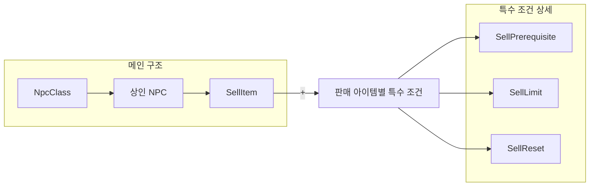
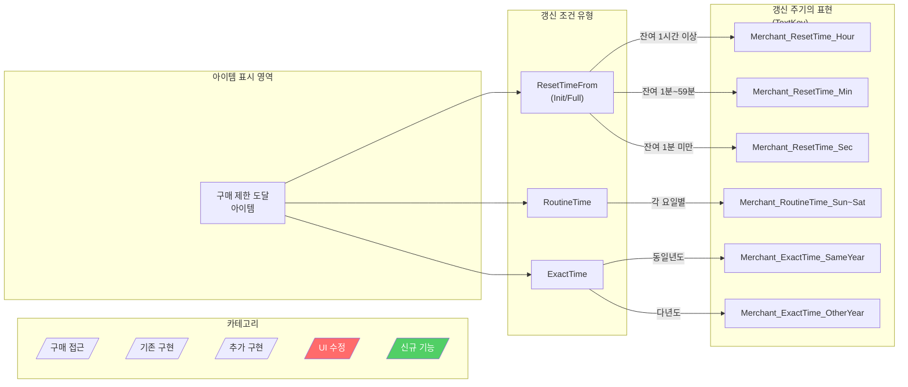
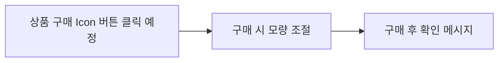
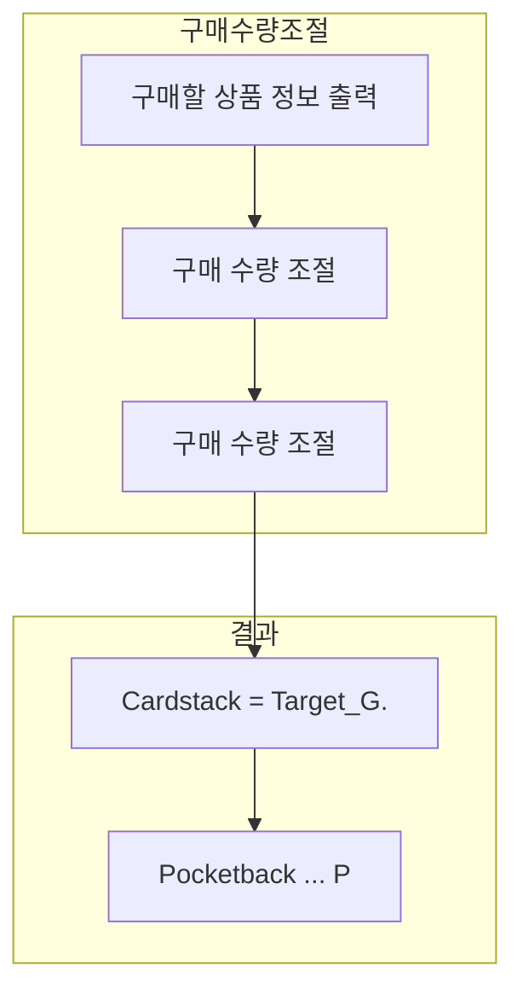
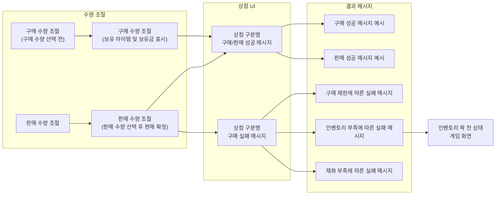
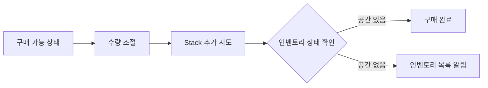
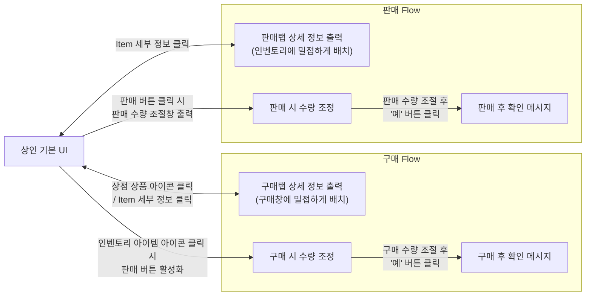
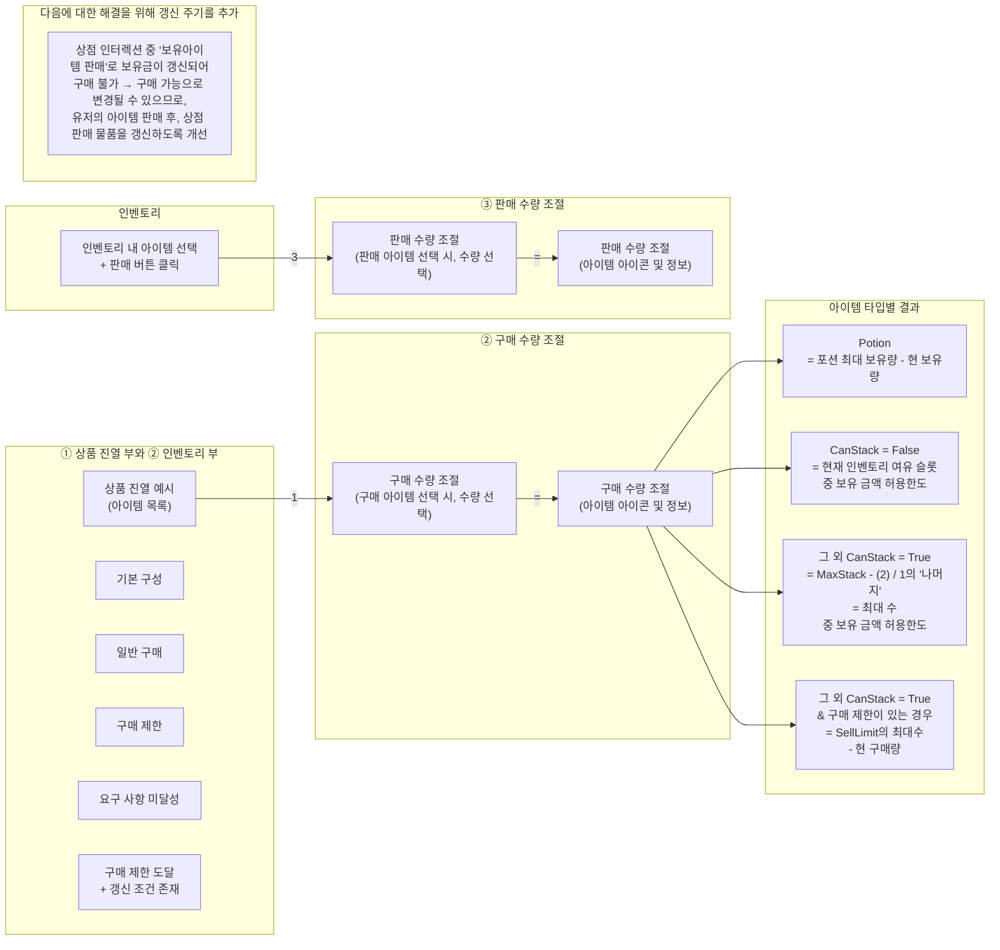

# PK_NPC 시스템 / 상인 NPC

## 1. 상인 NPC
[PK_NPC 시스템 / 상인 NPC]
## 1. 상인 NPC

- 상인 NPC는 물품의 판매 / 구매 2가지 기능을 수행

#### 1) 물품의 구매
- 각 상인 유형별로 지정된 Category의 아이템을 판매하며
- 각 아이템마다 구매 조건 / 구매 제한 / 갱신에 대한 정의가 가능해야 함

#### 2) 물품의 판매
- 캐릭터가 보유한 아이템을 상인에게 판매할 수 있음
- 상인마다 특정 아이템의 일반 구매를 수행
- 모든 상인이 아이템 구분 없이 일반 판매의 기능을 수행

---

### 상인 NPC 구조 플로우차트





---

> **[상인 NPC] 주석**: 물품 구매 / 물품 판매 !! 재판매 기능은 제외 !!

> **[SellItem] 주석**: 상인이 판매하는 물품 목록 / 아이템 별 구매 조건 / 제한 / 갱신 포함

> **[SellPrerequisite] 주석**: 아이템 별 구매 조건 (빨간색)

> **[SellLimit] 주석**: 아이템 별 구매 제한 (빨간색)

> **[SellReset] 주석**: 아이템 별 구매 갱신 조건 (빨간색)

> **[우측 상단 박스] 주석**: 하단 특수 조건이 없더라도 판매 아이템 ID / 판매 수량 / 비율이 정의 되어야 함

> **[우측 하단 박스] 주석**: 아이템 판매에 제한이 있을 경우, 특수 조건에 대한 정의 필요

> **기능1 주석**: 물품 구매 / 물품 판매
> **조건설명 주석**: 상인이 판매하는 물품 목록, 아이템 별 구매 조건 / 제한 / 갱신 포함
> **[?] 자세한 기능은 제한!!**: (NpcClass 하단 주석)

---

### 2) 해당 NPC 클릭 시, SellItem_Table 중 해당 NPC에 할당된 Item을 노출, 유저의 구매가 가능

### 3) 상인 NPC의 표기
- 플레이어 동선을 유도하며, 상황을 방지하기 위해 월드맵과 미니맵에서 위치 표기
- 현재 문서에서는 월드맵 / 미니맵에서의 아이콘 디자인의 분리는 고려하지 않으나 크기 등의 차이가 있으므로 변경 무관합니다.

---

### <상인 NPC의 범주별 Icon 표기>

| 구분 | 마스터 상점 | 제작소 가공 | 퀘스트 완료 상점 | 고유 아이템 상점 |
|------|-------------|-------------|------------------|------------------|
| Alpha2 | 무기 | 무기 아이콘 | "?" 아이콘 | 무기 아이콘 | "?" 아이콘 |
| Alpha2 | 방어구 | 방어구 아이콘 | "?" 아이콘 | 방어구 아이콘 | "?" 아이콘 |
| Alpha1 | 마법물품 | 마법물품 아이콘 | "?" 아이콘 | 마법물품 아이콘 | "?" 아이콘 |
| Alpha1 | 소모품 | 소모품 아이콘 | "?" 아이콘 | 소모품 아이콘 | "?" 아이콘 |

---

### 상인 유형별 아이콘

| 구분 | 아이콘 | 비고 |
|------|--------|------|
| 무기 상인 |  | 무기 슬롯에 장비할 "무기" Category의 아이템 상인 |
| 방어구 상인 |  | 방어구 슬롯에 장비할 "방어구" Category의 아이템 상인 |

---

### 참고 박스 (주황색)

> **상인 NPC의 경우, 가급적 Quest로의 연결을 사용하지 않는 것을 권장하나**

| 구분 | 아이콘 | 비고 |
|------|--------|------|
| 마법용품 상인 | ![마법서 모양 아이콘] | 스킬북, 스킬 소모품, 스크롤 등 **스킬 효과 관련 아이템** 상인 |
| 소모품 상인 | ![물약 모양 아이콘] | 포션, 각종 재료 등 **일반 소모품 관련 아이템** 상인 |

---

### 상인 NPC의 표기


| 표기 위치 | 설명 |
|-----------|------|
| 인게임 월드에서의 표기 | 상인 NPC의 표기 - 인게임 월드에서의 표기 (노란 박스로 NPC 위치 표시) |
| 월드맵에서의 표기 | 상인 NPC의 표기 - 월드맵에서의 표기 (X자로 표시된 마커) |
| 미니맵에서의 표기 | 상인 NPC의 표기 - 미니맵에서의 표기, **상인 NPC를 우클릭하면 경로** 버튼 표시 |

---

### 4) 상점 관련 테이블 = MerchantItems

- 각 상인별 판매 아이템의 구매 관련 정보를 정의
- Item 세부 정보는 Item Table에서 정의

#### <상인 구매 물품 테이블>

```
┌─────────────────┬─────────────────┬─────────────────┐
│    SellItem     │  SellPrerequisite │    SellLimit    │
│   (빨간색)       │    (파란색)        │   (파란색)       │
├─────────────────┼─────────────────┼─────────────────┤
│   상인 NPC의     │   구매 물품당      │   구매 물품당    │
│   판매 물품 정보  │   구매 요구 조건   │   구매 제한 조건  │
│                 │                   │   및 "재화 결정" 조건 │
└─────────────────┴─────────────────┴─────────────────┘
```

> **위의 항목이 기획서 입력 필수** (주황색 화살표로 SellLimit 강조)

---

### Ver 0.94 수정

> **기능 NPC 관련 테이블은 별도 시트에서 통합하여 정리**
> **(클릭하여 링크)**

---

### 5) 상점 UI 및 시스템

#### < 상인 NPC와 인터렉션 시 출력되는 UI >

> **!!! 상인 UI가 켜진 상태에서는 캐릭터의 조작은 금지되며, 안전 지대에서 발생하는 것이므로 전투 등으로의 단절은 없다고 간주 !!!**
> 
> **단, 상인 인터렉션으로 상점 UI 등이 상태에서 상인 NPC가 소멸할 경우, UI 클로징 + 상점 인터렉션 유지**

---

#### < 상점이 보이는 중 주변 노출물 상태 >

**(0.7 개선)**

> - 미니맵 결과는 마지막 화면 유지 (0.5 추가)
> - 미니맵 결과는 마지막 화면 유지, 확인 후 리치 개방
> - 후방 노출 제거 및 **NPC 아이콘에서의 표시를**

---

#### <Default 값>

1. 배치 순서는 **상단부터 Order순**서대로 배치 (1→100)
2. 구매 제한 조건
   - 미달성 시, 구매 조건 부분 Text는 적색 폰트로 출력

### <Default 값>
   - 존재 시, 구매 조건 부분 Text는 적색 폰트로 출력
   - 없을 시, 구매 조건은 보통 Text 미출력
3. **구매 조건**
   - 구매 조건 → 구매 불가 및 요구 조건 적색 폰트 출력
   - 달성 시, 별도 출력 X
4. **구매 제한 조건 도달**
   - **제한 조건 충족 시, 갱신 조건을 노란색 폰트 출력**
   - 갱신 조건 미충족 시, "구매 제한 도달" 출력

---

## 1. 상인 NPC > <구매 조건의 갱신>
[PK_NPC 시스템 / 상인 NPC]
## 1. 상인 NPC

### <구매 조건의 갱신>

#### • 정의:
구매 제한 상한에 도달하여 구매 불가 상황일 때, 일정 조건에 따라 구매 제한을 초기화 하는 기능

#### • 설정:
1. 구매 제한이 있는 경우에만 갱신 조건이 존재
2. 구매 제한은 최대 1종으로 다중 조건은 존재하지 않음

#### • 유형: 
**세부 데이터로 다음 링크 참고** → **(테이블 예시)**

1. Beta1 기준으로 모든 갱신 조건은 시간 값을 사용
2. 모든 갱신 조건은 최대 갱신 시간이 존재하며 해당 시간 이후로 갱신되지 않음
   - 예) 현재 진행중 6월이고 각 주 금요일마다 갱신되는 조건이 있을 때, 해당 갱신이 가능한 최대 일자가 6월 26일 목요일이라면 갱신되지 않음
3. 갱신 조건은 4개의 유형이 존재
   - ① **정한 갱신** (None) = 데이터 측 항상 판매되는 물품
   - ② **정해진 구매 일** (ResetTimeFromInit) = 구매 제한이 있는 물품을 "1개라도 구매했을 때부터 일정 시간 후 갱신
   - ③ **루틴도달** (ResetTimeFromInit) = 구매 제한이 있는 물품을 "구매량도가차" 구매했을 때부터 일정 시간 후 갱신
   - ④ **혈적일 후기** (RoutineTime) = 출력 정보 시간에 갱신
   - ⑤ **특정 시각** (ExactTime) = 정확히 지정된 시각에 갱신

---

### • 구매 제한 / 구매 갱신 아이템의 표기:

구매 제한이 있는 아이템의 경우 상점 내에서 다음과 같이 표기됨


| 상태 | 표기 내용 |
|------|----------|
| 구매 가능 | 제한 수량 및 갱신 시간 표시 |
| 구매 제한 도달 | "제한 도달" 안내 + 수 개만 가능 |
| 갱신 기능 | 타이머 형태로 남은 시간 표시 |

---

### 갱신 주기별 표기 (TextKey)

| 갱신 유형 | 데이터 키 |
|----------|----------|
| **ResetTimeFrom (Init/Full)** | |
| 시간 단위로 표기 (1시간마다 갱신) | Merchant_ResetTime_Hour |
| 제한 도달 안내 + 수 개만 가능 | Merchant_ResetTime_Min |
| | Merchant_ResetTime_Sec |
| **RoutineTime** | |
| 다 갱신할 TextKey) 별도 사용 가능한 경우에는 기존 기능 | Merchant_RoutineTime_Sun~Sat |
| **ExactTime** | |
| 기다리 표현 필요 / ex) 6월 26일 금요일 오후 3시 + "다음 달까지" / 구매량 까지 동일 시간에 동시 처리 | Merchant_ExactTime_SameYear |
| | Merchant_ExactTime_OtherYear |

---

### <구매/판매 Flow>

**< 상인 NPC를 통한 구매 Flow와 연동 UI >**

> **!!! 본 문서에서는 자동 구매 내용을 미작성 (+스케줄 및 자동 시스템 연동) !!!**





> **주석 - 갱신 조건 유형 설명**:
> - **ResetTimeFrom(Init)**: 구매 제한이 있는 물품을 "1개"라도 구매했을 때부터 일정 시간 후 갱신
> - **ResetTimeFrom(Full)**: 구매 제한이 있는 물품을 "구매한도까지" 구매했을 때부터 일정 시간 후 갱신
> - **RoutineTime**: 특정 요일, 시각에 갱신
> - **ExactTime**: 정확히 지정된 시각에 갱신


- 구매 시 수량 조절: 슬라이더 또는 입력으로 수량 선택
- 구매 후 확인 메시지: 구매 완료 안내 팝업

---

### <상점 → 구매 / 판매 시 Flow 요약>



> 1) 월드에서의 KeepOutEvent 관련 Item  
> PlayerStack_componentRef 아이템 위치 계산

---

### 구매 가능 아이템 수량 산정

- **upperStack.G. canType_Item** 사용 처리 활용

---

### 수량 조절 및 구매 진행 흐름




> **수량 필요 CanStack = True**  
> **= 구매 가능한 양 모두 Gen (GetLast)**  
> → 추가되어야 함 ② 식별

---

### 구매 결과 처리

- **구매 시 상품 적합성 Swapable [?반환?] 처리**
- **수량의 변화 → DataCollection 사용 사용**
- **수량을 1개 → 이미지 기준으로 가능은 중복**
- **조절 → 이미지 출력 용도 세로/인덱스 계산**

---

### !!! TB 아이템(제한 적용을 위해 중간 수 가윤 추가)

> - 대응 마감 예정은 처리로 오전하지 않는 현 시스템의 프로토타입 [?.jpg?]
> - 수량 정보하는 것 상품에 쓸되어 쓴 이미지는 수 없음으로,
> - **유물체류 등 수 구매 가능한 분할량 수 없음으로.**

---

## 1. 상인 NPC > 구매 및 판매 수량 조절 UI 흐름
[PK_NPC 시스템 / 상인 NPC]
## 1. 상인 NPC

### 구매 및 판매 수량 조절 UI 흐름





> **주석 - 상단 빨간색 텍스트**: 상점 인터랙션 중 "보유 아이템 판매"로 보유금이 갱신되어 구매 불가 → 구매 가능으로 변경될 수 있으므로, 유저의 아이템 판매 후, 상점 판매 목록을 갱신하도록 개선

> **주석 - 수량 조절 시**: 최대 구매량은 2가지 중 하나를 따름. 각 포션류의 경우, 스탯 정보의 포션 스지 한도를 따름 (ex: 한계 1200 - 보유량 800 = 최대 구매 가능 400)

> **주석 - 인벤토리 상태**: 인벤토리 아이템이 꽉 찬 상태 (=100/100), Stack은 가능한 상태 (포션 보유량 1/1200)인 경우, 동일 포션 재구매 시, "인벤토리 부족 알림"

> **주석 - 구매 시 예외 조건**: Item Stock들에 따라 인벤토리 잔여 슬롯 부족 시 등 다양한 예외 상황 처리

> **구매 성공 메시지**: "(아이템명)을 ??개 구매하였습니다."
> **판매 성공 메시지**: "(아이템명)을 ??개 판매하였습니다."

---

### 인벤토리 부족 알림 조건


인벤토리 아이템이 꽉 찬 상태 (=100/100)이나
Stack은 가능한 상태 (포션 보유량 1/1200)인 상태에서
동일 포션 재구매 시, **"인벤토리 부족 알림"** 출력

---

### <상점 – 구매/판매 시 메시지 출력>

---

### <구매 및 판매 성공 시>

**• 구매 성공:**
1. 선택 아이템의 총 비용만큼 재화 감소
2. 선택 아이템의 총 수량만큼 인벤토리로 이동
   - 인벤토리 기타 사항은 기본 문서를 참고
   - (`/PlannerWiki/System/WK_인벤토리 시스템.xlsx`)
3. 구매 성공 메시지 출력
   - "(아이템명)을 ??개 구매하였습니다."

**• 판매 성공:**
1. 선택 아이템의 총 수량만큼 인벤토리의 아이템 수량 감소
2. 선택 아이템의 총 동일량만큼 재화 증가
3. 판매 성공 메시지 출력
   - "(아이템명)을 ??개 판매하였습니다."

---

### <구매 시의 예외 조건>

ㄱ. Item Stack풀에 따라 인벤토리 칸이 없을 때 부족
- ㄴ. 기존 MaxStack이 99개기준 90개 보유 상태이고
- 보유 칸 풀이 없을 때 재고 2개 구매 시, 수량 안맞을이 1개 필요
- → "인벤토리 공간이 부족합니다." 출력

ㄷ. 구매 아이템 총 재화량 ＞ 보유 전체 재화량
- → "보유 재화가 부족합니다." 출력

ㄹ. 동일 아이템 구매 제한 수량에 적용된 경우
- → "해당 아이템을 더 구매할 수 없습니다."

**예외 사항 발생 시 (상): 에러메시지 출력 및 ※ 구매 미처리**

---

-- End of Sheet --

## 1. 상인 NPC > 인벤토리 풀 상태 처리
[PK_NPC 시스템 / 상인 NPC]
## 1. 상인 NPC

### 인벤토리 풀 상태 처리




> **인벤토리의 아이템이 꽉 찬 상태 (+100/100)이거나**  
> **Stack은 기능한 상태(옵션 보유량 1/1등)인 상태에서**  
> **중복 옵션 재구매 시, "인벤토리 목록 알림" 출력**

---

### <상점 → 구매/판매 시 메시지 플레이>


---

**-- End of Sheet --**

**상인 NPC를 통한 구매 Flow와 연동 UI**

> **!!! 본 문서에서는 자동 구매 내용을 미작성 (=스케줄 및 자동 사냥과 연동) !!!**

---

### 상인 기본 UI 흐름





> **[상인 기본 UI] 주석**: 중앙 허브 역할, 구매/판매 양쪽 흐름의 시작점
> **[구매탭 상세 정보 출력] 주석**: 구매창에 밀접하게 배치
> **[판매탭 상세 정보 출력] 주석**: 인벤토리에 밀접하게 배치
> **[문서 제목]**: 상점 - 구매 / 판매 Flow 요약
> **[상단 경고문]**: 본 문서에서는 자동 구매 내용을 미작성 (~스케줄 및 자동 시상과 연동)
> **<상점 – 구매 / 판매 Flow 요약>**

### <상점 기본 UI의 구성>


#### <상점 UI 설명>

| 번호 | 항목 | 설명 |
|------|------|------|
| ① | 상점 구분명 | |
| ② | 상품 진열부 | |
| ③ | 인벤토리부 | **구매 완료 시 갱신만 사용** |
| ④ | 판매 버튼 | |

#### 상점 구분 Icon 표기 추가 개선

1) 필드에서의 NamePlate 상단 Icon
2) 상점에서의 구분 Icon 모두 **NpcClass_IconField의 리소스 사용을 희망**

---

### ① 상점 구분명

- 상인 NPC의 판매 Category 종을 출력
- NpcClass의 Category_Desc 내부 Text 출력

---

### ② 상품 진열 부와 ③ 인벤토리 부

| 구분 | 기본 구성 |
|------|----------|
| 상품 진열부 | 기본 구성 |
| 인벤토리부 | 일반 구매 |

#### 구매 수량 조절

| 항목 | 설명 |
|------|------|
| 라벨 | 아이템 명 및 정보 |
| 구매 수량 조절 | 수량 입력 |
| 구매 제한 조건 | [?조건 표시?] |


### 아이템 타입별 구매 수량 조절 규칙

| 아이템 타입 | CanStack | 조건 | 최대 구매 수량 |
|-------------|----------|------|----------------|
| Potion | - | 포션 최대 보유량 - 현 보유량 | 현재 인벤토리 여유 슬롯 중 보유 금액 허용한도 |
| CanStack = False | False | - | 현재 인벤토리 여유 슬롯 중 보유 금액 허용한도 |
| 그 외 CanStack = True | True | - | MaxStack - (2) / 1의 '나머지' = 최대 수량 중 보유 금액 허용한도 |
| 그 외 CanStack = True & 구매 제한이 있는 경우 (SellLimit) | True | SellLimit 존재 | SellLimit의 최대수 - 현 구매량 (양 모두 금액허용한도) |


---

## 1. 상인 NPC > 판매 아이템 선택 시 수량 선택
[PK_NPC 시스템 / 상인 NPC]
## 1. 상인 NPC

### 판매 아이템 선택 시 수량 선택





> **[Potion] 주석**: = 포션 최대 보유량 - 현 보유량 중 보유 금액 허용한도

> **[CanStack = False] 주석**: = 현재 인벤토리 여유 슬롯 중 보유 금액 허용한도

> **[그 외 CanStack = True] 주석**: = MaxStack - (2) / 1의 '나머지' = 최대 수 중 보유 금액 허용한도

> **[SellLimit 케이스] 주석**: = SellLimit의 최대수 - 현 구매량 (장 오른 금액 허용한도)

> **[하단 박스] 주석**: [PK-2457] 상점 아이템 판매 후 금액이 충족하였으나 붉은 금액 표시 - Jira 이슈 관련 설명


| 번호 | 설명 |
|------|------|
| ① | 진열 상품 클릭 (아이콘 외) |
| ② | 구매 아이템 수량 조절 |
| ③ | 판매 아이템 수량 조절 |

---

### ④ 상품 진열부

- 해당 상인 NPC의 '공통' 판매 물품을 Order에 따라 표기
- Default 표기는 최상단 (=Order 1~6까지 표기)
- 각 탭들은 상단과 같은 구성 요소를 가짐
- 구매 조건 / 재화 - 금액, 구매 제한량에 따른 표기
- 지금까지 구매한 수량이 아이템에 표기
- **상점 내 최초 클릭 시 1회 갱신**하는 것을 중심으로 [이전 구매한 수량이 아이템 구매량에 적용되도록]

### <구매 / 판매 수량 선택>

- 상기와 같이 아이템의 정보 및 수량 조절로 구성된 표기
- 구매 제한 / 갱신 조건은 존재 시만 표기
- 현재 선택 수량 = 1
- Default 현재 선택 수량 = 1
- 현재 선택 수량 표기 부 클릭 시, 숫자 입력 가능
- 구매 취소 시, 아이템이 임시 슬롯에 들어갔지 않고 유지
- 수량 조절 시, **최대 구매량**은 3가지 룰을 따름
  - ㄴ 각 요소들의 경우, 스탯 정보의 요소수치 한도를 따름
  - (ex: 한계 1200 - 보유량 800 = 최대 구매량 400)

---

### 다음에 대한 해결을 위해 갱신 주기를 추가

> [PK-2457] 상점 아이템 판매 후 금액이 충족되었으나 붉은 금액 표시 - Jira

상점 인터랙션 중 '보유아이템 판매'로 보유금이 갱신되어
구매 불가 → 구매 가능으로 변경될 수 있으므로,
**유저의 아이템 판매 후, 상점 판매 물품을 갱신**하도록 개선

---

### ⑤ 판매 버튼 및 구매 시의 처리

### 수량 조절 시 최대 구매량 규칙

- 수량 조절 시, **최대 구매량**은 2가지 풀을 따름
- ㄱ. 각 포션류의 경우, 스탯 정보의 포션소지 한도를 따름
  - (ex: 한계 1200 - 보유량 800 = 최대 구매 가능 400)
- ㄴ. 그 외 스택 가능 물품의 경우, 최대 보유 수는 9999로 한정

---

### 상점 인터랙션 갱신 조건

상점 인터랙션 중 '보유아이템 판매'로 보유금이 갱신되어
구매 불가 → 구매 가능으로 변경될 수 있으므로,
**유저의 아이템 판매 후, 상점 판매 물품을 갱신하도록 개선**

---

## OOXML 원본 텍스트 (OCR 보정, 셀 위치 포함)
[PK_NPC 시스템 / 상인 NPC]
## OOXML 원본 텍스트 (OCR 보정, 셀 위치 포함)

R2: C2:▶ 상인 NPC
R4: C2:1. 상인 NPC
R5: C3:①  상인 NPC
R6: C5:: 상인 NPC는 물품의 판매 / 구매 2가지 기능을 수행
R7: C6:1) 물품의 구매
R8: C6:: 각 상인 유형별로 지정된 Category의 아이템을 판매하며
R9: C6:각 아이템마다 구매 조건 / 구매 제한 / 갱신에 대한 정의가 가능해야 함
R10: C6:2) 물품의 판매
R11: C6:: 캐릭터가 보유한 아이템을 상인에게 판매할 수 있음
R12: C6:: 상인마다 특정 아이템의 일반 구매를 수행
R13: C6:+ 모든 상인이 아이템 구분 없이 일반 판매의 기능을 수행
R38: C6:=  해당 NPC 클릭 시, SellItem_Table 중 해당 NPC에 할당된 Item을 노출, 유저의 구매가 가능
R40: C6:3) 상인 NPC의 표기
R41: C6:: 1) 플레이어 동선을 유도하며 2) 방황을 방지하기 위해 월드맵과 미니맵에서 위치 표기
R42: C7:현재 문서에서는 월드맵 / 미니맵에서의 아이콘 디자인의 분리는 고려하지 않으나 크기 등의 차이가 있으므로 변경 무관합니다.
R44: C6:<상인 NPC의 범주별 Icon 표기>
R45: C8:미퀘스트 상태 | C10:퀘스트 수락 가능 | C12:퀘스트 진행 중 | C14:퀘스트 완료 가능
R46: C3:Alpha2 | C8:무기 아이콘 | C10:“!” 아이콘 | C12:무기 아이콘 | C14:“?” 아이콘
R47: C6:방어구 | C8:방어구 아이콘 | C10:“!” 아이콘 | C12:방어구 아이콘 | C14:“?” 아이콘
R48: C6:마법용품 | C8:마법용품 아이콘 | C10:“!” 아이콘 | C12:마법용품 아이콘 | C14:“?” 아이콘
R49: C3:Alpha1 | C6:소모품 | C8:소모품 아이콘 | C10:“!” 아이콘 | C12:소모품 아이콘 | C14:“?” 아이콘
R51: C8:아이콘
R52: C6:무기 상인 | C10:무기 슬롯에 장비될
"무기" Category의 아이템 상인
R53: C6:방어구 상인 | C10:방어구 슬롯에 장비될
"방어구" Category의 아이템 상인
R54: C6:마법용품 상인 | C10:스킬북, 스킬 소모품, 스크롤 등 
스킬 효과 관련 아이템 상인
R55: C6:소모품 상인 | C10:포션, 각종 재료 등
일반 소모품 관련 아이템 상인
R77: C6:4) 상점 관련 테이블 = MerchantItems
R78: C6:: 각 상인별 판매 아이템의 판매 관련 정보를 정의 (Item 세부 정보는 Item Table에서 정의)
R107: C6:5) 상점 UI 및 시스템
R108: C6:: 상인 NPC와 인터렉션 시 출력되는 UI
R109: C1:0.5 추가 | C6:!!! 상인 UI가 출력된 상태에서는 캐릭터의 조작은 금지되며, 안전 지대에서 발생하는 것이므로 전투 등으로의 단절은 없다고 가정 !!!
R110: C6:다만, 상인 인터렉션으로 상점 UI 출력 상태에서 상인 NPC가 소멸될 경우, UI 클로징 + 상점 인터렉션 중지 | C21:<Defalut 룰>
R112: C6:• 상점 UI 노출 중 후방 노출 내용
R113: C6:다음 안 중 1종으로 아트팀 확인 후 확정 예정 | C21:①  배치 순서는 상단부터 Order순서대로 배치 (1~100)
R114: C6:ㄱ. 인게임 화면 노출 (+ 살짝 Dimmed 처리하여 UI에 집중) | C21:②  구매 제한 조건
R115: C6:ㄴ. 인게임 화면 중 PC - NPC의 부분만 확대 출력 (+ 주변 PC 랜더링 X) | C21:존재 시, 구매 조건 부분 Text는 적색 폰트로 출력
R116: C6:ㄷ. 별도의 이미지로 인게임 화면 가림 | C21:없을 시, 구매 조건 부분 Text는 미출력
R117: C6:→ Alpha 1에서는 ㄱ안으로 최소 비용으로 처리하도록 합의 | C21:③  구매 요구 조건
R118: C21:미달성 시, 구매 불가 및 요구 조건 적색 폰트 출력
R119: C21:달성 시,  별도 출력 X
R120: C21:④  구매 제한 조건 도달
R121: C21:+ 갱신 조건 존재 시, 갱신 조건을 노란색 폰트 출력
R122: C21:+ 갱신 조건 미존재 시, "구매 제한 도달" 출력
R124: C22:<구매 조건의 갱신>
R126: C22:• 정의 :
R127: C22:구매 제한 상한에 도달하여 구매 불가 상황일 때, 일정 조건에 따라 구매 제한을 초기화 하는 기능
R128: C22:• 성격 :
R129: C22:1) 구매 제한이 있는 경우에만 갱신 조건이 존재
R130: C22:2) 구매 제한은 최대 1종으로 다중 조건은 존재하지 않음
R132: C22:• 유형 : | C23:세부 테이블은 다음 링크 참고 | C26:(테이블 예시)
R133: C22:1) Beta1 기준으로 모든 갱신 조건은 시간 값을 사용
R134: C22:2) 모든 갱신 조건은 최대 갱신 시각이 존재하며 해당 시각 이후엔 갱신되지 않음
R135: C22:ex) 현재 25년 6월 4일이며 매주 목요일 00시에 갱신되는 품목이 존재.
R136: C22:단, 해당 물품의 ResetEndTime이 6월 20일이라면 6월 26일 목요일에는 갱신되지 않음
R137: C22:3) 갱신 조건은 4개의 유형으로 구분
R138: C22:-1 갱신 없음 (None) = 이벤트로 1회성 판매되는 물품
R139: C22:-2 제한 구매 후 일정 시간 (ResetTimeFromInit) = 구매 제한이 있는 물품을 "1개"라도 구매했을 때부터 일정 시간 후 갱신
R140: C22:-3 제한 도달 후 일정 시간 (ResetTimeFromFull) = 구매 제한이 있는 물품을 "구매한도까지" 구매했을 때부터 일정 시간 후 갱신
R141: C22:-4 특정 시간 주기 (RoutineTime) = 특정 요일, 시각에 갱신
R142: C22:-5 특정 시각 (ExactTime) = 정확히 지정된 시각에 갱신
R144: C22:• 구매 제한 / 구매 갱신 아이템의 표기 :
R145: C22:구매 제한이 있는 아이템의 경우 상점 내에서 다음과 같이 표기됨
R169: C6:<구매 /판매 Flow>
R170: C6:: 상인 NPC를 통한 구매 Flow와 연동 UI | C10:!!! 본 문서에서는 자동 구매 내용을 미작성 (=스케쥴 및 자동 사냥과 연동) !!!
R216: C6:<상점 기본 UI의 구성>
R239: C6:① 상점 구분명
R240: C6:• 상인 NPC의 판매 Category 명을 출력
R241: C6:• NpcClass의 Category_Desc 내부 Text 출력
R244: C6:② 상품 진열 부와 ③ 인벤토리 부
R288: C6:② 상품 진열부
R289: C6:• 해당 상인 NPC의 “모든” 판매 물품을 Order에 따라 표기
R290: C6:• Defalut 표기는 최상단 (=Order 1~6까지 표기)
R291: C6:• 각 슬롯은 상단과 같은 구성 요소를 가짐
R292: C6:구매 요구 / 제한 / 갱신 조건에 따라 별도의 특수 표기 존재함에 유의
R293: C6:• 각 조건에 따라 비활성 / 활성화는 실시간 적용이 어려우므로
R294: C6:상점 UI 최초 출력 시 1회 갱신하는 것을 원칙으로 함
R295: C6:(다만, 캐릭터 구매 수량 제한의 경우는 즉각 갱신을 희망)
R303: C6:④ 판매 버튼 및 구매 시의 처리
R345: C6:<구매 및 판매 성공 시> | C14:<구매 시의 예외 조건>
R346: C6:• 구매 성공 : | C14:ㄱ. Item Stock룰에 따라 인벤토리 잔여 슬롯 부족 시
R347: C6:① 선택 아이템의 총 비용만큼 재화 감소 | C14:Ex) 재료의 MaxStock이 999개인데 998개 보유 상태이고
R348: C6:② 선택 아이템의 총 수량만큼 인벤토리로 이동 | C14:남은 인벤 슬롯이 없는 때 재료 2개 구매 시, 추가 인벤 슬롯이 1개 필요
R349: C7:인벤토리 기타 사항은 기본 문서를 참고 | C14:= "인벤토리의 공간이 부족합니다." 출력
R350: C7:( ProjectK\Design\7_System\PK_인벤토리 시스템.xlxs ) | C14:ㄴ. 구매 아이템 요구 재화량 > 보유 잔여 재화량
R351: C6:③ 구매 성공 메시지 출력 | C14:= "보유 재화가 부족합니다." 출력
R352: C7:"(아이템명)을 ??개 구매하였습니다." | C14:ㄷ. 등록 아이템 구매 제한 수량에 적용될 경우
R353: C6:• 판매 성공 : | C14:(상점 UI 오픈으로 갱신 시의 정보와 비교 - 이후 구매 확정 시 재확인)
R354: C6:① 선택 아이템의 총 수량만큼 인벤토리의 아이템 수량 감소 | C14:=“해당 아이템을 더 구매할 수 없습니다.“
R355: C6:② 선택 아이템의 총 보상량만큼 재화 증가
R356: C6:③ 판매 성공 메시지 출력 | C14:예외 사항 발생 시, ① 에러메시지 출력 및 ② 구매 미처리
R357: C7:"(아이템명)을 ??개 판매하였습니다."
R359: C1:-- End of Sheet --

