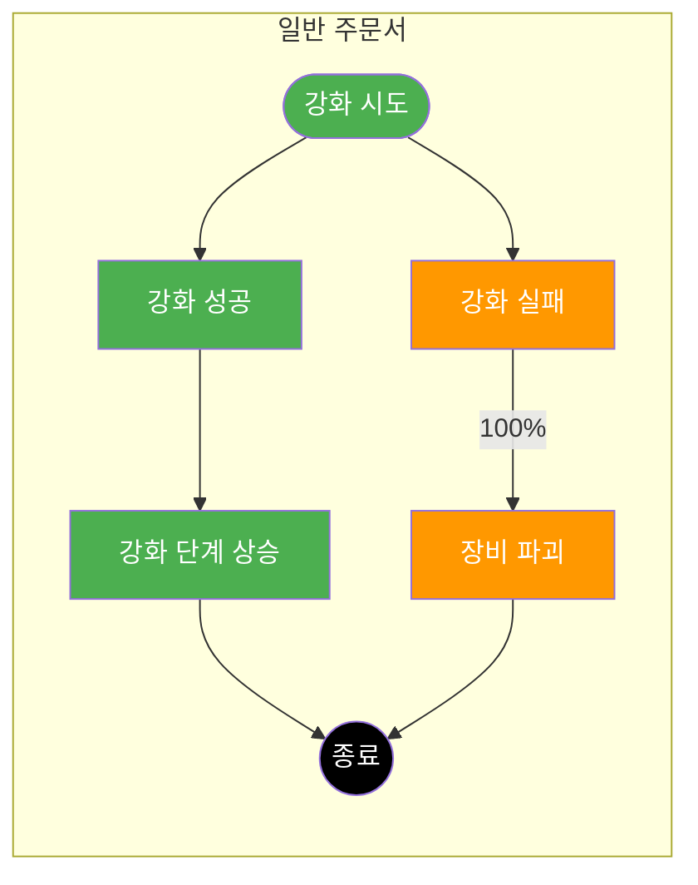
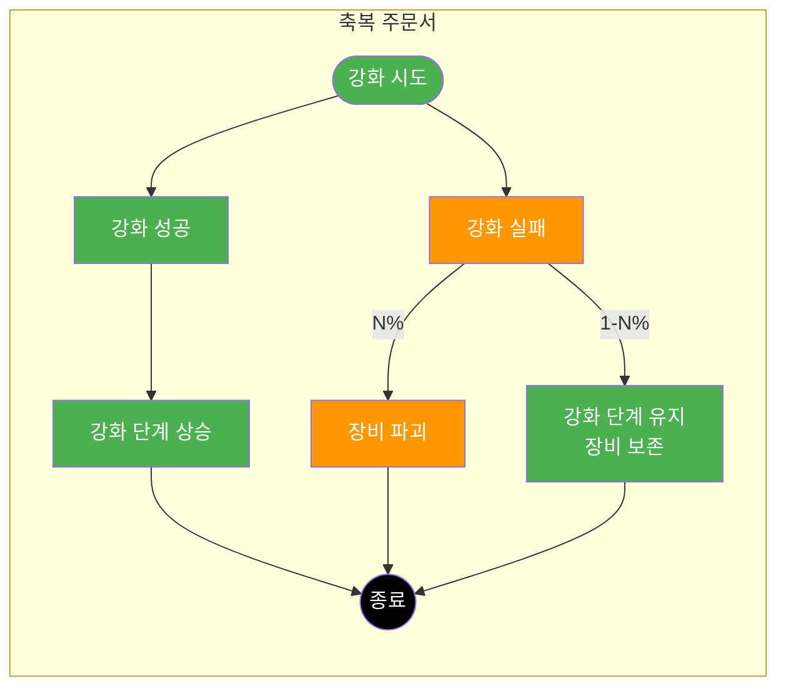
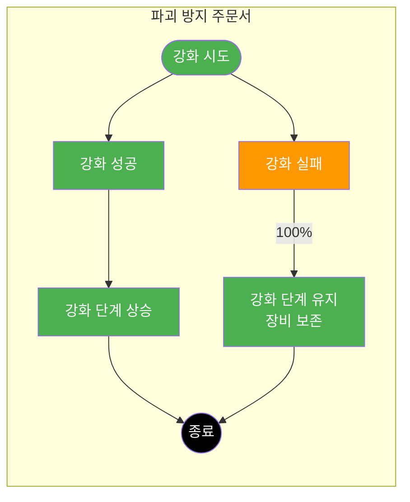
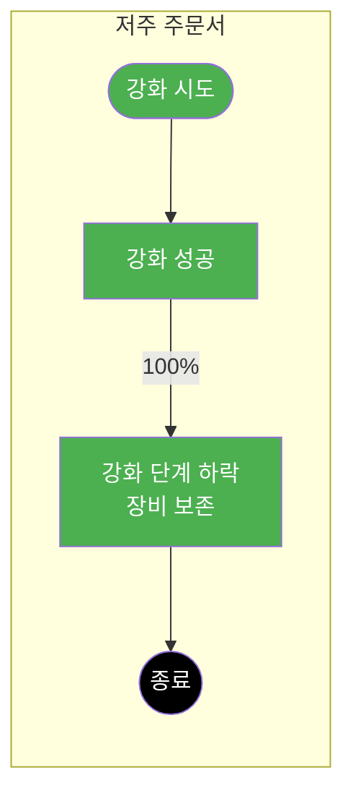
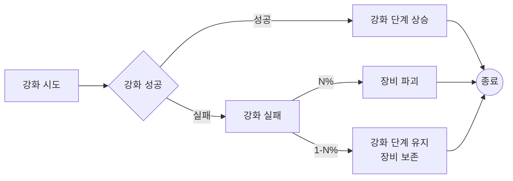
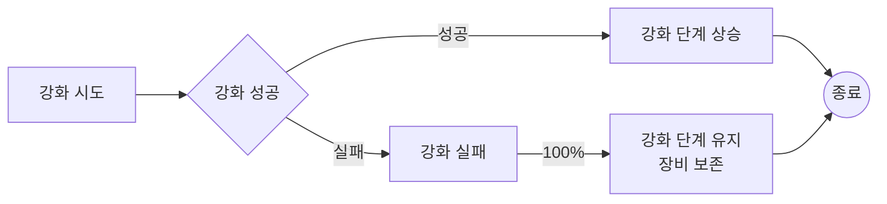
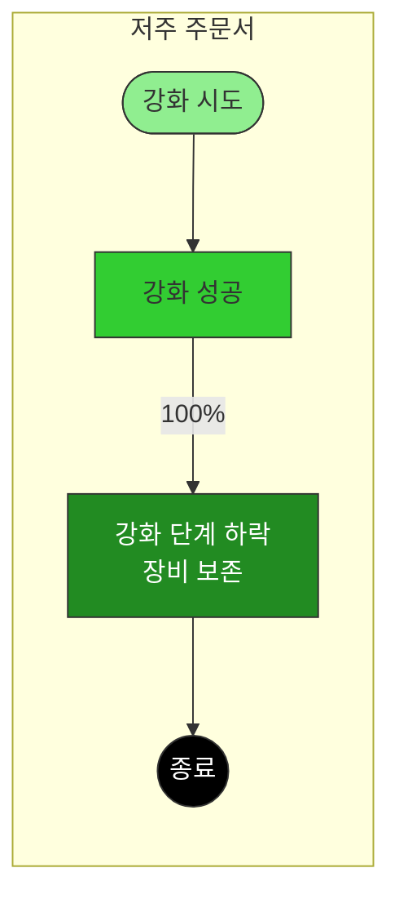

# PK_아이템 시스템 / 장비 강화

## 2) 주문서 획득
[PK_아이템 시스템 / 장비 강화]
## 2) 주문서 획득

- → 기본적으로 특정 던전 및 몬스터로부터 획득
- → BM 상점을 통해 **구매** (일일 구매 개수 제한 있음)
  - ✔ 유료 장신구 강화 주문서는 유료 재화로만 구매 가능
- → 각종 랜덤 상자 보상을 통해 획득
- → 강화 실패로 인해 장비 파괴 시 일정 확률로 획득
- → 제작을 통해 획득

---

## 2. 세부 정보 > ① 공통 규칙
[PK_아이템 시스템 / 장비 강화]
## 2. 세부 정보

### ① 공통 규칙

#### 1) 주문서 종류
→ 기능별 정리
- ✓ 기존의 축복 주문서가 +2 / +3이 될 확률이 매우 낮아 유저 피드백이 안 좋은 부분 보완
- ✓ 실패에 대한 부정적인 피드백 최소화를 위해, 강화 실패로 장비 파괴 시 일정 확률로 특정 아이템 획득 (Ex. 강화 주문서 / 제작 재료 등)

| 종류 | 소모량 | 성공 시 변동량 | 성공 시 | 실패 시 |
|------|--------|---------------|--------|--------|
| 일반 주문서 | 1 | +1 | 주문서 소모 | 장비 파괴 + 주문서 소모 |
| 축복 주문서 | 1 | +1~3 | | 일정 확률로 주문서만 소모 |
| 파괴 방지 주문서 | 1 | +1 | | 주문서만 소모 |
| 저주 주문서 | 1 | -1 | | 해당 없음 (실패 확률 없음) |

---

### 플로우차트: 일반 주문서

### 플로우차트 1: 일반 주문서

| 번호 | 텍스트 | 모양 | 위치 |
|-----|--------|------|------|
| 1 | 강화 시도 | 둥근사각형(녹색) | 좌측 |
| 2 | 강화 성공 | 사각형(녹색) | 중앙-상 |
| 3 | 강화 단계 상승 | 사각형(녹색) | 중앙-우-상 |
| 4 | 강화 실패 | 사각형(주황색) | 중앙-하 |
| 5 | 장비 파괴 | 사각형(주황색) | 중앙-우-하 |
| 6 | 종료 | 원(검정) | 우측 |

### 플로우차트 2: 축복 주문서

| 번호 | 텍스트 | 모양 | 위치 |
|-----|--------|------|------|
| 1 | 강화 시도 | 둥근사각형(녹색) | 좌측 |
| 2 | 강화 성공 | 사각형(녹색) | 중앙-상 |
| 3 | 강화 단계 상승 | 사각형(녹색) | 중앙-우-상 |
| 4 | 강화 실패 | 사각형(주황색) | 중앙-하 |
| 5 | 장비 파괴 | 사각형(주황색) | 중앙-우-중 |
| 6 | 강화 단계 유지 장비 보존 | 사각형(녹색) | 중앙-우-하 |
| 7 | 종료 | 원(검정) | 우측 |

### 플로우차트 3: 파괴 방지 주문서

| 번호 | 텍스트 | 모양 | 위치 |
|-----|--------|------|------|
| 1 | 강화 시도 | 둥근사각형(녹색) | 좌측 |
| 2 | 강화 성공 | 사각형(녹색) | 중앙-상 |
| 3 | 강화 단계 상승 | 사각형(녹색) | 중앙-우-상 |
| 4 | 강화 실패 | 사각형(주황색) | 중앙-하 |
| 5 | 강화 단계 유지 장비 보존 | 사각형(녹색) | 중앙-우-하 |
| 6 | 종료 | 원(검정) | 우측 |

### 플로우차트 4: 저주 주문서

| 번호 | 텍스트 | 모양 | 위치 |
|-----|--------|------|------|
| 1 | 강화 시도 | 둥근사각형(녹색) | 좌측 |
| 2 | 강화 성공 | 사각형(녹색) | 중앙 |
| 3 | 강화 단계 하락 장비 보존 | 사각형(녹색) | 중앙-우 |
| 4 | 종료 | 원(검정) | 우측 |

---

### 플로우차트 1: 일반 주문서

| 출발 | 도착 | 라벨 |
|-----|------|------|
| 강화 시도 | 강화 성공 | - |
| 강화 시도 | 강화 실패 | - |
| 강화 성공 | 강화 단계 상승 | - |
| 강화 단계 상승 | 종료 | - |
| 강화 실패 | 장비 파괴 | 100% |
| 장비 파괴 | 종료 | - |

### 플로우차트 2: 축복 주문서

| 출발 | 도착 | 라벨 |
|-----|------|------|
| 강화 시도 | 강화 성공 | - |
| 강화 시도 | 강화 실패 | - |
| 강화 성공 | 강화 단계 상승 | - |
| 강화 단계 상승 | 종료 | - |
| 강화 실패 | 장비 파괴 | N% |
| 강화 실패 | 강화 단계 유지 장비 보존 | 1-N% |
| 장비 파괴 | 종료 | - |
| 강화 단계 유지 장비 보존 | 종료 | - |

### 플로우차트 3: 파괴 방지 주문서

| 출발 | 도착 | 라벨 |
|-----|------|------|
| 강화 시도 | 강화 성공 | - |
| 강화 시도 | 강화 실패 | - |
| 강화 성공 | 강화 단계 상승 | - |
| 강화 단계 상승 | 종료 | - |
| 강화 실패 | 강화 단계 유지 장비 보존 | 100% |
| 강화 단계 유지 장비 보존 | 종료 | - |

### 플로우차트 4: 저주 주문서

| 출발 | 도착 | 라벨 |
|-----|------|------|
| 강화 시도 | 강화 성공 | - |
| 강화 성공 | 강화 단계 하락 장비 보존 | 100% |
| 강화 단계 하락 장비 보존 | 종료 | - |

---

### 일반 주문서


### 축복 주문서


### 파괴 방지 주문서


## 2. 세부 정보 > 저주 주문서
[PK_아이템 시스템 / 장비 강화]
## 2. 세부 정보

### 저주 주문서


---

> **참고 - 주문서 종류별 정보 (표 기반)**:
> - 일반 주문서: 소모량 1, 성공 시 +1, 실패 시 장비 파괴 + 주문서 소모
> - 축복 주문서: 소모량 1, 성공 시 +1~3, 실패 시 일정 확률로 주문서만 소모
> - 파괴 방지 주문서: 소모량 1, 성공 시 +1, 실패 시 주문서만 소모
> - 저주 주문서: 소모량 1, 성공 시 -1, 해당 없음 (실패 확률 없음)

---

### 플로우차트: 축복 주문서



---

### 플로우차트: 파괴 방지 주문서



---

### 플로우차트: 저주 주문서

```mermaid
flowchart LR
    A[강화 시도] -->|100%| B[강화 성공]
    B --> C[강화 단계 하락<br>장비 보존]
    C --> F((종료))

## 3) 주문서 가치 방어
[PK_아이템 시스템 / 장비 강화]
## 3) 주문서 가치 방어

- → 특정 주문서만 시장에 과잉 공급 / 결핍으로 인해 가치가 불안정해지는 것을 **최소화** 하기 위함
- → 기본적으로 몬스터로부터 획득되는 공급량으로 **1차 제어** 필요

### [공급량 비율 예시]

- ✔ 동일 환경 기준, 무기 강화 주문서 1장 드랍될 때 방어구 강화 주문서는 4장, 장신구 강화 주문서는 0.1개 드랍된다는 의미
- ✔ 즉, 장신구 > 무기 > 방어구 강화 주문서순으로 **가치가 높도록** 설계

| 종류 | 무기 | 방어구 | 장신구 |
|------|------|--------|--------|
| 드랍 개수 | 1 | 4 | 0.1 |

---

## OOXML 원본 텍스트 (OCR 보정, 셀 위치 포함)
[PK_아이템 시스템 / 장비 강화]
## OOXML 원본 텍스트 (OCR 보정, 셀 위치 포함)

R1: C2:▶ 장비 강화
R3: C2:1. 정의
R4: C3:(1) 아이템 중 장비만 강화 가능
R6: C3:(2) 아이템 외의 강화는 해당 문서에서 별도 정의
R7: C4:ü Ex. 변신 강화는 "PK_변신 및 스킬 시스템.xlsx" 참조
R9: C3:(3) 따라서 본 시트는 장비의 일반적인 강화 정보만 기재
R13: C2:2. 세부 정보
R15: C4:① 공통 규칙
R16: C5:1) 주문서 종류
R17: C5:→ 기능별 정리
R18: C5:ü 기존의 축복 주문서가 +2 / +3이 뜰 확률이 매우 낮아 유저 피드백이 안 좋은 부분 보완
R19: C5:ü 실패에 대한 부정적인 피드백 최소화를 위해, 강화 실패로 장비 파괴 시 일정 확률로 특정 아이템 획득 (Ex. 강화 주문서 / 제작 재료 등)
R20: C7:소모량 | C8:성공 시
변동량 | C9:성공 시 | C12:실패 시
R22: C5:일반 주문서 | C9:주문서 소모 | C12:장비 파괴 + 주문서 소모
R23: C5:축복 주문서 | C8:+1~3 | C12:일정 확률로 주문서만 소모
R24: C5:파괴 방지 주문서 | C12:주문서만 소모
R25: C5:저주 주문서 | C12:해당 없음 (실패 확률 없음)
R74: C5:→ 부위별 정리
R75: C5:ü 안전 강화 : 특정 강화 단계까지 실패 없이 강화를 할 수 있는 구간
R76: C5:ü 최대 강화 : 축복 주문서로 최대 강화를 초과하는 단계가 될 시 최대 강화 단계로 보정 (Ex. 14강에서 축복 주문서로 +2강을 성공해도 15강으로 처리)
R77: C5:ü 세부 수치는 추후 변경될 수 있음
R78: C8:안전 강화 | C9:최대 강화 | C12:파괴 방지
R79: C5:무기 강화 주문서 | C9:+20
R80: C5:방어구 강화 주문서 | C7:방어구 | C9:+20
R81: C5:장신구 강화 주문서 | C7:장신구 | C9:+20
R82: C5:유료 장신구 강화 주문서 | C7:장신구 | C9:+10
R85: C5:2) 주문서 획득
R86: C5:→ 기본적으로 특정 던전 및 몬스터로부터 획득
R87: C5:→ BM 상점을 통해 구매 (일일 구매 개수 제한 있음)
R88: C5:ü 유료 장신구 강화 주문서는 유료 재화로만 구매 가능
R89: C5:→ 각종 랜덤 상자 보상을 통해 획득
R90: C5:→ 강화 실패로 인해 장비 파괴 시 일정 확률로 획득
R91: C5:→ 제작을 통해 획득
R94: C5:3) 주문서 가치 방어
R95: C5:→ 특정 주문서만 시장에 과잉 공급 / 결핍으로 인해 가치가 불안정해지는 것을 최소화 하기 위함
R96: C5:→ 기본적으로 몬스터로부터 획득되는 공급량으로 1차 제어 필요
R98: C5:[공급량 비율 예시]
R99: C5:ü 동일 환경 기준, 무기 강화 주문서 1장 드랍될 때 방어구 강화 주문서는 4장, 장신구 강화 주문서는 0.1개 드랍된다는 의미
R100: C5:ü 즉, 장신구 > 무기 > 방어구 강화 주문서순으로 가치가 높도록 설계
R101: C6:무기
강화 주문서 | C7:방어구
강화 주문서 | C8:장신구
강화 주문서
R103: C5:드랍 개수 | C8:0.1
R106: C5:→ 주문서간 교차 제작을 통해 수급 불균형 2차 제어
R107: C5:ü 유료 장신구 강화 주문서 / 파괴 방지 주문서는 제작 불가
R108: C5:ü 제작으로 획득한 주문서는 일반적으로 거래가 불가한 "캐릭터 귀속"
R109: C5:ü 단, 낮은 확률로 거래 가능 아이템 획득 (자세한 사항은 "PK_제작 시스템.xlsx" 참조)
R110: C5:ü 제작 실패 확률이 있으며 실패 시 일정 개수를 돌려주는 방식 (제작 재료가 1개 이하면 돌려주지 않음)
R111: C5:ü 라이브 시 실제 제작 레시피는 아래 재료 외에 제작 비용 등 추가 필요
R112: C5:ü 각 주문서 간 제작 시 필요 개수 기획은 추후 밸런스 단계에서 진행 예정
R133: C4:② 확률 정보
R134: C5:1-1) 부위별 확률 예시 | C11:1-2) 단계별 누적
R135: C5:강화 단계 | C7:방어구 | C8:장신구 | C13:방어구 | C14:장신구
R137: C5:0 → 1 | C11:0 → 1
R138: C5:1 → 2 | C9:0.87 | C11:1 → 2 | C15:0.87
R139: C5:2 → 3 | C9:0.82 | C11:2 → 3 | C15:0.7133999999999999
R140: C5:3 → 4 | C9:0.77 | C11:3 → 4 | C15:0.549318
R141: C5:4 → 5 | C8:0.9 | C9:0.72 | C11:4 → 5 | C14:0.9 | C15:0.39550895999999996
R142: C5:5 → 6 | C8:0.85 | C9:0.67 | C11:5 → 6 | C14:0.765 | C15:0.2649910032
R143: C5:6 → 7 | C6:0.9 | C7:0.9 | C8:0.8 | C9:0.62 | C11:6 → 7 | C12:0.9 | C13:0.9 | C14:0.6120000000000001 | C15:0.16429442198400002
R144: C5:7 → 8 | C6:0.85 | C7:0.85 | C8:0.75 | C9:0.57 | C11:7 → 8 | C12:0.765 | C13:0.765 | C14:0.4590000000000001 | C15:0.09364782053088
R145: C5:8 → 9 | C6:0.8 | C7:0.8 | C8:0.7 | C9:0.52 | C11:8 → 9 | C12:0.6120000000000001 | C13:0.6120000000000001 | C14:0.32130000000000003 | C15:0.048696866676057604
R146: C5:9 → 10 | C6:0.75 | C7:0.75 | C8:0.65 | C9:0.47 | C11:9 → 10 | C12:0.4590000000000001 | C13:0.4590000000000001 | C14:0.20884500000000003 | C15:0.02288752733774707
R147: C5:10 → 11 | C6:0.7 | C7:0.7 | C8:0.6 | C11:10 → 11 | C12:0.32130000000000003 | C13:0.32130000000000003 | C14:0.125307
R148: C5:11 → 12 | C6:0.65 | C7:0.65 | C8:0.55 | C11:11 → 12 | C12:0.20884500000000003 | C13:0.20884500000000003 | C14:0.06891885
R149: C5:12 → 13 | C6:0.6 | C7:0.6 | C8:0.5 | C11:12 → 13 | C12:0.125307 | C13:0.125307 | C14:0.034459425
R150: C5:13 → 14 | C6:0.55 | C7:0.55 | C8:0.45 | C11:13 → 14 | C12:0.06891885 | C13:0.06891885 | C14:0.01550674125
R151: C5:14 → 15 | C6:0.5 | C7:0.5 | C8:0.4 | C11:14 → 15 | C12:0.034459425 | C13:0.034459425 | C14:0.0062026965
R152: C5:15 → 16 | C6:0.4 | C7:0.4 | C8:0.35 | C11:15 → 16 | C12:0.01378377 | C13:0.01378377 | C14:0.0021709437749999998
R153: C5:16 → 17 | C6:0.3 | C7:0.3 | C8:0.3 | C11:16 → 17 | C12:0.004135131 | C13:0.004135131 | C14:0.0006512831324999999
R154: C5:17 → 18 | C6:0.2 | C7:0.2 | C8:0.2 | C11:17 → 18 | C12:0.0008270262000000001 | C13:0.0008270262000000001 | C14:0.0001302566265
R155: C5:18 → 19 | C6:0.1 | C7:0.1 | C8:0.1 | C11:18 → 19 | C12:8.270262000000001e-05 | C13:8.270262000000001e-05 | C14:1.3025662650000001e-05
R156: C5:19 → 20 | C6:0.05 | C7:0.05 | C8:0.05 | C11:19 → 20 | C12:4.135131000000001e-06 | C13:4.135131000000001e-06 | C14:6.512831325000001e-07
R158: C7:0.7 | C8:0.25 | C9:0.05 | C13:0.7 | C14:0.25 | C15:0.05 | C19:0.7 | C20:0.25 | C21:0.05
R159: C5:2-1) 축복 주문서 확률 예시 (무기) | C11:2-2) 강화 실패 시 확률 예시 (방어구) | C17:2-3) 강화 실패 시 확률 예시 (일반 장신구)
R160: C5:강화 단계 | C6:강화 성공
확률 | C7:+1 강화
성공 | C8:+2 강화
성공 | C9:+3 강화
성공 | C11:강화 단계 | C12:강화 성공
확률 | C13:+1 강화
성공 | C14:+2 강화
성공 | C15:+3 강화
성공 | C17:강화 단계 | C18:강화 성공
확률 | C19:+1 강화
성공 | C20:+2 강화
성공 | C21:+3 강화
성공
R162: C5:0 → 1 | C7:0.7 | C8:0.25 | C9:0.05 | C11:0 → 1 | C13:0.7 | C14:0.25 | C15:0.05 | C17:0 → 1 | C19:0.7 | C20:0.25 | C21:0.05
R163: C5:1 → 2 | C7:0.7 | C8:0.25 | C9:0.05 | C11:1 → 2 | C13:0.7 | C14:0.25 | C15:0.05 | C17:1 → 2 | C19:0.7 | C20:0.25 | C21:0.05
R164: C5:2 → 3 | C7:0.7 | C8:0.25 | C9:0.05 | C11:2 → 3 | C13:0.7 | C14:0.25 | C15:0.05 | C17:2 → 3 | C19:0.7 | C20:0.25 | C21:0.05
R165: C5:3 → 4 | C7:0.7 | C8:0.25 | C9:0.05 | C11:3 → 4 | C13:0.7 | C14:0.25 | C15:0.05 | C17:3 → 4 | C19:0.7 | C20:0.25 | C21:0.05
R166: C5:4 → 5 | C7:0.7 | C8:0.25 | C9:0.05 | C11:4 → 5 | C13:0.7 | C14:0.25 | C15:0.05 | C17:4 → 5 | C18:0.9 | C19:0.7 | C20:0.25 | C21:0.05
R167: C5:5 → 6 | C7:0.7 | C8:0.25 | C9:0.05 | C11:5 → 6 | C13:0.7 | C14:0.25 | C15:0.05 | C17:5 → 6 | C18:0.85 | C19:0.7 | C20:0.25 | C21:0.05
R168: C5:6 → 7 | C6:0.9 | C7:0.63 | C8:0.225 | C9:0.045000000000000005 | C11:6 → 7 | C12:0.9 | C13:0.63 | C14:0.225 | C15:0.045000000000000005 | C17:6 → 7 | C18:0.8 | C19:0.63 | C20:0.225 | C21:0.045000000000000005
R169: C5:7 → 8 | C6:0.85 | C7:0.595 | C8:0.2125 | C9:0.0425 | C11:7 → 8 | C12:0.85 | C13:0.595 | C14:0.2125 | C15:0.0425 | C17:7 → 8 | C18:0.75 | C19:0.595 | C20:0.2125 | C21:0.0425
R170: C5:8 → 9 | C6:0.8 | C7:0.5599999999999999 | C8:0.2 | C9:0.04000000000000001 | C11:8 → 9 | C12:0.8 | C13:0.5599999999999999 | C14:0.2 | C15:0.04000000000000001 | C17:8 → 9 | C18:0.7 | C19:0.5599999999999999 | C20:0.2 | C21:0.04000000000000001
R171: C5:9 → 10 | C6:0.75 | C7:0.5249999999999999 | C8:0.1875 | C9:0.037500000000000006 | C11:9 → 10 | C12:0.75 | C13:0.5249999999999999 | C14:0.1875 | C15:0.037500000000000006 | C17:9 → 10 | C18:0.65 | C19:0.5249999999999999 | C20:0.1875 | C21:0.037500000000000006
R172: C5:10 → 11 | C6:0.7 | C7:0.48999999999999994 | C8:0.175 | C9:0.034999999999999996 | C11:10 → 11 | C12:0.7 | C13:0.48999999999999994 | C14:0.175 | C15:0.034999999999999996 | C17:10 → 11 | C18:0.6 | C19:0.48999999999999994 | C20:0.175 | C21:0.034999999999999996
R173: C5:11 → 12 | C6:0.65 | C7:0.45499999999999996 | C8:0.1625 | C9:0.0325 | C11:11 → 12 | C12:0.65 | C13:0.45499999999999996 | C14:0.1625 | C15:0.0325 | C17:11 → 12 | C18:0.55 | C19:0.45499999999999996 | C20:0.1625 | C21:0.0325
R174: C5:12 → 13 | C6:0.6 | C7:0.42 | C8:0.15 | C9:0.03 | C11:12 → 13 | C12:0.6 | C13:0.42 | C14:0.15 | C15:0.03 | C17:12 → 13 | C18:0.5 | C19:0.42 | C20:0.15 | C21:0.03
R175: C5:13 → 14 | C6:0.55 | C7:0.385 | C8:0.1375 | C9:0.027500000000000004 | C11:13 → 14 | C12:0.55 | C13:0.385 | C14:0.1375 | C15:0.027500000000000004 | C17:13 → 14 | C18:0.45 | C19:0.385 | C20:0.1375 | C21:0.027500000000000004
R176: C5:14 → 15 | C6:0.5 | C7:0.35 | C8:0.125 | C9:0.025 | C11:14 → 15 | C12:0.5 | C13:0.35 | C14:0.125 | C15:0.025 | C17:14 → 15 | C18:0.4 | C19:0.35 | C20:0.125 | C21:0.025
R177: C5:15 → 16 | C6:0.4 | C7:0.27999999999999997 | C8:0.1 | C9:0.020000000000000004 | C11:15 → 16 | C12:0.4 | C13:0.27999999999999997 | C14:0.1 | C15:0.020000000000000004 | C17:15 → 16 | C18:0.35 | C19:0.27999999999999997 | C20:0.1 | C21:0.020000000000000004
R178: C5:16 → 17 | C6:0.3 | C7:0.21 | C8:0.075 | C9:0.015 | C11:16 → 17 | C12:0.3 | C13:0.21 | C14:0.075 | C15:0.015 | C17:16 → 17 | C18:0.3 | C19:0.21 | C20:0.075 | C21:0.015
R179: C5:17 → 18 | C6:0.2 | C7:0.13999999999999999 | C8:0.05 | C9:0.010000000000000002 | C11:17 → 18 | C12:0.2 | C13:0.13999999999999999 | C14:0.05 | C15:0.010000000000000002 | C17:17 → 18 | C18:0.2 | C19:0.13999999999999999 | C20:0.05 | C21:0.010000000000000002
R180: C5:18 → 19 | C6:0.1 | C7:0.06999999999999999 | C8:0.025 | C9:0.005000000000000001 | C11:18 → 19 | C12:0.1 | C13:0.06999999999999999 | C14:0.025 | C15:0.005000000000000001 | C17:18 → 19 | C18:0.1 | C19:0.06999999999999999 | C20:0.025 | C21:0.005000000000000001
R181: C5:19 → 20 | C6:0.05 | C7:0.034999999999999996 | C8:0.0125 | C9:0.0025000000000000005 | C11:19 → 20 | C12:0.05 | C13:0.034999999999999996 | C14:0.0125 | C15:0.0025000000000000005 | C17:19 → 20 | C18:0.05 | C19:0.034999999999999996 | C20:0.0125 | C21:0.0025000000000000005
R182: C5:ü 무기 / 방어구 / 일반 장신구가 각각 고유의 확률을 가질 수 있다는 것을 표현, 현재는 임시로 모두 동일한 확률로 기재
R185: C5:3-1) 축복 주문서 강화 실패 시 확률 예시 (무기) | C11:3-2) 축복 주문서 강화 실패 시 확률 예시 (방어구) | C17:3-3) 축복 주문서 강화 실패 시 확률 예시 (일반 장신구)
R186: C5:강화 단계 | C6:강화 성공
확률 | C7:장비 파괴 | C8:장비 보존 | C11:강화 단계 | C12:강화 성공
확률 | C13:장비 파괴 | C14:장비 보존 | C17:강화 단계 | C18:강화 성공
확률 | C19:장비 파괴 | C20:장비 보존
R188: C5:0 → 1 | C11:0 → 1 | C17:0 → 1
R189: C5:1 → 2 | C11:1 → 2 | C17:1 → 2
R190: C5:2 → 3 | C11:2 → 3 | C17:2 → 3
R191: C5:3 → 4 | C11:3 → 4 | C17:3 → 4
R192: C5:4 → 5 | C11:4 → 5 | C17:4 → 5 | C18:0.9
R193: C5:5 → 6 | C11:5 → 6 | C17:5 → 6 | C18:0.85
R194: C5:6 → 7 | C6:0.9 | C7:0.5 | C8:0.5 | C11:6 → 7 | C12:0.9 | C13:0.5 | C14:0.5 | C17:6 → 7 | C18:0.8 | C19:0.5 | C20:0.5
R195: C5:7 → 8 | C6:0.85 | C7:0.55 | C8:0.44999999999999996 | C11:7 → 8 | C12:0.85 | C13:0.55 | C14:0.44999999999999996 | C17:7 → 8 | C18:0.75 | C19:0.55 | C20:0.44999999999999996
R196: C5:8 → 9 | C6:0.8 | C7:0.6 | C8:0.4 | C11:8 → 9 | C12:0.8 | C13:0.6 | C14:0.4 | C17:8 → 9 | C18:0.7 | C19:0.6 | C20:0.4
R197: C5:9 → 10 | C6:0.75 | C7:0.65 | C8:0.35 | C11:9 → 10 | C12:0.75 | C13:0.65 | C14:0.35 | C17:9 → 10 | C18:0.65 | C19:0.65 | C20:0.35
R198: C5:10 → 11 | C6:0.7 | C7:0.7 | C8:0.30000000000000004 | C11:10 → 11 | C12:0.7 | C13:0.7 | C14:0.30000000000000004 | C17:10 → 11 | C18:0.6 | C19:0.7 | C20:0.30000000000000004
R199: C5:11 → 12 | C6:0.65 | C7:0.75 | C8:0.25 | C11:11 → 12 | C12:0.65 | C13:0.75 | C14:0.25 | C17:11 → 12 | C18:0.55 | C19:0.75 | C20:0.25
R200: C5:12 → 13 | C6:0.6 | C7:0.8 | C8:0.19999999999999996 | C11:12 → 13 | C12:0.6 | C13:0.8 | C14:0.19999999999999996 | C17:12 → 13 | C18:0.5 | C19:0.8 | C20:0.19999999999999996
R201: C5:13 → 14 | C6:0.55 | C7:0.85 | C8:0.15000000000000002 | C11:13 → 14 | C12:0.55 | C13:0.85 | C14:0.15000000000000002 | C17:13 → 14 | C18:0.45 | C19:0.85 | C20:0.15000000000000002
R202: C5:14 → 15 | C6:0.5 | C7:0.9 | C8:0.09999999999999998 | C11:14 → 15 | C12:0.5 | C13:0.9 | C14:0.09999999999999998 | C17:14 → 15 | C18:0.4 | C19:0.9 | C20:0.09999999999999998
R203: C5:15 → 16 | C6:0.4 | C7:0.9 | C8:0.09999999999999998 | C11:15 → 16 | C12:0.4 | C13:0.9 | C14:0.09999999999999998 | C17:15 → 16 | C18:0.35 | C19:0.9 | C20:0.09999999999999998
R204: C5:16 → 17 | C6:0.3 | C7:0.9 | C8:0.09999999999999998 | C11:16 → 17 | C12:0.3 | C13:0.9 | C14:0.09999999999999998 | C17:16 → 17 | C18:0.3 | C19:0.9 | C20:0.09999999999999998
R205: C5:17 → 18 | C6:0.2 | C7:0.9 | C8:0.09999999999999998 | C11:17 → 18 | C12:0.2 | C13:0.9 | C14:0.09999999999999998 | C17:17 → 18 | C18:0.2 | C19:0.9 | C20:0.09999999999999998
R206: C5:18 → 19 | C6:0.1 | C7:0.9 | C8:0.09999999999999998 | C11:18 → 19 | C12:0.1 | C13:0.9 | C14:0.09999999999999998 | C17:18 → 19 | C18:0.1 | C19:0.9 | C20:0.09999999999999998
R207: C5:19 → 20 | C6:0.05 | C7:0.9 | C8:0.09999999999999998 | C11:19 → 20 | C12:0.05 | C13:0.9 | C14:0.09999999999999998 | C17:19 → 20 | C18:0.05 | C19:0.9 | C20:0.09999999999999998
R208: C5:ü 무기 / 방어구 / 일반 장신구가 각각 고유의 확률을 가질 수 있다는 것을 표현, 현재는 임시로 모두 동일한 확률로 기재
R211: C5:4) 저주 주문서 확률 예시
R212: C5:강화 단계 | C7:방어구 | C8:일반
장신구
R214: C5:전구간

## → 부위별 정리
[PK_아이템 시스템 / 장비 강화]
## → 부위별 정리

- **안전 강화**: 특정 강화 단계까지 실패 없이 강화를 할 수 있는 구간
- **최대 강화**: 축복 주문서로 최대 강화를 초과하는 단계가 될 시 최대 강화 단계로 보정 (Ex. 14강에서 축복 주문서로 +2강을 성공해도 15강으로 처리)
- ✔ 세부 수치는 추후 변경될 수 있음

| 종류 | 부위 | 안전 강화 | 최대 강화 | 일반 | 축복 | 파괴 방지 |
|------|------|----------|----------|------|------|----------|
| 무기 강화 주문서 | 무기 | +7 | +20 | O | O | O |
| 방어구 강화 주문서 | 방어구 | +7 | +20 | O | O | O |
| 장신구 강화 주문서 | 장신구 | +7 | +20 | O | O | O |
| 유료 장신구 강화 주문서 | 장신구 | +1 | +10 | O | X | O |

---

## → 주문서간 교차 제작을 통해 수급 불균형 **2차 제어**
[PK_아이템 시스템 / 장비 강화]
## → 주문서간 교차 제작을 통해 수급 불균형 **2차 제어**

- ✔ 유료 장신구 강화 주문서 / 파괴 방지 주문서는 **제작 불가**
- ✔ 제작으로 획득한 주문서는 일반적으로 거래가 불가한 "**캐릭터 귀속**"
- ✔ 단, 낮은 확률로 거래 가능 아이템 획득 (자세한 사항은 "PK_제작 시스템.xlsx" 참조)
- ✔ **제작 실패 확률**이 있으며 실패 시 일정 개수를 돌려주는 방식 (제작 재료가 1개 이하면 돌려주지 않음)
- ✔ 라이브 시 실제 제작 레시피는 아래 재료 외에 제작 비용 등 추가 필요
- ✔ 각 주문서 간 제작 시 필요 개수 기획은 추후 밸런스 단계에서 진행 예정

---

### 제작 가능/불가 다이어그램

```mermaid
flowchart LR
    subgraph 동일종류[동일 종류]
        A1[일반 주문서] -->|제작 가능| B1[축복 주문서]
    end
    
    subgraph 다른종류[다른 종류]
        A2[일반 주문서] <-->|제작 가능| B2[축복 주문서]
        A2 -.->|제작 불가| B2
    end
```

> **범례**: 
> - 녹색 화살표 (→): 제작 가능
> - 빨간색 화살표 (→): 제작 불가

#### 동일 종류
- 일반 주문서 → 축복 주문서: **제작 가능** (녹색)

#### 다른 종류
- 일반 주문서 ↔ 일반 주문서: **제작 가능** (녹색, 양방향)
- 축복 주문서 ↔ 축복 주문서: **제작 가능** (녹색, 양방향)
- 일반 주문서 → 축복 주문서: **제작 불가** (빨간색)
- 축복 주문서 → 일반 주문서: **제작 불가** (빨간색)

---

## ② 확률 정보 > 2-2) 강화 실패 시 확률 예시 (방어구)
[PK_아이템 시스템 / 장비 강화]
## ② 확률 정보

### 2-2) 강화 실패 시 확률 예시 (방어구)

| 강화 단계 | 강화 성공 확률 | +1 강화 성공 | +2 강화 성공 | +3 강화 성공 |
|----------|--------------|-------------|-------------|-------------|
| 0 → 1 | 100% | 70.0% | 25.0% | 5.0% |
| 1 → 2 | 100% | 70.0% | 25.0% | 5.0% |
| 2 → 3 | 100% | 70.0% | 25.0% | 5.0% |
| 3 → 4 | 100% | 70.0% | 25.0% | 5.0% |
| 4 → 5 | 100% | 70.0% | 25.0% | 5.0% |
| 5 → 6 | 100% | 70.0% | 25.0% | 5.0% |
| 6 → 7 | 90% | 63.0% | 22.5% | 4.5% |
| 7 → 8 | 85% | 59.5% | 21.3% | 4.3% |
| 8 → 9 | 80% | 56.0% | 20.0% | 4.0% |
| 9 → 10 | 75% | 52.5% | 18.8% | 3.8% |
| 10 → 11 | 70% | 49.0% | 17.5% | 3.5% |
| 11 → 12 | 65% | 45.5% | 16.3% | 3.3% |
| 12 → 13 | 60% | 42.0% | 15.0% | 3.0% |
| 13 → 14 | 55% | 38.5% | 13.8% | 2.8% |
| 14 → 15 | 50% | 35.0% | 12.5% | 2.5% |
| 15 → 16 | 40% | 28.0% | 10.0% | 2.0% |
| 16 → 17 | 30% | 21.0% | 7.5% | 1.5% |
| 17 → 18 | 20% | 14.0% | 5.0% | 1.0% |
| 18 → 19 | 10% | 7.0% | 2.5% | 0.5% |
| 19 → 20 | 5% | 3.5% | 1.3% | 0.3% |

---

### 2-3) 강화 실패 시 확률 예시 (일반 장신구)

| 강화 단계 | 강화 성공 확률 | +1 강화 성공 | +2 강화 성공 | +3 강화 성공 |
|----------|--------------|-------------|-------------|-------------|
| 0 → 1 | 100% | 70.0% | 25.0% | 5.0% |
| 1 → 2 | 100% | 70.0% | 25.0% | 5.0% |
| 2 → 3 | 100% | 70.0% | 25.0% | 5.0% |
| 3 → 4 | 100% | 70.0% | 25.0% | 5.0% |
| 4 → 5 | 90% | 70.0% | 25.0% | 5.0% |
| 5 → 6 | 85% | 70.0% | 25.0% | 5.0% |
| 6 → 7 | 80% | 63.0% | 22.5% | 4.5% |
| 7 → 8 | 75% | 59.5% | 21.3% | 4.3% |
| 8 → 9 | 70% | 56.0% | 20.0% | 4.0% |
| 9 → 10 | 65% | 52.5% | 18.8% | 3.8% |
| 10 → 11 | 60% | 49.0% | 17.5% | 3.5% |
| 11 → 12 | 55% | 45.5% | 16.3% | 3.3% |
| 12 → 13 | 50% | 42.0% | 15.0% | 3.0% |
| 13 → 14 | 45% | 38.5% | 13.8% | 2.8% |
| 14 → 15 | 40% | 35.0% | 12.5% | 2.5% |
| 15 → 16 | 35% | 28.0% | 10.0% | 2.0% |
| 16 → 17 | 30% | 21.0% | 7.5% | 1.5% |
| 17 → 18 | 20% | 14.0% | 5.0% | 1.0% |
| 18 → 19 | 10% | 7.0% | 2.5% | 0.5% |
| 19 → 20 | 5% | 3.5% | 1.3% | 0.3% |

> ✓ 무기 / 방어구 / 일반 장신구가 각각 고유의 확률을 가질 수 있다는 것을 표현. 현재는 임시로 모두 동일한 확률로 기재

---

### 3-1) 축복 주문서 강화 실패 시 확률 예시 (무기)

| 강화 단계 | 강화 성공 확률 | 장비 파괴 | 장비 보존 |
|----------|--------------|----------|----------|
| 0 → 1 | 100% | - | - |
| 1 → 2 | 100% | - | - |
| 2 → 3 | 100% | - | - |
| 3 → 4 | 100% | - | - |
| 4 → 5 | 100% | - | - |
| 5 → 6 | 90% | 50.0% | 50.0% |
| 6 → 7 | 85% | 55.0% | 45.0% |
| 7 → 8 | 80% | 60.0% | 40.0% |
| 8 → 9 | 75% | 65.0% | 35.0% |
| 9 → 10 | 70% | 65.0% | 35.0% |
| 10 → 11 | 65% | 70.0% | 30.0% |
| 11 → 12 | 60% | 80.0% | 20.0% |
| 12 → 13 | 55% | 80.0% | 20.0% |
| 13 → 14 | 50% | 90.0% | 10.0% |
| 14 → 15 | 40% | 90.0% | 10.0% |
| 15 → 16 | 35% | 90.0% | 10.0% |
| 16 → 17 | 30% | 95.0% | 5.0% |
| 17 → 18 | 10% | 95.0% | 5.0% |
| 18 → 19 | 10% | 95.0% | 5.0% |
| 19 → 20 | 5% | 95.0% | 5.0% |
| 5 → 6 | 100% | - | - |
| 6 → 7 | 90% | 50.0% | 50.0% |
| 7 → 8 | 85% | 55.0% | 45.0% |
| 8 → 9 | 80% | 60.0% | 40.0% |
| 9 → 10 | 75% | 65.0% | 35.0% |
| 10 → 11 | 70% | 70.0% | 30.0% |
| 11 → 12 | 65% | 75.0% | 25.0% |
| 12 → 13 | 60% | 80.0% | 20.0% |
| 13 → 14 | 55% | 85.0% | 15.0% |
| 14 → 15 | 50% | 90.0% | 10.0% |
| 15 → 16 | 40% | 90.0% | 10.0% |
| 16 → 17 | 30% | 90.0% | 10.0% |
| 17 → 18 | 20% | 90.0% | 10.0% |
| 18 → 19 | 10% | 90.0% | 10.0% |
| 19 → 20 | 5% | 90.0% | 10.0% |

---

## ② 확률 정보 > 3-2) 축복 주문서 강화 실패 시 확률 예시 (방어구)
[PK_아이템 시스템 / 장비 강화]
## ② 확률 정보

### 3-2) 축복 주문서 강화 실패 시 확률 예시 (방어구)

| 강화 단계 | 강화 성공 확률 | 장비 파괴 | 장비 보존 |
|----------|--------------|----------|----------|
| 0 → 1 | 100% | - | - |
| 1 → 2 | 100% | - | - |
| 2 → 3 | 100% | - | - |
| 3 → 4 | 100% | - | - |
| 4 → 5 | 100% | - | - |
| 5 → 6 | 90% | 50.0% | 50.0% |
| 6 → 7 | 85% | 50.0% | 50.0% |
| 7 → 8 | 80% | 60.0% | 40.0% |
| 8 → 9 | 80% | 60.0% | 40.0% |
| 9 → 10 | 75% | 70.0% | 30.0% |
| 10 → 11 | 70% | 70.0% | 30.0% |
| 11 → 12 | 65% | 80.0% | 20.0% |
| 12 → 13 | 65% | 80.0% | 20.0% |
| 13 → 14 | 55% | 90.0% | 10.0% |
| 14 → 15 | 50% | 90.0% | 10.0% |
| 15 → 16 | 45% | 90.0% | 10.0% |
| 16 → 17 | 35% | 95.0% | 5.0% |
| 17 → 18 | 20% | 95.0% | 5.0% |
| 18 → 19 | 10% | 95.0% | 5.0% |
| 19 → 20 | 5% | 95.0% | 5.0% |
| 5 → 6 | 100% | - | - |
| 6 → 7 | 90% | 50.0% | 50.0% |
| 7 → 8 | 85% | 55.0% | 45.0% |
| 9 → 10 | 75% | 65.0% | 35.0% |
| 11 → 12 | 65% | 75.0% | 25.0% |
| 12 → 13 | 60% | 80.0% | 20.0% |
| 13 → 14 | 55% | 85.0% | 15.0% |
| 15 → 16 | 40% | 90.0% | 10.0% |
| 16 → 17 | 30% | 90.0% | 10.0% |
| 17 → 18 | 20% | 90.0% | 10.0% |
| 18 → 19 | 10% | 90.0% | 10.0% |
| 19 → 20 | 5% | 90.0% | 10.0% |

---

### 4) 저주 주문서 확률


---

### 3-3) 축복 주문서 강화 실패 시 확률 예시 (일반 장신구)

| 강화 단계 | 강화 성공 확률 | 장비 파괴 | 장비 보존 |
|-----------|---------------|-----------|-----------|
| 0 → 1 | 100% | - | - |
| 1 → 2 | 100% | - | - |
| 2 → 3 | 100% | - | - |
| 3 → 4 | 100% | - | - |
| 4 → 5 | 100% | - | - |
| 5 → 6 | 85% | - | - |
| 6 → 7 | 80% | 50.0% | 50.0% |
| 7 → 8 | 75% | 55.0% | 45.0% |
| 8 → 9 | 70% | 60.0% | 40.0% |
| 9 → 10 | 65% | 65.0% | 35.0% |
| 10 → 11 | 60% | 70.0% | 30.0% |
| 11 → 12 | 55% | 75.0% | 25.0% |
| 12 → 13 | 50% | 80.0% | 20.0% |
| 13 → 14 | 45% | 85.0% | 15.0% |
| 14 → 15 | 40% | 90.0% | 10.0% |
| 15 → 16 | 35% | 90.0% | 10.0% |
| 16 → 17 | 30% | 90.0% | 10.0% |
| 17 → 18 | 20% | 90.0% | 10.0% |
| 18 → 19 | 10% | 90.0% | 10.0% |
| 19 → 20 | 5% | 90.0% | 10.0% |

> ✓ 무기 / 방어구 / 일반 장신구가 각각 고유의 확률을 가질 수 있다는 것을 표현, 현재는 임시로 모두 동일한 확률로 기재

---

### 4) 저주 주문서 확률 예시

| 강화 단계 | 무기 | 방어구 | 일반 장신구 |
|-----------|------|--------|-------------|
| 전구간 | 100% | | |

## ②: 확률 정보 > 3-2) 축복 주문서 강화 실패 시 확률 예시 (방어구)
[PK_아이템 시스템 / 장비 강화]
## ②: 확률 정보

### 3-2) 축복 주문서 강화 실패 시 확률 예시 (방어구)

| 강화 단계 | 강화 성공 | 장비 파괴 | 장비 보존 |
|----------|----------|----------|----------|
| 0 → 1 | - | - | - |
| 1 → 2 | - | - | - |
| 2 → 3 | - | - | - |
| 3 → 4 | 100% | - | - |
| 4 → 5 | 100% | - | - |
| 5 → 6 | 100% | - | - |
| 6 → 7 | 100% | 50.0% | 50.0% |
| 7 → 8 | 90% | 50.0% | 50.0% |
| 8 → 9 | 85% | 60.0% | 40.0% |
| 9 → 10 | 75% | 70.0% | 30.0% |
| 10 → 11 | 75% | 70.0% | 30.0% |
| 11 → 12 | 65% | 80.0% | 20.0% |
| 12 → 13 | 55% | 80.0% | 20.0% |
| 13 → 14 | 50% | 90.0% | 10.0% |
| 14 → 15 | 40% | 90.0% | 10.0% |
| 15 → 16 | 35% | 90.0% | 10.0% |
| 16 → 17 | 30% | 95.0% | 5.0% |
| 17 → 18 | 20% | 95.0% | 5.0% |
| 18 → 19 | 10% | 95.0% | 5.0% |
| 19 → 20 | 5% | 95.0% | 5.0% |

---

### 3-3) 축복 주문서 강화 실패 시 확률 예시 (장신구 별도)

| 강화 단계 | 강화 성공 | 장비 파괴 | 장비 보존 |
|----------|----------|----------|----------|
| 0 → 1 | - | - | - |
| 1 → 2 | 100% | - | - |
| 2 → 3 | 100% | - | - |
| 3 → 4 | 100% | - | - |
| 4 → 5 | 100% | - | - |
| 5 → 6 | 90% | 50.0% | 45.0% |
| 6 → 7 | 85% | 50.0% | 45.0% |
| 7 → 8 | 80% | 60.0% | 45.0% |
| 8 → 9 | 75% | 70.0% | 30.0% |
| 9 → 10 | 65% | 70.0% | 30.0% |
| 10 → 11 | 60% | 80.0% | 20.0% |
| 11 → 12 | 55% | 80.0% | 20.0% |
| 12 → 13 | 50% | 90.0% | 10.0% |
| 13 → 14 | 40% | 90.0% | 10.0% |
| 14 → 15 | 35% | 90.0% | 10.0% |
| 15 → 16 | 30% | 95.0% | 5.0% |
| 16 → 17 | 10% | 95.0% | 5.0% |
| 17 → 18 | 10% | 95.0% | 5.0% |
| 18 → 19 | 5% | 95.0% | 5.0% |
| 19 → 20 | 5% | 95.0% | 5.0% |

---

### 4) 저주 주문서 확률

| 강화 단계 | 무기 | 방어구 | 장신구 |
|----------|------|--------|--------|
| 전구간 | 100% | - | - |

## ②: 확률 정보 > 스크롤별로 확률 적용
[PK_아이템 시스템 / 장비 강화]
## ②: 확률 정보

### 스크롤별로 확률 적용

#### 1-1) 강화 성공 누적

| 강화 단계 | 무기 | 방어구 | 장신구 |
|----------|------|--------|--------|
| 0 → 1 | 100% | 100% | 100% |
| 1 → 2 | 100% | 100% | 87% |
| 2 → 3 | 100% | 100% | 77% |
| 3 → 4 | 100% | 100% | 71% |
| 4 → 5 | 100% | 100% | 67% |
| 5 → 6 | 100% | 95% | 63% |
| 6 → 7 | 90% | 90% | 57% |
| 7 → 8 | 85% | 85% | 51% |
| 8 → 9 | 80% | 80% | 47% |
| 9 → 10 | 75% | 75% | 41% |
| 10 → 11 | 70% | 70% | - |
| 11 → 12 | 65% | 65% | - |
| 12 → 13 | 60% | 60% | - |
| 13 → 14 | 55% | 55% | - |
| 14 → 15 | 50% | 50% | - |
| 15 → 16 | 40% | 40% | - |
| 16 → 17 | 30% | 30% | - |
| 17 → 18 | 20% | 20% | - |
| 18 → 19 | 10% | 10% | - |
| 19 → 20 | 5% | 5% | - |

#### 1-2) 강화별 누적 (장신구 별도)

| 강화 단계 | 무기 | 방어구 | 장신구 |
|----------|------|--------|--------|
| 0 → 1 | 100% | 100% | 100% |
| 1 → 2 | 100% | 100% | 87% |
| 2 → 3 | 100% | 100% | 67% |
| 3 → 4 | 100% | 100% | 55% |
| 4 → 5 | 100% | 100% | 40% |
| 5 → 6 | 95% | 95% | 28% |
| 6 → 7 | 81% | 81% | 18% |
| 7 → 8 | 65% | 71% | 9% |
| 8 → 9 | 49% | 57% | 4% |
| 9 → 10 | 37% | 43% | 2% |
| 10 → 11 | 27% | 21% | - |
| 11 → 12 | 18% | 7% | - |
| 12 → 13 | 6.8% | 6.8% | - |
| 13 → 14 | 1.65% | 1.65% | - |
| 14 → 15 | 1.04% | 1.04% | - |
| 15 → 16 | 0.58% | 0.18% | - |
| 16 → 17 | 0.009% | 0.04% | - |
| 17 → 18 | 0.003% | 0.009% | - |
| 18 → 19 | 0.0006% | 0.0009% | - |
| 19 → 20 | 0.00003% | 0.00004% | 0.0001% |

---

### 2-1) 축복 주문서 성공 확률 (무기)

| 강화 단계 | 강화 성공 | +1 강화 | +2 강화 |
|----------|----------|---------|---------|
| 0 → 1 | - | - | - |
| 1 → 2 | 100% | 70.0% | 25.0% |
| 2 → 3 | 100% | 70.0% | 25.0% |
| 3 → 4 | 100% | 70.0% | 25.0% |
| 4 → 5 | 100% | 70.0% | 25.0% |
| 5 → 6 | 100% | 70.0% | 25.0% |
| 6 → 7 | 90% | 65.0% | 22.5% |
| 7 → 8 | 85% | 59.5% | 21.3% |
| 8 → 9 | 80% | 56.0% | 20.0% |
| 9 → 10 | 75% | 52.5% | 18.8% |
| 10 → 11 | 70% | 49.0% | 17.5% |
| 11 → 12 | 65% | 45.5% | 16.3% |
| 12 → 13 | 60% | 42.0% | 15.0% |
| 13 → 14 | 55% | 38.5% | 13.8% |
| 14 → 15 | 50% | 35.0% | 12.5% |
| 15 → 16 | 40% | 28.0% | 10.0% |
| 16 → 17 | 30% | 21.0% | 7.5% |
| 17 → 18 | 20% | 14.0% | 5.0% |
| 18 → 19 | 10% | 7.0% | 2.5% |
| 19 → 20 | 5% | 3.5% | 1.3% |

| 강화 단계 | 강화 성공 | +1 강화 | +2 강화 |
|----------|----------|---------|---------|
| 0 → 1 | - | 100% | 25.0% |
| 1 → 2 | - | 100% | 75.0% |
| 2 → 3 | - | 100% | 70.0% |
| 3 → 4 | - | 100% | 70.0% |
| 4 → 5 | - | 100% | 70.0% |
| 5 → 6 | - | 90% | 70.0% |
| 6 → 7 | - | 80% | 59.5% |
| 7 → 8 | - | 85% | 59.5% |
| 8 → 9 | - | 75% | 52.5% |
| 9 → 10 | - | 75% | 52.5% |
| 10 → 11 | - | 65% | 45.5% |
| 11 → 12 | - | 65% | 45.5% |
| 12 → 13 | - | 55% | 38.5% |
| 13 → 14 | - | 55% | 38.5% |
| 14 → 15 | - | 45% | 31.5% |
| 15 → 16 | - | 40% | 28.0% |
| 16 → 17 | - | 30% | 14.0% |
| 17 → 18 | - | 20% | 14.0% |
| 18 → 19 | - | 10% | 5.0% |
| 19 → 20 | - | 5% | 1.3% |

---

### 2-2) 축복 강화 성공 확률 세부 (방어구)

| 강화 단계 | 강화 성공 | +1 강화 | +2 강화 |
|----------|----------|---------|---------|
| 0 → 1 | - | 100% | 25.0% |
| 1 → 2 | - | 100% | 75.0% |
| 2 → 3 | - | 100% | 70.0% |
| 3 → 4 | - | 100% | 70.0% |
| 4 → 5 | - | 100% | 70.0% |
| 5 → 6 | - | 95% | 70.0% |
| 6 → 7 | - | 90% | 63.0% |
| 7 → 8 | - | 85% | 59.5% |
| 8 → 9 | - | 80% | 56.0% |
| 9 → 10 | - | 75% | 52.5% |
| 10 → 11 | - | 70% | 49.0% |
| 11 → 12 | - | 65% | 45.5% |
| 12 → 13 | - | 60% | 42.0% |
| 13 → 14 | - | 55% | 38.5% |
| 14 → 15 | - | 50% | 35.0% |
| 15 → 16 | - | 40% | 28.0% |
| 16 → 17 | - | 30% | 21.0% |
| 17 → 18 | - | 20% | 14.0% |
| 18 → 19 | - | 10% | 7.0% |
| 19 → 20 | - | 5% | 3.5% |

---

### 2-3) 축복 강화 성공 확률 세부 (장신구)

| 강화 단계 | 강화 성공 | +1 강화 | +2 강화 |
|----------|----------|---------|---------|
| 0 → 1 | - | 100% | 70.0% |
| 1 → 2 | - | 100% | 70.0% |
| 2 → 3 | - | 100% | 70.0% |
| 3 → 4 | - | 100% | 70.0% |
| 4 → 5 | - | 85% | 65.0% |
| 5 → 6 | - | 75% | 56.0% |
| 6 → 7 | - | 75% | 56.0% |
| 7 → 8 | - | 65% | 45.5% |
| 8 → 9 | - | 55% | 45.5% |
| 9 → 10 | - | 55% | 20.0% |
| 10 → 11 | - | - | - |

---

## 저주 주문서 플로우차트
[PK_아이템 시스템 / 장비 강화]
## 저주 주문서 플로우차트




---

> **부위별 정리 (하단 주석)**:
> - ✓ **안전 강화**: 특정 강화 단계까지 실패 없이 강화를 할 수 있는 구간
> - ✓ **최대 강화**: 축복 주문서로 최대 강화를 초과하는 단계가 될 시 최대 강화 단계로 보정 (Ex. 14강에서 축복 주문서 +2강을 성공해도 15강으로 처리)
> - ✓ **세부 수치는 추후 변경될 수 있음**

---

