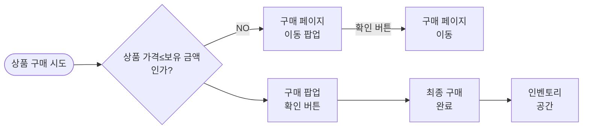
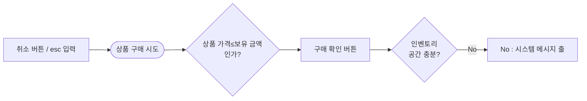

# PK_아이템 시스템 / 재화

## 1. 정의
[PK_아이템 시스템 / 재화]
## 1. 정의

(1) 아이템 구매/판매/제작 및 각종 컨텐츠 및 기능 이용 시 교환되는 재화 단위를 의미

(2) 크게 "유료 재화"와 "무료 재화"로 구분
- ✓ 유료 재화 = 현금 결제로만 구매 가능

(3) 일부의 경우, 재화 간 교환도 가능
- ✓ Ex. 유료 재화 100개 <-> 무료 재화 100,000개

---

## 2. 세부 정보
[PK_아이템 시스템 / 재화]
## 2. 세부 정보

### ① 유료 재화

**1) 정의**
일반적으로 현금으로만 구매할 수 있는 재화
계정 귀속

**2) 최대 스택수**
999,999

**3) 로직**

> **[구매 페이지 이동 팝업] 주석**: 취소 버튼 / esc 입력
> **[구매 팝업 확인 버튼] 주석**: 취소 버튼 / esc 입력

---

**문서 상단 정보:**
- 계정 귀속
- 최대 스택수: 999,999
- [UI] → 구매 페이지 이동 팝업

> **[구매 페이지 이동 팝업] 관련**: 취소 버튼 / esc 입력 시 팝업 닫힘
> **[구매 팝업 확인 버튼] 관련**: 취소 버튼 / esc 입력 시 팝업 닫힘

---

**[UI]**
→ 구매 페이지 이동 팝업

- 검정 배경의 팝업창
- 상단: "안내" 타이틀
- 본문: "재화가 부족합니다. 구매 화면으로 이동하시겠습니까?"
- 하단 버튼 영역 (버튼 텍스트 미표시 상태)

## OOXML 원본 텍스트 (OCR 보정, 셀 위치 포함)
[PK_아이템 시스템 / 재화]
## OOXML 원본 텍스트 (OCR 보정, 셀 위치 포함)

R1: C2:▶ 재화
R3: C2:1. 정의
R4: C3:(1) 아이템 구매/판매/제작 및 각종 컨텐츠 및 기능 이용 시 교환되는 재화 단위를 의미
R6: C3:(2) 크게 "유료 재화"와 "무료 재화"로 구분
R7: C4:ü 유료 재화 = 현금 결제로만 구매 가능
R9: C3:(3) 일부의 경우, 재화 간 교환도 가능
R10: C4:ü Ex. 유료 재화 100개 <-> 무료 재화 100,000개
R14: C2:2. 세부 정보
R16: C4:① 유료 재화
R17: C5:1) 정의
R18: C5:일반적으로 현금으로만 구매할 수 있는 재화
R19: C5:계정 귀속
R21: C5:2) 최대 스택수
R22: C5:999999
R24: C5:3) 로직
R41: C5:[UI]
R42: C5:→ 구매 페이지 이동 팝업
R53: C5:4) 주요 사용처
R54: C5:→ 거래소에서 아이템 구매/판매 시 사용
R55: C5:→ BM 상점 내 일부 상품 구매 시 사용
R56: C5:ü Ex. 유료 패키지 / 유료 액세서리 등
R57: C5:ü 일부 상품은 현금으로만 구매 가능
R58: C5:→ 각종 컨텐츠 확장 / 강화 / 이용 시 사용
R59: C5:ü Ex. 인벤토리 최대 슬롯 확장 / 특정 던전 입장료 등
R60: C5:→ 일부 컨텐츠의 경우, 유료/무료 재화 중 선택하여 사용 가능
R61: C5:ü Ex. 사망 패널티 복구 등
R63: C5:5) 주요 획득처
R64: C5:→ BM 상점에서 관련 상품을 현금 구매
R65: C5:→ 거래소에서 물건 판매 성공
R66: C5:ü 일부 수수료 발생 (Ex. 판매금의 5%), 이를 제외한 금액 실제 획득
R68: C5:6) 보관 방법
R69: C5:→ 획득 시마다 즉시 HUD 중앙 상단 UI에 더해짐
R70: C5:→ 최대 스택수 초과분 획득 시 시스템 메시지 출력과 함께 획득 불가
R71: C5:출력 조건 | C9:시스템 메시지
R72: C5:현재 스택수+획득 스택수 > 최대 스택수 | C9:더 이상 획득할 수 없습니다.
R73: C5:→ 별도 인벤토리 슬롯을 차지 X
R74: C5:ü 자세한 사항은 "PK_HUD 시스템.xlsx" 참고
R89: C6:[해당 부분 확대] | C12:[HUD 화면]
R91: C5:7) 아이콘 예시
R92: C5:→ 일반적인 디자인인 다이아몬드 형태
R93: C5:ü 게임 컨셉에 맞게 캐주얼한 느낌이 아닌 실사 느낌이 들도록 제작 필요
R94: C5:예시1 | C7:예시2
R104: C4:② 무료 재화
R105: C5:1) 정의
R106: C5:일반적으로 플레이를 통해 획득할 수 있는 재화
R107: C5:캐릭터 귀속
R109: C5:2) 최대 스택수
R110: C5:9999999999
R112: C5:3) 로직
R122: C5:ü 시스템 메시지 정보는 "PK_인벤토리 시스템.xlsx" - "③ 인벤토리_슬롯" 부분 참조
R125: C5:4) 주요 사용처
R126: C5:→ NPC 상점 아이템 구매/판매 시 사용
R127: C5:→ BM 상점 내 일부 상품 구매 시 사용
R128: C5:ü Ex. 일일 구매 가능한 뽑기권 / 강화 주문서 등
R129: C5:→ 각종 컨텐츠 강화 / 이용 시 사용
R130: C5:ü Ex. 스킬 강화 수수료 / 변신 합성 시 수수료 등
R131: C5:→ 일부 컨텐츠의 경우, 유료/무료 재화 중 선택하여 사용 가능
R132: C5:ü Ex. 사망 패널티 복구 등
R134: C5:5) 주요 획득처
R135: C5:→ 몬스터 처치
R136: C5:→ 퀘스트 완료 보상
R137: C5:ü 일부 수수료 발생 (Ex. 판매금의 5%), 이를 제외한 금액 실제 획득
R139: C5:6) 보관 방법
R140: C5:→ 유료 재화와 동일
R142: C5:7) 아이콘 예시
R143: C5:→ 일반적인 디자인인 코인/금화 형태
R144: C5:ü 게임 컨셉에 맞게 캐주얼한 느낌이 아닌 실사 느낌이 들도록 제작 필요
R145: C5:예시1 | C7:예시2

## [UI] 구매 페이지 이동 팝업
[PK_아이템 시스템 / 재화]
## [UI] 구매 페이지 이동 팝업

- 검정 배경 팝업창
- 상단: "안내" 타이틀
- 본문: "재화가 부족합니다. 구매 화면으로 이동하시겠습니까?"
- 부족 금액: 💎 3,000
- 하단 버튼: [취소] [확인]

---

### 4) 주요 사용처
→ 거래소에서 아이템 구매/판매 시 사용
→ BM 상점 내 일부 상품 구매 시 사용
  - ✓ Ex. 유료 패키지 / 유료 액세서리 등
  - ✓ 일부 상품은 현금으로만 구매 가능
→ 각종 컨텐츠 확장 / 강화 / 이용 시 사용
  - ✓ Ex. 인벤토리 최대 슬롯 확장 / 특정 던전 입장료 등
→ 일부 컨텐츠의 경우, 유료/무료 재화 중 선택하여 사용 가능
  - ✓ Ex. 사망 패널티 복구 등

### 5) 주요 획득처
→ BM 상점에서 관련 상품을 현금 구매
→ 거래소에서 물건 판매 성공
  - ✓ 일부 수수료 발생 (Ex. 판매금의 5%), 이를 제외한 금액 실제 획득

### 6) 보관 방법
→ 획득 시마다 즉시 HUD 중앙 상단 UI에 더해짐
→ 최대 스택수 초과분 획득 시 시스템 메시지 출력과 함께 획득 불가

| 출력 조건 | 시스템 메시지 |
|-----------|---------------|
| 현재 스택수+획득 스택수 > 최대 스택수 | 더 이상 획득할 수 없습니다. |

→ 별도 인벤토리 슬롯을 차지 X
  - ✓ 자세한 사항은 "PK_HUD 시스템.xlsx" 참고

- 좌측 상단: 💎 999,999 (다이아몬드)
- 우측 상단: 🪙 9,999,999,999 (골드)
- **계정 귀속** 영역:
  - ○ 명칭 999,999,999
  - ○ 명칭 999,999,999
  - ○ 명칭 999,999,999
- **캐릭터 귀속** 영역:
  - ○ 명칭 999,999,999
  - ○ 명칭 999,999,999
  - ○ 명칭 999,999,999

- 우측 상단에 재화 표시 영역
- 💎 999,999 | 🪙 9,999,999,999
- 캐릭터 실루엣이 보이는 전체 게임 화면

---

### 7) 아이콘 예시
→ 일반적인 디자인인 다이아몬드 형태
  - ✓ 게임 컨셉에 맞게 캐주얼한 느낌이 아닌 실사 느낌이 들도록 제작 필요

| 예시1 | 예시2 |
|-------|-------|
| 검정 배경, 보라색/핑크색 그라데이션 다이아몬드 | 검정 배경, 파란색 실사풍 다이아몬드 |

---

## ② 무료 재화
[PK_아이템 시스템 / 재화]
## ② 무료 재화

일반적으로 플레이를 통해 획득할 수 있는 재화
캐릭터 귀속

#########
#########

※ 시스템에서 사기를

> ⚠️ 최대 스택수 하단의 텍스트가 이미지 경계에서 잘려 있음

> **[시스템 메시지] 주석**: 시스템 메시지 정보는 "PK_인벤토리 시스템.xlsx" - "③ 인벤토리_슬롯" 부분 참조

> **참고**: 이미지가 우측이 잘려있어 "No : 시스템 메시지 출" 노드의 전체 텍스트와 이후 플로우가 보이지 않습니다. 또한 마름모 노드들의 Yes 경로 일부가 이미지에서 확인되지 않습니다.

> ✔ 시스템 메시지 정보는 "PK_인벤토리 시스템.xlsx" - "③ 인벤토리_슬롯" 부분 참조

---

### 4) 주요 사용처
- → NPC 상점 아이템 구매/판매 시 사용
- → BM 상점 내 일부 상품 구매 시 사용
  - ✔ Ex. 일일 구매 가능한 뽑기권 / 강화 주문서 등
- → 각종 컨텐츠 강화 / 이용 시 사용
  - ✔ Ex. 스킬 강화 수수료 / 변신 합성 시 수수료 등
- → 일부 컨텐츠의 경우, 유료/무료 재화 중 선택하여 사용 가능
  - ✓ Ex. 사망 패널티 복구 등

### 5) 주요 획득처
- → 몬스터 처치
- → 퀘스트 완료 보상
- ✔ 일부 수수료 발생 (Ex. 판매금의 5%), 이를 제외한 금액 실제 획득

### 6) 보관 방법
- → 유료 재화와 동일

### 7) 아이콘 예시
- → 일반적인 디자인인 코인/금화 형태
- ✓ 게임 컨셉에 맞게 캐주얼한 느낌이 아닌 실사 느낌이 들도록 제작 필요

| 예시1 | 예시2 |
|:---:|:---:|
|  |  |

