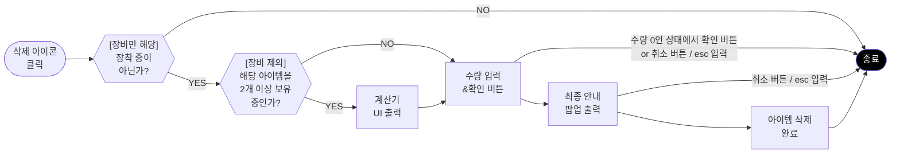

# PK_인벤토리 시스템 / 아이템창&슬롯

## (2) 슬롯 정보_공통
[PK_인벤토리 시스템 / 아이템창&슬롯]
## (2) 슬롯 정보_공통

2) 슬롯 정보 간 출력 우선 순위
- ✓ 장비 : 쿨타임 정보 > 클릭시 "장착"/"해제" 출력 > 기간제 아이템 잔여 일수
- ✓ 소모품 : 쿨타임 정보 > 클릭 시 "사용" 출력 > 기간제 아이템 잔여 일수
- ✓ 기타 : 기간제 아이템 잔여 일수

---

### 3) 아이템 클릭 시 각 상황별 규칙

| 구분 | 상태 | 효과 | 비고 | UI 예시 |
|:---:|:---:|------|------|:-------:|
| 빈슬롯 | - | 반응 없음 | - | - |
| | | 테두리 하이라이트 | - | |
| | | 슬롯 딤드 | - | |
| 공통 | 모든 아이템 | - | 1초 유지 후 자동 사라짐 컬러는 배경색과 동일 |  |
| | | | 슬롯 상단_아이템명 출력 | 아이템명 배경은 아이템명 길이에 따라 유동적으로 늘어나고 줄어듬 |
| | | | 가장 최근에 클릭한 아이템명만 출력 (동시에 최대 1개까지만 출력 가능) | |
| 장비 | 모든 아이템 | 착용 중 | 중앙+중앙 텍스트 출력 | "해제" |  |
| | | 미착용 | 중앙+중앙 텍스트 출력 | "장착" | |
| 장비 外 아이템 | 사용 가능 | - | 중앙+중앙 텍스트 출력 | "사용" | |
| | 사용 불가 | - | 추가 효과 X | - | |

---

### 4) 아이템 사용 시 각 상황별 규칙

✓ 수동 사용 / 자동 사용 구분 없이 모두 동일

| 구분 | 조건 | 효과 | 비고 | UI 예시 |
|:---:|:---:|------|------|:-------:|
| 공통 | 상자 타입 +스택수 2개 이상 | 즉시 사용되지 않고 화면 중앙에 계산기 UI 출력 | • 계산기 UI 수량 Default = 보유한 최대 스택 수 |  |
| 조건부 | 쿨타임 O | 아이콘 전체 짙게 점멸 + 시계 방향으로 남은 쿨타임 만큼 딤드 효과 점차 해제 | • 중앙에 잔여 쿨타임 출력 (Ex. 5,4,3,2,1) • 1초 미만일 때는 소수점 첫째 자리까지 표기 (Ex. 0.5, 0.1) • HUD 아이템 슬롯에 등록된 아이템의 경우, 연출 동기화 필요 |  |
| | | 쿨타임 종료 시 아이콘 전체 밝게 점멸 | • (예시_좌측) 인벤토리 • (예시_우측) HUD 슬롯 |  |

---

### 5) 기간제 아이템_잔여 기간 출력 방식

| 구분 | 조건 | 효과 | 비고 | UI 예시 |
|:---:|:---:|------|------|:-------:|
| 공통 | 기본 출력 | 아이콘 중앙 잔여 기간(일) 출력 | • 조건 : ExpireTime = 7일 미만부터 삭제 전까지 ✓ 6일 23시간 59분 59초부터 • 평시 : 잔여 기간의 '일'만 출력 (시/분/초는 미출력) ✓ 시인성 강조를 위해 다른 폰트와 다른 형태로 출력 ✓ Ex. ⓘ 6일 23시간 59분 후 삭제 |  |

---

## (3) 아이템 정보
[PK_인벤토리 시스템 / 아이템창&슬롯]
## (3) 아이템 정보

### 아이템 정보 UI 구성

### TextKey 정보

| Name | 내용 |
|------|------|
| Weapon | 무기 |
| Armor | 방어구 |
| Accessory | 액세서리 |
| Consume | 소모품 |
| Material | 재료 |
| CanStorage | 창고 이동 |
| DeathDrop | 사망 시 드랍 |

## 2. 장비 비교 기능
[PK_인벤토리 시스템 / 아이템창&슬롯]
## 2. 장비 비교 기능

### (1) 목적&역할
→ 획득한 장비와 장착 중인 장비간 가치 판단을 용이하게 하기 위한 유저 편의 기능

### (2) 동작 조건

**[출력]**
→ 인벤토리 내의 아이템 선택 시 다음의 조건을 모두 만족하는 경우
- ✓ 현재 착용 중인 장비와 동일 슬롯 장비
- ✓ 이때, 해당 장비의 EquipParts가 해당 캐릭터가 착용할 수 있는 경우만 출력

**[미출력]**
→ 인벤토리 내의 아이템 선택 시 다음의 조건 중 1개 이상 만족하는 경우
- ✓ 해당 캐릭터가 착용할 수 없는 EquipParts 의 장비일 경우
- ✓ 현재 착용 중인 장비일 경우

### (3) UI 규칙

→ HUD 좌측 끝에 착용 중인 아이템 정보창이 출력되는 형태

**— UI 닫기 규칙**
- ✓ 선택한 아이템 정보창 닫기 = 선택한 정보창, 착용 중인 정보창 **모두 닫힘**
- ✓ 착용 중인 아이템 정보창 닫기 = 해당 UI만 닫힘 / 선택한 아이템 정보창은 안 닫힘
- ✓ 인벤토리 UI 닫기 = 위의 정보창 2종 및 인벤토리 UI 모두 닫힘

**— 착용 중인 장비 툴팁 규칙**
- ✓ 강화를 제외하고 분해 / 거래소 / 장비 비교 / 버리기 아이콘 비활성화
- ✓ 그 외의 아이콘은 각각의 기능 규칙을 따름

**— 선택 중인 장비 툴팁 규칙**
- ✓ 장착 중인 장비와 비교하여 다음과 같은 규칙으로 관련 값 출력

| 스탯 종류 | 상태 | 표기 |
|---------|------|------|
| 동일 스탯 | 착용 장비보다 큰 경우 | "+n" |
| 동일 스탯 | 착용 장비보다 작은 경우 | "-n" |
| 동일 스탯 | 착용 장비와 동일한 경우 | "-" |
| 다른 스탯 | 착용 장비에 없는 스탯 | "추가" |
| 다른 스탯 | 착용 장비에 있는 스탯 | "제외" |

- ✓ 출력 위치는 각 해당 스탯 우측 끝
- ✓ "제외"에 해당되는 스탯은 최하단에 출력되며 장착 중인 장비 툴팁에 명시된 순서대로 출력

**좌측 정보창 (착용 중인 장비):**
- 아이템이름아이템이름 / 아이템이름아이템이름아이템이름
- [클래스]
- (p.lv%)
- 무기최소공격력+11 → +2
- 무기최대공격력+12 → +3
- 근거리 저항력 +6
- 추가 피해 +1

**우측 정보창 (선택한 장비):**
- 아이템이름아이템이름아이템이름 / 아이템이름아이템이름아이템이름
- [클래스]
- (p.lv%)
- 무기최소공격력+12 → +2
- 무기최대공격력+11 → +7
- 근거리 저항력 +5
- 근거리 명중 +1
- 추가 피해 +1 (빨간색으로 "제외" 표시)

- 빨간 화살표가 우측 정보창의 "제외" 항목을 가리키며, 좌측 테이블의 "제외" 규칙과 연결됨

---

## 3. 아이템 삭제 기능
[PK_인벤토리 시스템 / 아이템창&슬롯]
## 3. 아이템 삭제 기능

### (1) 목적&역할
→ 유저 기호에 따라 불필요한 아이템을 삭제하여 인벤토리 공간을 확보할 수 있도록 하는 유저 편의 기능

### (2) 아이템 버리기 버튼 활성화 조건
→ 아이템 테이블에서 해당 칼럼값이 TRUE인 아이템

### (3) 삭제 플로우

> **문서 제목**: 3. 아이템 삭제 기능

> **(1) 목적&역할**: 유저 기호에 따라 불필요한 아이템을 삭제하여 인벤토리 공간을 확보할 수 있도록 하는 유저 편의 기능

> **(2) 아이템 버리기 버튼 활성화 조건**: 아이템 테이블에서 해당 컬럼값이 TRUE인 아이템

> **(4) 삭제 불가 규칙**:
> - Case.1 장착 중인 장비
> - Case.2 삭제가 불가능한 아이템 (Item 테이블에서 CanDelete가 FALSE인 경우)
> - Case.3 잠금 기능이 활성화 중인 아이템

> **분기 조건 주석**: "NO" 경로 및 "취소 버튼 / esc 입력" 경로는 모두 동일한 종료점(수량 0인 상태에서 확인 버튼 or 취소 버튼 / esc 입력)으로 연결

---

- **Case.1** 장착 중인 장비
- **Case.2** 삭제가 불가능한 아이템 (Item 테이블에서 CanDelete가 FALSE 인 경우)
- **Case.3** 잠금 기능이 활성화 중인 아이템

---

### (5) UI 정보

**→ 문장 규칙 (수량 1개)**
- ✔ "아이템명" 아이템을 삭제하시겠습니까?
- 삭제한 아이템은 복구가 불가합니다.

**→ 문장 규칙 (수량 2개 이상)**
- ✔ "아이템명" 아이템 "n"개를 삭제하시겠습니까?
- 삭제한 아이템은 복구가 불가합니다.

**→ 계산기 UI는 아이템 삭제 외에도 수량을 입력하는 UI가 필요할 때 공용으로 사용**
- ✔ 계산기의 최초값은 0 이며, 최댓값은 해당 아이템의 최대 수량을 넘지 않음

**→ 계산기 출력시 수량 Default 값은 1**
- ✔ 보유 스택 수가 2개 이상인 아이템이어도 Default값은 1

---

## 4. 잠금 기능
[PK_인벤토리 시스템 / 아이템창&슬롯]
## 4. 잠금 기능

→ 임의의 아이템이 판매/분해 등의 이유로 원치 않게 소실되는 것을 방지하기 위한 유저 편의 기능
→ 따라서, 수동 사용 / 자동 사용 모두 가능하며 그 외의 기능을 제한

### (2) 잠금 설정 / 잠금 해제 방법
→ 임의의 아이템의 아이템 정보창에서 잠금 UI (자물쇠 마크) 클릭 시 "잠금 설정 ↔ 잠금 해제" 전환

### (3) 잠금 상태 규칙
→ 잠금 상태인 아이템은 다음의 규칙 적용

| 판매 | 분해 | 삭제 | 추후 각 기능 추가 시 삭제 필요 | 아이템 사용 |
|------|------|------|-------------------------------|-------------|
| 불가 | 불가 | 불가 | [?...?] | 가능 |

- ✔ "판매 / 창고 이동" 기능 이용 시 잠금 상태 아이템은 각 UI 목록에서 비활성화 상태로 출력
- ✔ 아이템 정보창에서 "강화 / 거래소 등록 / 분해 / 삭제" 버튼 비활성화 처리

### (4) 기타
→ 자동 사용 기능이 On인 소모품을 잠금 설정 or 해제 하여도 자동 사용 기능이 Off 되지 않음
→ 장착 중인 장비를 잠금 설정 or 해제 하여도 장착이 해제되거나 하지 않음

### (5) UI
→ 잠금 해제 상태가 Default
→ CanLock 컬럼 = TRUE 인 경우 아이콘 출력
- ✔ 잠금 해제 상태 = "자물쇠" 마크 비활성화 🔓 ←

- ✔ 잠금 상태 = "자물쇠" 마크 활성화

- 좌측: 잠금 해제 상태 - 아이템 정보창 상단에 비활성화된 자물쇠 아이콘
- 우측: 잠금 상태 - 아이템 정보창 상단에 활성화된 자물쇠 아이콘 (🔒)
- 양방향 화살표(↔)로 두 상태 간 전환 표시
- 아이템 정보창 내용:
  - 아이템명: 아이템이름아이템이름 (999개)
  - [효과]: 근거리 영웅 +1, 원거리 영웅 +1
  - [지속 시간]: 30분
  - [재사용 대기 시간]: 10초
  - [설명]: 일정 시간 동안 능력치가 증가합니다.
- 하단 주석 박스: "잠금 설정/해제 상태에 따라 관련 기능 아이콘도 함께 활성화/비활성화 상태로 전환"

---

## 5. 귀속 기능
[PK_인벤토리 시스템 / 아이템창&슬롯]
## 5. 귀속 기능

→ 특정 아이템 공급 시 거래 가능한 동일 아이템과의 가치 분산을 위해 "귀속", "캐릭터 귀속" 기능 제공

### (2) 종류 및 의미

**알파2 기준, 개발하지 않음**
**추후 거래소 및 창고 시스템 개발 후 확인 필요**

| 구분 | 거래소 | 창고 보관 | 출력 방식 | 출력 조건 |
|------|--------|-----------|-----------|-----------|
| 캐릭터 귀속 | 불가 | 불가 | - | 모두 FALSE 인 경우 자동 출력 |
| 귀속 | 불가 | 불가 | 아이템명 (귀속) | Item 테이블 - "CanAuction" 컬럼이 FALSE 인 경우 자동 출력 |

→ "귀속"은 기능적으로 계정 귀속과 동일한 의미
→ 창고는 기본적으로 동일 계정 = 동일 서버 내의 캐릭터간 공유한다는 전제
- ✔ 자세한 사항은 "PK_창고 시스템.xlsx" 참조

---

## 6. 아이템 자동 사용 기능
[PK_인벤토리 시스템 / 아이템창&슬롯]
## 6. 아이템 자동 사용 기능

→ HUD 아이템 슬롯 자동 사용 기능을 인벤토리에서도 제어할 수 있도록 하는 편의 기능
→ HUD 아이템 슬롯에 올려놓지 않아도 자동 사용 기능을 제어할 수 있도록 하기 위함
- ✔ 참고 문서 : PK_HUD 시스템.xlsx - "HUD 전투" 시트 - "HUD 슬롯 자동 사용 관련 컬럼 추가?"

### (2) 동작 조건 및 방법
→ ItemConsumeClass - "CanAutoUse"=TRUE 인 아이템일 경우, 해당 버튼 활성화
→ 자동 사용 버튼이 활성화 상태이 경우, 클릭할 때마다 "사용 중" 상태 ↔ "활성화" 상태 전환 (토글 방식)

| 구분 | 자동 사용 | 동작 여부 |
|------|-----------|-----------|
| 사용 전 | [아이콘: 비활성 자동사용] | 아래의 액션 시 동작 / 기본값 (Default) 1. "사용 중" 상태에서 클릭 2. "사용 중" 상태에서 HUD 자동 사용 기능 해제 |
| 사용 중 | [아이콘: 활성 자동사용] | 아래의 액션 시 동작 1. "활성화" 상태에서 클릭 2. "활성화" 상태에서 HUD 자동 사용 기능 사용 |

### (3) HUD 슬롯과 연동
→ "사용 중" 상태는 HUD 아이템 슬롯 - 자동 사용 기능과 실시간 동기화

- 좌측: 인벤토리 아이템 정보창 (자동 사용 버튼 활성화 상태)
- 우측: HUD 전투 슬롯 영역 - 상단에 "배틀 모드에서만 등록/해제/정렬/사용이 가능합니다" 경고 메시지
- HUD 슬롯에 아이템들이 배치되어 있으며, 자동 사용 기능과 연동됨을 표시

- 게임 화면 좌측: 캐릭터 및 인벤토리 UI
- 우측: 인벤토리 창 (아이템 그리드)
- 숫자 마커 설명:
  - ① 상단 빨간 점선 영역: "모두 사용 시, 자동 사용 해제 버튼" 영역
  - ② 좌측: "자동 사용 버튼" (아이템 정보창 내)
  - ③ 하단 HUD 슬롯: "HUD_아이템 슬롯"
  - ④ 인벤토리 내 아이템: "인벤토리_아이템 슬롯"

| 번호 | 이름 | Default | 조작 | | 표현 | | 비고 |
|------|------|---------|------|------|------|------|------|
| | | | 사용 On | 사용 Off | 사용 On | 사용 Off | |
| ① | 모두 사용 시, 자동 사용 해제 버튼 | "끔" 상태 | 끔 상태에서 클릭 | 켬 상태에서 클릭 | [아이콘: 켬] | [아이콘: 끔] | "CanAutoUse"=TRUE 일 때만 출력 |
| ② | 자동 사용 버튼 | "Off" 상태 | 사용 Off 상태에서 클릭 | 사용 On 상태에서 클릭 | 아이콘 테두리 FX 출력 Ex. HUD 물약 자동 사용 FX | 아이템 테두리 FX 미출력 | "CanAutoUse"=TRUE 일 때만 출력 |
| ③ | HUD_아이템 슬롯 | 비활성화 | 사용 Off 상태에서 아래로 드래그 | 사용 On 상태에서 슬롯 위로 드래그 | 슬롯이 살짝 아래로 내려가며 테두리 FX 출력 | 슬롯이 원위치로 올라오며 테두리 FX 미출력 | - |
| ④ | 인벤토리_아이템 슬롯 | - | 직접 조작 불가 자동 사용 기능 On, Off에 따라 테두리 FX 출력 여부만 동작 | | HUD 아이템 테두리 FX와 동일 [아이콘: 아이템 슬롯 with 9,999] | 테두리 FX 미출력 | - |

---

### (4) 인벤토리_자동 사용 아이템 탭
→ 소모품 아이템 중 자동 사용이 가능한 아이템만 필터링
→ 리스팅 규칙:
  1) 자동 사용이 가능한 아이템 (ItemConsumeClass - "CanAutoUse"=TRUE)
  2-1) 인벤토리 내에 보유 중인 아이템 → 미보유 아이템
  2-2) 보유 중인 아이템 = 인벤토리 배치 순
  ✓ 인벤토리 배치 순서 = 좌측 상단부터 우측 하단 순
  2-3) 미보유 아이템 = 수량이 0이 먼저된 순
  ✓ 단, 미보유 상태에서 자동 사용 기능을 Off 할 경우 동일 아이템이 다시 인벤토리에 들어오기 전까진 인벤토리 내에서 미출력
→ 그 외의 규칙은 모두 기존 인벤토리 슬롯 규칙을 따름

**UI 구성 설명:**
- 좌측: 캐릭터 정보 패널 (버프 아이콘 목록 포함)
  - 버프 아이콘에 15.0% 수치들 표시
  - "일정 시간 동안 획득 효율 증가와 획득적용 활성"
  - "전투 버프로만 마리"
  - 하단 아이콘: 장비, 설정 등
  - ③ 표시: 하단 좌측 영역
- 우측: "가방" 인벤토리 창
  - 상단: 자동 사용 아이템 리스팅 영역 (② 표시)
    - "사용" 표시된 초록색 물약 아이템들
  - 우측 필터 탭: All, 장비, 소모품, 기타 아이콘
  - 하단: 일반 인벤토리 그리드
    - ① 표시: 하단 우측 영역
    - Ⓐ 표시: 하단 우측 코너
  - 하단 정보: "25/100 ⊕" (인벤토리 용량)
  - 하단 버튼: 정렬, 필터 아이콘

| 번호 | 이름 | Default | 클릭 시 동작 |
|------|------|---------|-------------|
| ① | 자동 사용 아이템 탭 | "All" 탭 | 인벤토리 전체("All" 탭)에서 자동 사용이 가능한 아이템 + 현재 수량은 0개이지만 자동 사용 On 상태의 기존 아이템 필터링 |
| ② | 자동 사용 아이템 리스팅 | - | 각 아이템 클릭 시, 기존과 동일하게 좌측에 해당 툴팁 출력  상태별 아이콘은 아래 참조 |
| ③ | 아이템 툴팁 | 비활성화 | 기존 툴팁 규칙과 동일 |

---

### (5) 상황별 아이콘 연출

| 보유 중_자동 사용 Off | 보유 중_자동 사용 On | 보유 중_아이템 선택 | 미보유_자동 사용 Off |
|---------------------|---------------------|-------------------|---------------------|
|  |  |  |  |
| 테두리 효과 추가 | 테두리 효과 + 딤드 및 "사용" 출력 | 테두리 효과 + 아이콘 비활성화 + 수량 미표기 | |

**아이콘 상세:**
- 보유 중_자동 사용 Off: 초록 물약, 수량 "1" 표시
- 보유 중_자동 사용 On: 초록 물약 + 테두리 효과, 수량 "1" 표시
- 보유 중_아이템 선택: 딤드 처리 + "사용" 텍스트 오버레이
- 미보유_자동 사용 Off: 회색 처리된 물약 아이콘 (비활성화 상태)

---

### (6) 참고 사항
→ 추후 HUD 버프 아이콘쪽에서 아래 내용 추가 필요
✓ 사용 중인 버프 아이템 수량이 0이 되면 관련 버프 아이콘 HUD 알림 추가
✓ 이하 리니지2m 예시

## OOXML 원본 텍스트 (OCR 보정, 셀 위치 포함)
[PK_인벤토리 시스템 / 아이템창&슬롯]
## OOXML 원본 텍스트 (OCR 보정, 셀 위치 포함)

R1: C2:▶ 아이템창&슬롯
R3: C2:1. UI 정보
R4: C3:(1) 슬롯 정보_소모성 아이템 / 장비 아이템
R5: C5:소모성 아이템 | C7:재료 아이템 | C13:장비 아이템 | C15:퀘스트 아이템 | C17:기간제 아이템 | C19:자동 사용 중 아이템
R14: C5:[수량 1만 미만] | C7:[수량 1만 이상]
R21: C10:기본 출력
R22: C6:배경&아이콘 UI | C11:[역할]
 • 잔여 쿨타임, 사용/해제 텍스트, 잔여 사용 시간 등의 실시간 주요 정보들을 출력하는 공간

[규칙]
 • 배경 위에 고유 아이콘 이미지 출력
 • 배경색은 GradeEnum 에 따라 다름
   → PK_아이템 시스템.xlsx - "등급" 시트 참조
R23: C6:장착 여부 UI
퀘스트 아이템 식별 UI | C11:1. 장비 아이템
조건 : ItemTypeEnum = Equip
동작 : 아이템 아이콘 좌측 상단 "E" 마크 출력

2. 퀘스트 아이템
조건 : ItemTypeEnum = Quest
동작 : 아이템 아이콘 좌측 상단 "Q" 마크 출력
R24: C6:잠금 여부 UI | C11:"4. 잠금 기능" 참조
R25: C6:강화 / 수량 정보 | C11:[장비 아이템]
• +1 강화부터 출력 / +99 강화까지 표기
• +0 강화(기본)일 때는 미출력

[소모성 아이템]
• 1만 미만
   🡺 수량으로 표기 (최대 9,999)
• 1만 이상 ~10만 미만
   🡺 소수점 첫째+"만"으로 표기 (최대 9.9만)
• 10만 이상
   🡺 정수+"만"으로 표기 (최대 9,999만)
• 1만 이상일 때 구체적인 수량 확인
   🡺 툴팁에서 확인 가능
R26: C6:기간제 아이템 UI | C11:ExpireTime 컬럼에 값이 있는 경우 출력
R27: C6:자동 사용 중 UI | C11:아이콘 테두리에 HUD 자동 사용 중 효과와
동일한 FX 출력
R30: C3:(2) 슬롯 정보_공통
R31: C4:1) 슬롯 조작은 1회 클릭(선택)과 2회 클릭(사용)로 구분
R32: C5:ü 1회 클릭 = 해당 아이템이 선택된 상태 (아이템 장착 및 사용 X)
R33: C5:ü 2회 클릭 = 1회 클릭 상태에서 한 번 더 클릭한 경우를 의미 (아이템 장착 및 사용 O)
R34: C5:ü 기존 리니지M 등에 있던 슬롯을 홀드하는 조작은 사용성이 좋지 않아 사용하지 않음
R36: C4:2) 슬롯 정보 간 출력 우선 순위
R37: C5:ü 장비 : 쿨타임 정보 > 클릭시 "장착"/"해제" 출력 > 기간제 아이템 잔여 일수
R38: C5:ü 소모품 : 쿨타임 정보 > 클릭 시 "사용" 출력 > 기간제 아이템 잔여 일수
R39: C5:ü 기타 : 기간제 아이템 잔여 일수
R41: C4:3) 아이템 클릭 시 각 상황별 규칙
R42: C12:UI 예시
R43: C5:빈슬롯 | C8:반응 없음
R44: C6:모든 아이템 | C8:테두리 하이라이트
R45: C8:슬롯 딤드
R46: C8:슬롯 상단_아이템명 출력 | C10:1초 유지 후 자동 사라짐
컬러는 배경색과 동일

가장 최근에 클릭한 아이템명만 출력 (동시에 최대 1개까지만 출력 가능)
R48: C6:모든 아이템 | C7:착용 중 | C8:공통+중앙 텍스트 출력 | C10:"해제" | C12:"사용"
R49: C7:미착용 | C8:공통+중앙 텍스트 출력 | C10:"장착"
R50: C5:장비 외
아이템 | C6:사용 가능 | C8:공통+중앙 텍스트 출력 | C10:"사용"
R51: C6:사용 불가 | C8:추가 효과 X
R53: C4:4) 아이템 사용 시 각 상황별 규칙
R54: C5:ü 수동 사용 / 자동 사용 구분 없이 모두 동일
R55: C14:UI 예시
R56: C6:상자 타입
+스택수
2개 이상 | C7:즉시 사용되지 않고
화면 중앙에
계산기 UI 출력 | C9:• 계산기 UI 수량 Default = 보유한 최대 스택 수
R57: C5:조건부 | C6:쿨타임 O | C7:아이콘 전체 짧게 점멸
+ 시계 방향으로
남은 쿨타임 만큼
딤드 효과 점차 해제 | C9:• 중앙에 잔여 쿨타임 출력 (Ex. 5,4,3,2,1)
• 1초 미만일 때는 소수점 첫째 자리까지 표기 (Ex. 0.5, 0.1)
• HUD 아이템 슬롯에 등록된 아이템의 경우, 연출 동기화 필요
R62: C7:쿨타임 종료 시
아이콘 전체 짧게 점멸 | C9:• (예시_좌측) 인벤토리
• (예시_우측) HUD 슬롯
R67: C4:5) 기간제 아이템_잔여 기간 출력 방식
R68: C14:UI 예시
R69: C6:기본 출력 | C7:아이콘 중앙에
잔여 기간(일) 출력 | C9:• 조건 : ExpireTime = 7일 미만부터 삭제 전까지
   ✔ 6일 23시간 59분 59초부터
• 방식 : 잔여 기간의 "일"만 출력 (시/분/초는 미출력)
   ✔ 시인성 강조를 위해 다른 폰트와 다른 형태로 출력
   ✔ Ex.       6일 23시간 59분 후 삭제
R72: C3:(3) 아이템 정보
R74: C5:아이템 정보 | C10:화면 전체 이미지 예시
R98: C20:TextKey 정보
R99: C10:기본 출력 | C11:조작 가능 | C16:아이콘 예시 | C20:Name
R100: C12:아이템창 닫기
R101: C6:아이템 속성 정보 | C12:[역할]
 • 해당 아이템의 기본 정보 안내

[출력 순서]
 • 좌→우 기준
 • 무기 / 방어구 / 액세서리 / 소모품 / 재료
   / 창고 이동 / 사망 시 드랍
 • 해당되는 아이콘은 활성화 처리
 • 해당되지 않는 아이콘은 비활성화 처리
 • 각 아이콘 클릭 시 관련 설명 일시적으로 출력 | C16:[무기] [방어구] [액세서리]     [소모품]     [재료]

[창고 이동]   [사망 시 드랍]

* 각각 활성화 / 비활성화 각각 1개씩 제작 필요 | C20:Weapon
Armor
Accessory
Consume
Material
CanStorage
DeathDrop | C23:무기
방어구
액세서리
소모품
재료
창고 이동
사망 시 드랍
R102: C6:아이템 세부 정보 | C8:스크롤 | C12:[역할]
 • 해당 아이템의 효과, 지속 시간 등의 모든 정보

[규칙]
 • 출력 항목 및 순서
   1) 아이템 삭제까지 남은 시간
    ✔ ExpireTime 에 값이 있는 경우 출력
    ✔ 분 단위로 실시간 변경
    ✔ 일시분 / 시분 / 분 방식으로 출력
    ✔ 1분 미만 = "0분"으로 표기
   2) 사용 가능 장비 심볼
    ✔ EquipParts 에 해당하는 심볼 출력
    ✔ CharacterClass -  IconResource 참조
   3) 사용 효과 (장비 효과 or 버프 효과)
    ✔ 장비 (ItemEquipClass)
      🡺 EffectStatName / EffectStatValue 참조
    ✔ 소모품 (ItemConsumeClass)
      🡺 연결된 BuffID의 EffectClass 참조
   4) 지속 시간
   ✔ 일시분초 방식으로 출력
    ✔ 소모품 (ItemConsumeClass)
      🡺 연결된 BuffID의 Duration 참조
   5) 재사용 대기 시간
    ✔ 일시분초 방식으로 출력
      🡺 각 테이블의 Cooltime 참조
   6) 아이템 설명
      🡺 각 테이블의 TextKeyDesc 참조

 • 출력할 정보가 없는 항목은 통째로 미출력
    ✔ Ex. 아이템 삭제 일시가 따로 없는 아이템의
       경우, 해당 항목명 or 아이콘도 미출력 처리
R103: C6:판매 정보 | C12:[역할]
 • 판매 가능 여부 및 판매가 정보 상시 제공

[규칙]
 • Case.1 판매 가능 아이템
   🡺 "판매 금액" 텍스트 + 화폐 아이콘 + 금액
 • Case.2 판매 불가 아이템
   🡺 "판매 불가" 텍스트만 출력 (붉은색 폰트)
R104: C6:아이템 기능 정보 | C12:[역할]
 • 아이템 관련 각종 기능 나열 및 숏컷 기능

[규칙]
 • 각 아이콘 클릭 시 해당 UI or 팝업 출력
 • 자동 사용 / 강화 / 거래소 / 버리기
   ✔ 강화 / 거래소 = 알파2 이후 개발
   ✔ 자동 사용 = "6. 아이템 자동 사용 기능" 참조
   ✔ 삭제 = "3. 아이템 삭제 기능" 참조
 • 사용 가능한 기능은 활성화 처리
 • 사용 불가능한 기능은 비활성화 처리
R105: C6:잠금 기능 | C12:[역할]
 • 아이템 사용 외의 대부분의 기능 제한
 • 유저가 실수로 처분하는 것 방지

[규칙]
 • 잠금 기능 OFF = Default
 • 클릭 시마다 아이콘 활성화 D 비활성화 전환
 • "4. 잠금 기능" 참조 | C16:아이템은 기본적으로 잠금 기능 비활성화 상태
클릭할 때마다 활성화 D 비활성화 전환
활성화 시 = 
비활성화 시 =
R106: C6:슬롯 정보 | C12:[역할]
 • 각종 아이템 정보 출력
    ✔ 장착 여부
    ✔ 등급에 따른 배경 색상
    ✔ 강화 단계 or 보유 수량
    ✔ 잠금 버튼 및 잠금 여부

[규칙]
 • 잠금 기능
    ✔ 바로 위의 "⑥ 잠금 기능" 참조
 • 잠금 기능 외의 기능
    ✔ "(1) 슬롯 정보_소모성 아이템 / 장비 아이템" 참조
R107: C6:수량 정보 | C12:[역할]
 • 스택이 가능한 아이템의 현재 보유 수량 표시

[규칙]
 • 인벤토리에 출력되는 수량과 동일하게 출력
 • ItemType=Equip 인 경우, 미출력(공란)
R112: C2:2. 장비 비교 기능
R113: C3:(1) 목적&역할
R114: C4:→ 획득한 장비와 장착 중인 장비간 가치 판단을 용이하게 하기 위한 유저 편의 기능
R116: C3:(2) 동작 조건
R117: C4:[출력]
R118: C4:→ 인벤토리 내의 아이템 선택 시 다음의 조건을 모두 만족하는 경우
R119: C5:ü 현재 착용 중인 장비와 동일 슬롯 장비
R120: C5:ü 이때, 해당 장비의 EquipParts가 해당 캐릭터가 착용할 수 있는 경우만 출력
R122: C4:[미출력]
R123: C4:→ 인벤토리 내의 아이템 선택 시 다음의 조건 중 1개 이상 만족하는 경우
R124: C5:ü 해당 캐릭터가 착용할 수 없는 EquipParts 의 장비일 경우
R125: C5:ü 현재 착용 중인 장비일 경우
R127: C3:(3) UI 규칙
R128: C4:→ HUD 좌측 끝에 착용 중인 아이템 정보창이 출력되는 형태
R129: C4:→ UI 닫기 규칙
R130: C5:ü 선택한 아이템 정보창 닫기 = 선택한 정보창, 착용 중인 정보창 모두 닫힘
R131: C5:ü 착용 중인 아이템 정보창 닫기 = 해당 UI만 닫힘 / 선택한 아이템 정보창은 안 닫힘
R132: C5:ü 인벤토리 UI 닫기 = 위의 정보창 2종 및 인벤토리 UI 모두 닫힘
R133: C4:→ 장착 중인 장비 툴팁 규칙
R134: C5:ü 강화를 제외하고 분해 / 거래소 / 장비 비교 / 버리기 아이콘 비활성화
R135: C5:ü 그 외의 아이콘은 각각의 기능 규칙을 따름
R136: C4:→ 선택 중인 장비 툴팁 규칙
R137: C5:ü 장착 중인 장비와 비교하여 다음과 같은 규칙으로 관련 값 출력
R138: C5:스탯 종류
R139: C5:동일 스탯 | C6:착용 장비보다 큰 경우 | C8:"+n"
R140: C6:착용 장비보다 작은 경우 | C8:"-n"
R141: C6:착용 장비와 동일한 경우 | C8:"-"
R142: C5:다른 스탯 | C6:착용 장비에 없는 스탯 | C8:"추가"
R143: C6:착용 장비에 있는 스탯 | C8:"제외"
R144: C5:ü 출력 위치는 각 해당 스탯 우측 끝
R145: C5:ü "제외"에 해당되는 스탯은 최하단에 출력되며 장착 중인 장비 툴팁에 명시된 순서대로 출력
R169: C2:3. 아이템 삭제 기능
R170: C3:(1) 목적&역할
R171: C4:→ 유저 기호에 따라 불필요한 아이템을 삭제하여 인벤토리 공간을 확보할 수 있도록 하는 유저 편의 기능
R173: C3:(2) 아이템 버리기 버튼 활성화 조건
R174: C4:→ 아이템 테이블에서 해당 컬럼값이 TRUE인 아이템
R176: C3:(3) 삭제 플로우
R191: C3:(4) 삭제 불가 규칙
R192: C4:Case.1 장착 중인 장비
R193: C4:Case.2 삭제가 불가능한 아이템 (Item 테이블에서 CanDelete가 FALSE 인 경우)
R194: C4:Case.3 잠금 기능이 활성화 중인 아이템
R196: C3:(5) UI 정보
R197: C4:→ 문장 규칙 (수량 1개)
R198: C5:ü "아이템명" 아이템을 삭제하시겠습니까?
R199: C5:삭제한 아이템은 복구가 불가합니다.
R200: C4:→ 문장 규칙 (수량 2개 이상)
R201: C5:ü "아이템명" 아이템 "n"개를 삭제하시겠습니까?
R202: C5:삭제한 아이템은 복구가 불가합니다.
R203: C4:→ 계산기 UI는 아이템 삭제 외에도 수량을 입력하는 UI가 필요할 때 공용으로 사용
R204: C5:ü 계산기의 최솟값은 0 이며, 최댓값은 해당 아이템의 최대 수량을 넘지 않음
R205: C4:→ 계산기 출력시 수량 Default 값은 1
R206: C5:ü 보유 스택 수가 2개 이상인 아이템이어도 Default값은 1
R224: C9:[최종 안내 UI] | C18:[계산기 UI]
R228: C2:4. 잠금 기능
R229: C3:(1) 목적&역할
R230: C4:→ 임의의 아이템이 판매/분해 등의 이유로 원치 않게 소실되는 것을 방지하기 위한 유저 편의 기능
R231: C4:→ 따라서, 수동 사용 / 자동 사용 모두 가능하며 그 외의 기능을 제한
R233: C3:(2) 잠금 설정 / 잠금 해제 방법
R234: C4:→ 임의의 아이템의 아이템 정보창에서 잠금 UI (자물쇠 마크) 클릭 시 "잠금 설정 D 잠금 해제" 전환
R236: C3:(3) 잠금 상태 규칙
R237: C4:→ 잠금 상태인 아이템은 다음의 규칙 적용
R238: C9:거래소 등록 | C10:제작 재료 사용 | C11:창고 이동 | C12:아이템 사용
R240: C5:ü "판매 / 창고 이동" 기능 이용 시 잠금 상태 아이템은 각 UI 목록에서 비활성화 상태로 출력
R241: C5:ü 아이템 정보창에서 "강화 / 거래소 등록 / 분해 / 삭제" 버튼 비활성화 처리
R243: C3:(4) 기타
R244: C4:→ 자동 사용 기능이 On인 소모품을 잠금 설정 or 해제 하여도 자동 사용 기능이 Off 되지 않음
R245: C4:→ 장착 중인 장비를 잠금 설정 or 해제 하여도 장착이 해제되거나 하지 않음
R247: C3:(5) UI
R248: C4:→ 잠금 해제 상태가 Default
R249: C4:→ CanLock 컬럼 = TRUE 인 경우 아이콘 출력
R250: C5:✔ 잠금 해제 상태 = "자물쇠" 마크 비활성화
R251: C5:✔ 잠금 상태 = "자물쇠" 마크 활성화
R274: C2:5. 귀속 기능
R275: C3:(1) 목적&역할
R276: C4:→ 특정 아이템 공급 시 거래 가능한 동일 아이템과의 가치 분산을 위해 "귀속", "캐릭터 귀속" 기능 제공
R278: C3:(2) 종류 및 의미
R279: C6:거래소 | C7:창고 보관 | C8:출력 방식 | C10:출력 조건
R280: C5:캐릭터 귀속 | C8:아이템명 (캐릭터 귀속) | C10:Item 테이블 - "CanAuction", "CanStorage" 컬럼이 모두 FALSE 인 경우 자동 출력
R281: C8:아이템명 (귀속) | C10:Item 테이블 - "CanAuction" 컬럼이 FALSE 인 경우 자동 출력
R282: C4:→ "귀속"은 기능적으로 계정 귀속과 동일한 의미
R283: C4:→ 창고는 기본적으로 동일 계정 + 동일 서버 내의 캐릭터간 공유한다는 전제
R284: C5:ü 자세한 사항은 "PK_창고 시스템.xlsx" 참조
R289: C2:6. 아이템 자동 사용 기능
R290: C3:(1) 목적&역할
R291: C4:→ HUD 아이템 슬롯 자동 사용 기능을 인벤토리에서도 제어할 수 있도록 하는 편의 기능
R292: C4:→ HUD 아이템 슬롯에 올려놓지 않아도 자동 사용 기능을 제어할 수 있도록 하기 위함
R293: C5:✔ 참고 문서 : PK_HUD 시스템.xlsx - "HUD 전투" 시트 - "HUD 슬롯 자동 사용 관련 컬럼 추가"
R295: C3:(2) 동작 조건 및 방법
R296: C4:→ ItemConsumeClass - "CanAutoUse"=TRUE 인 아이템일 경우, 해당 버튼 활성화
R297: C4:→ 자동 사용 버튼이 활성화 상태이 경우, 클릭할 때마다 "사용 중" 상태 D "활성화" 상태 전환 (토글 방식)
R308: C3:(3) HUD 슬롯과 연동
R309: C4:→ "사용 중" 상태는 HUD 아이템 슬롯 - 자동 사용 기능과 실시간 동기화
R330: C8:Default | C9:사용 On | C12:사용 Off | C15:사용 On | C18:사용 Off
R331: C6:모두 사용 시,
자동 사용 해제 버튼 | C8:"끔"
상태 | C9:끔 상태에서 클릭 | C12:켬 상태에서 클릭 | C21:"CanAutoUse"=TRUE 일 때만 출력
R332: C6:자동 사용 버튼 | C8:"Off"
상태 | C9:사용 Off 상태에서 클릭 | C12:사용 On 상태에서 클릭 | C15:아이콘 테두리 FX 출력
Ex. HUD 물약 자동 사용 FX | C18:아이템 테두리 FX 미출력 | C21:"CanAutoUse"=TRUE 일 때만 출력
R333: C6:HUD_아이템 슬롯 | C8:비활성화 | C9:사용 Off 상태에서 아래로 드래그 | C12:사용 On 상태에서 슬롯 위로 드래그 | C15:슬롯이 살짝 아래로 내려가며
테두리 FX 출력 | C18:슬롯이 원위치로 올라오며
테두리 FX 미출력
R334: C6:인벤토리_아이템 슬롯 | C9:직접 조작 불가
자동 사용 기능 On, Off에 따라 테두리 FX 출력 여부만 동작 | C15:HUD 아이템 테두리 FX와 동일 | C18:테두리 FX 미출력
R336: C3:(4) 인벤토리_자동 사용 아이템 탭
R337: C4:→ 소모품 아이템 중 자동 사용이 가능한 아이템만 필터링
R338: C4:→ 리스팅 규칙
R339: C5:1) 자동 사용이 가능한 아이템 (ItemConsumeClass - "CanAutoUse"=TRUE)
R340: C5:2-1) 인벤토리 내에 보유 중인 아이템 → 미보유 아이템
R341: C5:2-2) 보유 중인 아이템 = 인벤토리 배치 순
R342: C5:ü 인벤토리 배치 순서 = 좌측 상단부터 우측 하단 순
R343: C5:2-3) 미보유 아이템 = 수량이 0이 먼저된 순
R344: C5:ü 단, 미보유 상태에서 자동 사용 기능을 Off 할 경우 동일 아이템이 다시 인벤토리에 들어오기 전까진 인벤토리 내에서 미출력
R345: C4:→ 그 외의 규칙은 모두 기존 인벤토리 슬롯 규칙을 따름
R367: C8:Default | C9:클릭 시 동작
R368: C6:자동 사용 아이템 탭 | C8:"All" 탭 | C9:인벤토리 전체("All" 탭)에서
자동 사용이 가능한 아이템 + 
현재 수량은 0개이지만 자동 사용 On 상태의 기존 아이템 필터링
R369: C6:자동 사용 아이템
리스팅 | C9:각 아이템 클릭 시, 기존과 동일하게
좌측에 해당 툴팁 출력

상태별 아이콘은 아래 참조
R370: C6:아이템 툴팁 | C8:비활성화 | C9:기존 툴팁 규칙과 동일
R373: C3:(5) 상황별 아이콘 연출
R374: C5:보유 중_자동 사용 Off | C7:보유 중_자동 사용 On | C9:보유 중_아이템 선택 | C11:미보유_자동 사용 Off
R389: C3:(6) 참고 사항
R390: C4:→ 추후 HUD 버프 아이콘쪽에서 아래 내용 추가 필요
R391: C5:ü 사용 중인 버프 아이템 수량이 0이 되면 관련 버프 아이콘 HUD 알림 추가
R392: C5:ü 이하 리니지2m 예시

## ▶ 아이템창&슬롯
[PK_인벤토리 시스템 / 아이템창&슬롯]
## ▶ 아이템창&슬롯

### 1. UI 정보

#### (1) 슬롯 정보 소모성 아이템 / 장비 아이템

****
- 소모성 아이템: 노란 원형 배경에 아이콘
- 재료 아이템: 노란 원형 배경에 아이콘
- 좌측 하단: 자물쇠 아이콘 (③)
- 하단 중앙: 수량 표시 "9,999" (④)
- [수량 1만 미만]: "9,999" 표기
- [수량 1만 이상]: "9,999만" 표기

****
- 상단: "가방" 타이틀, X 닫기 버튼
- 좌측: 카테고리 필터 (All, 검, 방패, 갑옷, 장신구, 기타 아이콘)
- 중앙: 아이템 그리드 슬롯 (다수의 빈 슬롯)
- 하단: "50 / 100" 슬롯 사용량, + 버튼
- 우하단: 정렬 아이콘, 휴지통 아이콘

****
- **장비 아이템**: "E" 마크 (좌측 상단 ①), 노란 테두리, 자물쇠 아이콘 (③), 강화 수치 "+7" (④)
- **퀘스트 아이템**: "Q" 마크 (좌측 상단), 녹색 계열
- **기간제 아이템**: 시계 아이콘 (⑤), 수량 "9,999"
- **자동 사용 중 아이템**: 회전 화살표 아이콘, 테두리 이펙트, 수량 "9,999" (⑥)

---

### UI 요소 상세 테이블

| 번호 | 이름 | 분류 | 기본 출력 | 설명 |
|:---:|------|------|:--------:|------|
| ① | 배경&아이콘 UI | 버튼 | O | **[역할]** • 잔여 쿨타임, 사용/해제 텍스트, 잔여 사용 시간 등의 실시간 주요 정보를 출력하는 공간  **[규칙]** • 배경 위에 고유 아이콘 이미지 출력 • 배경색은 GradeEnum 에 따라 다름 → PK_아이템 시스템.xlsx - "등급" 시트 참조 |
| ② | 장착 여부 UI 퀘스트 아이템 식별 UI | UI | X | **1. 장비 아이템** 조건 : ItemTypeEnum = Equip 동작 : 아이템 아이콘 좌측 상단 "E" 마크 출력  **2. 퀘스트 아이템** 조건 : ItemTypeEnum = Quest 동작 : 아이템 아이콘 좌측 상단 "Q" 마크 출력 |
| ③ | 잠금 여부 UI | UI | O | "4. 잠금 기능" 참조 |
| ④ | 강화 / 수량 정보 | UI | X | **[장비 아이템]** • +1 강화부터 출력 / +99 강화까지 표기 • +0 강화(기본)일 때는 미출력  **[소모성 아이템]** • 1만 미만 → 수량으로 표기 (최대 9,999) • 1만 이상 ~10만 미만 → 소수점 첫째+"만"으로 표기 (최대 9.9만) • 10만 이상 → 정수 + "만"으로 표기 (최대 9,999만) • 1만 이상일 때 구체적인 수량 확인 → 툴팁에서 확인 가능 |
| ⑤ | 기간제 아이템 UI | UI | O | ExpireTime 컬럼에 값이 있는 경우 출력 |
| ⑥ | 자동 사용 중 UI | UI | X | 아이콘 테두리에 HUD 자동 사용 중 효과와 동일한 FX 출력 |

---

### (2) 슬롯 정보 공통

1) 슬롯 조작은 1회 클릭(선택)과 2회 클릭(사용)로 구분
- ✓ 1회 클릭 = 해당 아이템이 선택된 상태 (아이템 장착 및 사용 X)
- ✓ 2회 클릭 = 1회 클릭 상태에서 한 번 더 클릭한 경우를 의미 (아이템 장착 및 사용 O)
- ✓ 기존 리니지M 등에 있던 슬롯을 홀드하는 조작은 사용성이 좋지 않아 사용하지 않음

2) 슬롯 정보 간 출력 우선 순위

## 아이템 정보 UI 상세 구성 요소
[PK_인벤토리 시스템 / 아이템창&슬롯]
## 아이템 정보 UI 상세 구성 요소

| 번호 | 이름 | 분류 | 기본 출력 | 조작 가능 | 설명 | 아이콘 예시 |
|------|------|------|----------|----------|------|------------|
| ③ | 아이템 세부 정보 | 스크롤 | O | O | **[역할]** • 해당 아이템의 효과, 지속 시간 등의 모든 정보  **[규칙]** • 출력 항목 및 순서 1) 아이템 삭제까지 남은 시간 　✓ ExpireTime 에 값이 있는 경우 출력 　✓ 분 단위로 실시간 변경 　✓ 일시간x 시분x / 분 방식으로 출력 　✓ "n분 미만 = 아이콘으로 표기" 2) 사용 가능 장비 심볼 　✓ EquipParts 에 해당하는 심볼 출력 　✓ CharacterClass → IconResource 참조 3) 사용 효과 (장비 효과 or 버프 효과) 　✓ 장비 (ItemEquipClass) 　→ EffectStatName / EffectStatValue 참조 　✓ 소모품 (ItemConsumeClass) 　→ 연결된 BuffID의 EffectClass 참조 4) 지속 시간 　✓ 일시분초 방식으로 출력 　✓ 소모품 (ItemConsumeClass) 　→ 연결된 BuffID의 Duration 참조 5) 재사용 대기 시간 　✓ 일시분초 방식으로 출력 　→ 각 테이블의 Cooltime 참조 6) 아이템 설명 　→ 각 테이블의 TextKeyDesc 참조  • 출력할 정보가 없는 항목은 통째로 미출력 　✓ Ex. 아이템 삭제 일시가 따로 없는 아이템의 경우, 해당 항목에 or 아이콘도 미출력 처리 | - |
| ④ | 판매 정보 | UI | O | X | **[역할]** • 판매 가능 여부 및 판매가 정보 상시 제공  **[규칙]** • Case 1 판매 가능 아이템 　→ "판매 금액" 텍스트 + 화폐 아이콘 + 금액 • Case 2 판매 불가 아이템 　→ "판매 불가" 텍스트만 출력 (붉은색 폰트) | - |
| ⑤ | 아이템 기능 정보 | 버튼 | O | O | **[역할]** • 아이템 관련 각종 기능 나열 및 숏컷 기능  **[규칙]** • 각 아이콘 클릭 시 해당 UI or 팝업 출력 • 자동 사용 / 강화 / 거래소 / 버리기 　✓ 강화 / 거래소 = 일람2 이후 개발 　✓ 자동 사용 → 6. 아이템 자동 사용 기능" 참조 　✓ 삭제 → "3. 아이템 삭제 기능" 참조 • 사용 가능한 기능은 활성화 처리 • 사용 불가능한 기능은 비활성화 처리 | [표: 구분/자동사용/강화/거래소/버리기] 비활성화: 🔘⬜⬜🗑️ 활성화: 🔘⬜⬜🗑️ 사용 후: 🔘 |
| ⑥ | 잠금 기능 | 버튼 | O | O | **[역할]** • 아이템 사용 외의 대부분의 기능 제한 • 유저가 실수로 처분하는 것 방지  **[규칙]** • 잠금 기능 OFF = Default • 클릭 시마다 아이콘 활성화 ↔ 비활성화 전환 • "4. 잠금 기능" 참조 | 아이템은 기본적으로 잠금 기능 비활성화 상태 클릭할 때마다 활성화 ↔ 비활성화 전환 활성화 시 = 🔒 비활성화 시 = 🔓 |
| ⑦ | 슬롯 정보 | UI | O | X | **[역할]** • 각종 아이템 정보 출력 　✓ 장착 여부 　✓ 등급에 따른 배경 색상 　✓ 강화 단계 or 보유 수량 　✓ 잠금 버튼 및 잠금 여부  **[규칙]** • 잠금 기능 　✓ 바로 위의 "⑥ 잠금 기능" 참조 • 잠금 기능 외의 기능 　✓ "(1) 슬롯 정보_소모성 아이템 / 장비 아이템" 참조 | - |
| ⑧ | 수량 정보 | UI | O | X | **[역할]** • 스택이 가능한 아이템의 현재 보유 수량 표시  **[규칙]** • 인벤토리에 출력되는 수량과 동일하게 출력 • ItemType=Equip 인 경우, 미출력(공란) | - |

---

