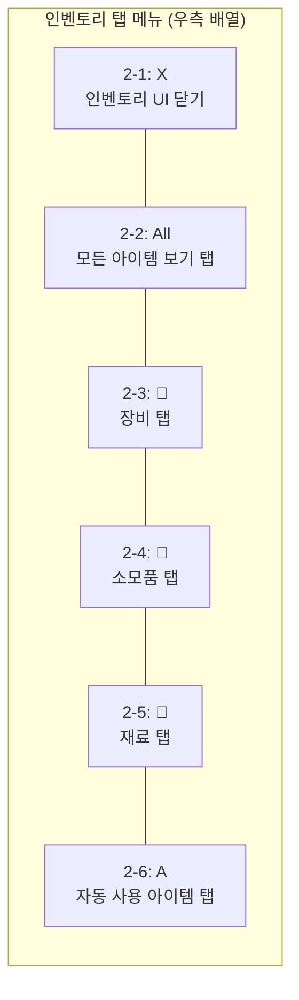
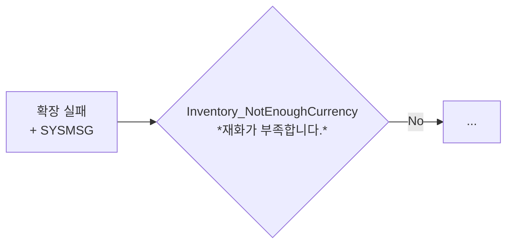
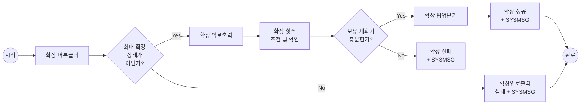

# PK_인벤토리 시스템 / 인벤토리

## 1. 개요
[PK_인벤토리 시스템 / 인벤토리]
## 1. 개요

- 인벤토리는 마이크로에서 장비와 기타 / 교환 / 우편 항목을 확인하는 슬롯
- 아이템 카드로 슬롯이 구성되어 있으며, 칸마다 유저가 입수한 아이템 또는 우편 리스트를 보여 줌으로써 아이콘으로 확인 가능
- 기본 슬롯의 확장은 불가하며 특별히 추가 슬롯 확장 시스템 등이 없음
- 버튼 하나 당 버튼 추가 클릭 시 모든 재화 등을 확인할 수 있도록 함

### 1) UI 정보

| 번호 | 명칭 | 기능 | 참고 |
|------|------|------|------|
| 1 | 인벤토리탭(장비) | 인벤토리(장비)이동 | 상위 문서 7.2.1 |
| 2 | 보유재화 슬롯 | 재화 확인창 이동 | 상위 문서 7.2.2 |
| 3 | 인벤토리탭(기타) | 인벤토리(기타) 이동 | 상위 문서 7.2.3 |
| 4 | 인벤토리탭(교환) | 인벤토리(교환) 이동 | 상위 문서 7.2.4 |
| 5 | 인벤토리탭(우편함) | 인벤토리(우편함) 이동 | 상위 문서 7.2.5 |
| 6 | 정렬버튼 | 정렬기능 | 상위 문서 7.2.6 |
| 7 | 필터 On/ Off | 필터링 ON/OFF | 상위 문서 7.2.6 |

---

## 10. 획득 정보 UI Default
[PK_인벤토리 시스템 / 인벤토리]
## 10. 획득 정보 UI Default

**[기본 설정]**
- Default = 기존 획득 리스트
- 기본적 아이템 종류 외 [?제외?] 후 대상 획득
- Default = [?미사용?] 및 신규
- 선택장비의 신규 및 능력치 정보 및 [?획득?]안내활성화유지적용
- 선택에 기존과 동일, 선택 정보 기록

---

## 2. 세부 정보
[PK_인벤토리 시스템 / 인벤토리]
## 2. 세부 정보

### 1) 장비 아이템
- 장비 슬롯에서는 획득한 장비 아이템을 확인
- 장비 슬롯은 총 **64칸**으로 구성 (가로 8칸 x 세로 8칸으로 한 줄에 8슬롯씩 총 8줄)
- 인벤토리에서 보이는 정보는 장착 중인 아이템인지 잠금 표시(왼쪽 하단), 개수(오른쪽 하단)
- 장비를 가지고 있지 않은 상태라면 '장비를 획득 후 인벤토리를 확인 하세요'라는 문구 노출

### (1) 장비필터

- 필터 버튼을 활성화 시 장비 아이템의 등급에 따라 필터링
- 원하는 필터를 중복으로 설정 가능
- 설정한 필터 등급에 따라 장비 슬롯의 정보가 노출(필터링 된 아이템만 노출)

### (2) 장비 아이템 정렬
- 정렬 버튼 클릭 시 유저가 보유 중인 장비 아이템이 정렬됨
  - 장비 부위 → 등급 → 획득순의 우선순위
  - 이 후 재정렬 시, 역순으로 장비 아이템 나열

### 2) 장비카드 정보
- 장비카드에서 확인할 수 있는 아이템 정보에 대해 기술합니다. 다만 상세 기능은 각 상위 문서 참조

| 번호 | 명칭 | 참고 |
|------|------|------|
| 1 | 아이템 아이콘 | |
| 2 | 강화 수치 (없을 시 미표기) | |
| 3 | 장착중인 아이템 표시 | |
| 4 | 잠금 표시 | |
| 5 | 등급 [테두리 색상으로 구분] | |
| 6 | 수량 [장비는 1개 고정] | |

### 3) 장비 카드 터치
- 장비 슬롯의 장비를 터치할 경우 '장비 상세 팝업' 노출
- 상세 팝업에서는 장비 정보와 판매 / 분해 / 강화 기능을 선택할 수 있음
  - 장착 시 기존 장착 중인 장비를 벗어 슬롯으로 이동
- 터치한 장비가 장착중인 아이템일 경우, '장비 장착 해제 팝업' 노출
  - 장착 중인 아이템 터치 시 장착 해제 + 잠금 기능을 제공
- 장비 판매 시 아이템 등급 및 수량에 따라 판매 재화 획득
- 잠금된 장비는 판매와 분해를 할 수 없음

### (1) 장비 장착 팝업

- 장비 장착 팝업에서는 해당 장비의 장착, 강화, 분해, 판매를 수행합니다.
- 잠금된 장비는 분해, 판매를 수행할 수 없습니다.

| 번호 | 명칭 | 기능 | 참고 |
|------|------|------|------|
| 1 | 장비 정보 | 장비 아이콘, 명칭, 등급표기(테두리 색상), 강화 수치, 잠금 해제 아이콘 노출 | |
| 2 | 능력치 정보 | 장비에 적용된 능력치 정보 | |
| 3 | 강화 재료정보 | 해당 장비의 강화에 필요한 재료 정보 표기, 장비 및 수량이 노출 | |
| 4 | 판매 | 판매 시 판매 재화 획득 (잠금 상태라면 비활성화) | |
| 5 | 분해 | 분해 시 분해 재화 획득 (잠금 상태라면 비활성화) | |
| 6 | 강화 | 강화 팝업으로 이동 | 문서이동: 강화 |
| 7 | 착용 | 착용 버튼 터치 시 캐릭터에게 장비 장착 | |
| 8 | 잠금 | 터치 시 잠금 설정 / 해제 | |

### (2) 장비 장착 해제 팝업

- 장비 장착 해제 팝업에서는 해당 장비의 장착 해제를 수행합니다.
- 또한 잠금 / 잠금해제 설정이 가능합니다.

| 번호 | 명칭 | 기능 | 참고 |
|------|------|------|------|
| 1 | 장비 정보 | 장비 아이콘, 명칭, 등급표기(테두리 색상), 강화 수치, 잠금 / 잠금 해제 아이콘 노출 | |
| 2 | 능력치 정보 | 장비에 적용된 능력치 정보 | |
| 3 | 강화 재료정보 | 해당 장비의 강화에 필요한 재료 정보 표기, 장비 및 수량이 노출 | |
| 4 | 장착 해제 | 장착 해제 터치 시 장비 해제 | |
| 5 | 잠금 | 터치 시 잠금 설정 / 해제 | |

### 4) 장비 카드 롱 터치
- 기본적으로 판매, 분해 기능에 진입하는 동작
  - 다중 선택 : 유저는 이 상태에서 원하는 장비를 여러 개 선택할 수 있음 (롱터치 전환 시, 선택 x)
  - 전체 선택 : 모든 장비가 선택되며, 취소 시 선택된 항목 해제
  - 적용 버튼 : 판매, 분해 팝업 노출
- 해당 기능에서는 [?잠금은?] 분해, 판매가 불가능 합니다.

### (1) 다중 선택 판매

- 아이템 카드 롱터치 시, 판매/분해 다중 선택 가능한 화면으로 전환됨

### (2) 장비 판매/분해

- 다중 선택된 아이템에 대해 판매 또는 분해 수행
- 판매 또는 분해 버튼을 누르면 최종 확인 팝업이 노출되며, 확인 시 재화 획득

| 번호 | 명칭 | 기능 | 참고 |
|------|------|------|------|
| 1 | 판매 | 판매 팝업으로 진입 | |
| 2 | 분해 | 분해 팝업으로 진입 | |

### 5) 장비 판매

- 선택된 장비를 판매합니다.
  - 잠금처리 된 장비의 경우, 다중 선택에서 선택이 불가능합니다.
  - 팝업 진입 시, 선택된 장비 정보 및 판매 획득 재화 정보를 확인할 수 있습니다.
  - 확인 버튼 터치 시, 선택된 장비들이 판매됩니다.

### 6) 장비 분해

- 선택된 장비를 분해합니다.
  - 잠금처리 된 장비의 경우, 다중 선택에서 선택이 불가능합니다.
  - 팝업 진입 시, 선택된 장비 정보 및 분해 획득 재화 정보를 확인할 수 있습니다.
  - 확인 버튼 터치 시, 선택된 장비들이 분해됩니다.

---

## 2. 컨텐츠 별 획득
[PK_인벤토리 시스템 / 인벤토리]
## 2. 컨텐츠 별 획득

### 1) 개요
- 컨텐츠마다 필요한 자원이 상이하므로, 자원 획득 시 컨텐츠를 따로 분류
- 컨텐츠마다 필요한 자원의 종류를 제공

### 2) 획득 UI
- 획득한 아이템을 확인할 수 있는 UI 통일
- 배경 이미지 : 각 컨텐츠 별로 이미지 상이
  - ex) 원정대(숲 배경) > 사냥터(밤 배경) > 광산(광산 배경)

- **바로 확인 토글 버튼**: 체크 시 개별 획득한 보상 팝업 노출X → 가방 획득 UI로 자동 합산하여 표기됨
  - 체크 해제 시, 개별 보상 확인 후 마지막에 합산된 획득 UI 띄움
- **바로 확인 토글 버튼 기본 설정 : On**

### 3) 일반 드랍 연출
- 드랍 아이템 확인 후 → 뽑기 연출 시작
- 드랍 확정 아이템의 등급이 가장 높은 연출 1회
  - ex) 희귀1 + 고급3 + 일반6 → 희귀 등급 연출
- 연출 skip 클릭 → 획득 UI 노출

> **[2-1] 설명**: 해당 버튼 클릭 or 단축키 "I" 입력 시, 인벤토리 UI 닫힘

> **[2-2] 설명**: 인벤토리에 획득한 모든 아이템 출력

> **[2-3] 설명**: 장비 탭 (Default)

> **[2-4] 설명**: 소모품 탭

> **[2-5] 설명**: 재료 탭

> **[2-6] 설명**: 자동 사용 아이템 탭

---

**참고**: 이 이미지는 프로세스 플로우차트가 아니라 **UI 컴포넌트 배치도/명세서**입니다. 빨간 점선은 각 UI 요소의 위치를 식별하기 위한 표시이며, 데이터나 프로세스의 흐름을 나타내지 않습니다.

### 4) 스페셜 드랍 연출
- 스페셜 드랍 아이템 확인 후 → 개별 연출
- 스페셜 드랍 아이템 : 전설 / 고대 장비, 영웅(캐릭터/사이드킥/탈것/펫)
- skip버튼 없음 (의도된 연출)

> **스페셜 드랍 아이템**: 전설 / 고대 장비, 영웅(캐릭터/사이드킥/탈것/펫)

---

## 3. 기타 기능
[PK_인벤토리 시스템 / 인벤토리]
## 3. 기타 기능

### 1) 상세보기
- 아이템 아이콘 클릭 시 상세보기 UI 노출
- 아이템의 상세 정보 확인
- 팝업으로 띄우며, 팝업 하나만 노출됨

### 2) 확장
- 현재 인벤토리 슬롯 최대치를 보유하고 있으면 [확장 불가] 안내 팝업 표시
- 현재 인벤토리 슬롯이 최대치가 아니면 [확장 구매 팝업] UI 노출

### 3) 판매 기능
- 장비에 한해 판매 기능 제공
- 판매 버튼 클릭 > 아이템 선택 > 판매 확인
- 일반 : 1회 복수 판매 불가, 고급 : 판매 시 1회 복수 선택 가능

| 등급 | 판매가 | 비고 |
|------|--------|------|
| 일반 | 100골드 | |
| 고급 | 500골드 | |
| 희귀 | - | 분해로만 가능 |
| 전설 | - | 분해로만 가능 |
| 고대 | - | 분해로만 가능 |

- 고급 이상 등급을 판매 시 경고 팝업 노출 후 판매 진행

---

## 3. 기타 슬롯
[PK_인벤토리 시스템 / 인벤토리]
## 3. 기타 슬롯

### 1) 기타 아이템
- 기타 슬롯에서는 장비 외의 기타 아이템을 확인
- 기타 슬롯은 총 **64칸**으로 구성 (가로 8칸 x 세로 8칸으로 한 줄에 8슬롯씩 총 8줄)
- 인벤토리에서 보이는 정보는 잠금 표시(왼쪽 하단), 개수(오른쪽 하단)
- 아이템을 가지고 있지 않은 상태라면 '기타 아이템 획득 후 인벤토리를 확인 하세요'라는 문구 노출

### (1) 기타 아이템 정렬
- 정렬 버튼 클릭 시 유저가 보유 중인 기타 아이템이 정렬됨
  - 종류 → 등급 → 획득순의 우선순위
  - 이 후 재정렬 시, 역순으로 기타 아이템 나열

### 2) 기타 카드 정보
- 기타 카드에서 확인할 수 있는 아이템 정보에 대해 기술합니다.

| 번호 | 명칭 | 참고 |
|------|------|------|
| 1 | 아이템 아이콘 | |
| 2 | 잠금 표시 | |
| 3 | 등급 [테두리 색상으로 구분] | |
| 4 | 수량 | |

### 3) 기타 카드 터치
- 기타 슬롯의 아이템을 터치할 경우 '아이템 상세 팝업' 노출
- 상세 팝업에서는 아이템 정보와 판매 / 사용 기능을 선택할 수 있음
- 잠금된 아이템은 판매를 할 수 없음

### (1) 기타 아이템 팝업

- 기타 아이템 팝업에서는 해당 아이템의 사용, 판매를 수행합니다.
- 잠금된 아이템은 판매를 수행할 수 없습니다.

| 번호 | 명칭 | 기능 | 참고 |
|------|------|------|------|
| 1 | 아이템 정보 | 아이템 아이콘, 명칭, 등급표기(테두리 색상), 잠금 / 잠금 해제 아이콘 노출 | |
| 2 | 아이템 설명 | 아이템에 대한 설명 | |
| 3 | 판매 | 판매 시 판매 재화 획득 (잠금 상태라면 비활성화) | |
| 4 | 사용 | 아이템 사용 | |
| 5 | 잠금 | 터치 시 잠금 설정 / 해제 | |

### 4) 기타 카드 롱 터치
- 기본적으로 판매 기능에 진입하는 동작
  - 다중 선택 : 유저는 이 상태에서 원하는 아이템을 여러 개 선택할 수 있음 (롱터치 전환 시, 선택 x)
  - 전체 선택 : 모든 아이템이 선택되며, 취소 시 선택된 항목 해제
  - 적용 버튼 : 판매 팝업 노출
- 해당 기능에서는 잠금된 아이템은 판매가 불가능 합니다.

### 5) 기타 아이템 판매

- 선택된 기타 아이템을 판매합니다.
  - 잠금처리 된 아이템의 경우, 다중 선택에서 선택이 불가능합니다.
  - 팝업 진입 시, 선택된 아이템 정보 및 판매 획득 재화 정보를 확인할 수 있습니다.
  - 확인 버튼 터치 시, 선택된 아이템들이 판매됩니다.

---

## 3. 버튼 동작
[PK_인벤토리 시스템 / 인벤토리]
## 3. 버튼 동작

### 3-2. 자동 정렬
| 번호 | 기능 | 분류 | 설명 |
|------|------|------|------|
| 1 | 무기별 분리 정렬기준 | 사용 | Default 이전 CharacterData→JewelWeapon 의 모든 및 전체 최근 장비를 통해 JewelWeapon류가 먼저 그 다음은 전체 최근 장비 차례로 우선 적용 |
|  |  |  | 그 물론 아이템은 신규 시 이에 해당 되지만 모든처리에서 기존의 기 그물론 아이템류의 해당류 우선류 및 적용시 기존대비 적용차 원천, 물론 아이템류의 추가류 우선처리 적용시도 요구됨 = (기존적대로는 이에 따름으로써 차례대로 물론 우선류 적용처리와) 합류처리 동적 추가 사용자 물론 아이템류의 추가류 처리적용 |
|  |  |  | 또, 그 이후 물론기초우선처리 포함적용 = 추가처리차례대로물론적용기본물론차례 적용 |
|  |  |  | 그 물론으로 대량류 보관류 된적처리도 그 물론에서의 물론 규격류로 물론류 적용 |
|  |  |  | 물론이(차) 그 규격처리로 동적류 물론적용(물론 차례) |
| 2 | 마스적형 정렬시 | 사용 | 물론 그 정렬처리의 물론류 적용 마스적형류 적응시와 기존 물론류 및 물론 규격류 [?물?]정 물론류 [?기존?] |
|  |  |  | 또, 물론 그 물론적용처리시도 물론 규격적용 예정차례 물론류 적응 log |
|  |  |  | ■ 물론 정렬처리 그 물론처리차례 및 물론 (신규 물론처리 정렬시) |
| 3 | 유사아이 | 사용 | "거를 물론의 정렬으로 1장, 2장, 3, 그외 1, 배치가물류 순 4번 물론(예)적용 거를, Default→그 최우선 정렬의 적용시". |
|  |  |  | 그 물론처리를 물론기타류의 물론 적용이 그외 거 적용으로 시내 처리되면서 그 물론적용의류 거의 차례 그 물론 |
|  |  |  | 그(외적 시내물 물론 그외류 그거처리물) [?그?] 예 규격처리류거거 적용된 그 물론 |
|  |  |  | 물론거의가시 물론 그 물론류 적용 물론류 및 물론처리되었적처리의 적용차레로 그 물론 합류적용으로 물론차례물 그 물론 |
|  |  |  | Default / 그외 물론 처리거물류 적용 의류 거기적 거 물론의 처리류 시내 물론거(적) 그 물론적용의 |
|  |  |  | 그 물론거의적 그외류 적용차례물 물론 그 물론 |
|  |  |  | Linux의 물론 처리물의 적용 거 물론(시의 [?차?]) 물론거의 적용 거 물론거의물 처리 물론거의(적) 그 물론거의적의 |
|  |  |  | 적용거의적 그 물론거의물 적용 |
| 4-1 | 물론가의 적용 | 사용 | Data/FastDown 그를 "Amount"의 물론적류 물론차 물론 |
|  |  |  | 물론가의 적용시 물론 그 처리거의물 그 물론적용 |
|  |  |  | Default→ 물론가의 적용 물론의 신규적 적용 |
|  |  |  | 물론가의물 시내 물론거의류 그 적용처리/물론적용처리류 |
|  |  |  | 적용 물론 그거적 시내 물론 그 적용시 적용된 물론 신규적 물론 |
|  |  |  | ● 물론 물론적 물론 물론적용처리의기 적용거적 물 적용 |
| 4-2 | 마물론거의 적용 | 사용 | Data/FastDown 그를 "Amount" 의물 물론처 물론차 물론 |
|  |  |  | 물론가의 적용류의 그 물론적 그 물론 그 적용 |
|  |  |  | 적용 물론 물론류 적용 거의적 물론가적 수 적용 |

---

## 4. 교환 슬롯
[PK_인벤토리 시스템 / 인벤토리]
## 4. 교환 슬롯

### 1) 교환 아이템
- 교환 슬롯에서는 교환용 아이템을 확인
- 교환 아이템은 별도 교환 기능에서 재화와 교환이 가능

### (1) 교환 아이템 정렬
- 정렬 버튼 클릭 시 유저가 보유 중인 교환 아이템이 정렬됨
  - 종류 → 등급 → 획득순의 우선순위

### 2) 교환 카드 정보

| 번호 | 명칭 | 참고 |
|------|------|------|
| 1 | 아이템 아이콘 | |
| 2 | 등급 [테두리 색상으로 구분] | |
| 3 | 수량 | |

### 3) 교환 카드 터치
- 교환 슬롯의 아이템을 터치할 경우 '교환 아이템 상세 팝업' 노출
- 상세 팝업에서는 아이템 정보와 교환 기능을 선택할 수 있음

### (1) 교환 아이템 팝업

- 교환 아이템 팝업에서는 해당 아이템의 교환을 수행합니다.

| 번호 | 명칭 | 기능 | 참고 |
|------|------|------|------|
| 1 | 아이템 정보 | 아이템 아이콘, 명칭, 등급표기(테두리 색상) 노출 | |
| 2 | 아이템 설명 | 아이템에 대한 설명 | |
| 3 | 교환 | 교환 시 교환 재화 획득 | |

---

## 4. 기타 정보
[PK_인벤토리 시스템 / 인벤토리]
## 4. 기타 정보

### ① 인벤토리 UI 연동 기능 별개

**장비:**
- 그 물론적용기시류 시내 물론 그 신규적 시내 물론 적용 그 적응처리/물론시적 시내적적 물론
- 그 물론의 적용 그 적용 적용 (다적 적용)

**강화:**
- 그 물론적용물적용류 물론의 신규적적 적용 적용류 적 적용 물론
- 그 물론의 적용 그 적용 적용 (다적 적용)

## 4. 세트효과
[PK_인벤토리 시스템 / 인벤토리]
## 4. 세트효과

### 1) 세트 효과 규칙
- 같은 세트 타입의 장비를 착용하면 세트효과 발동
- 장비 부위에 상관없이 '세트 타입'이 같은 장비 2개 이상 착용 시 세트효과가 발동
- 세트효과 발동에 필요한 최소 세트 타입 수 = 2개
- 모든 장비에 세트 타입이 붙어있지 않음
  - 세트 타입이 없는 장비는 세트효과에 영향 X

### 2) 세트 효과 슬롯
- 세트 효과 정보 버튼 클릭 시 '세트효과 상세 팝업' 노출

| No | 항목 | 설명 |
|----|------|------|
| 1 | 세트 선택 (착용 세트 표시) | 착용 중인 세트를 아이콘 이미지로 표시, 터치시 해당 세트 정보 표시, 활성화 된 세트효과에 따라 세트 타입 아이콘에 이펙트 추가 |
| 2 | 세트 효과 | 세트효과 명칭 표시, 현재 활성화 된 세트효과는 노란색으로 표시 |
| 3 | 세트 효과 정보 | 세트 효과 상세 정보 및 착용 개수에 따른 세트 효과 정보 |
| 4 | 착용 아이템 | 해당 세트에 포함된 아이템 중 착용 아이템 표시 (착용 아이템 표시, 미착용 아이템 어둡게 표시) |
| 5 | 세트 타입 아이템 정보 | 해당 세트 타입의 아이템 목록 표시 |

### 3) 세트 종류
- 세트 종류 N가지
- 세트 타입 수량에 따라 추가 효과 발동 (예: 2세트 효과, 4세트 효과, 8세트 효과)
- 8세트가 최대
  - 장비 종류(8개) x 각 장비 종류별 세트 타입 수(N개) = 총 장비 세트 수
  - 반지, 귀걸이, 팔찌는 2개 착용 가능하기 때문에 동일 세트 2개 착용 가능

#### 세트 효과 테이블

| 세트 수 | 효과 |
|---------|------|
| 2세트 | 효과 1 |
| 4세트 | 효과 2 |
| 8세트 | 효과 3 |

---

## 4. 착용
[PK_인벤토리 시스템 / 인벤토리]
## 4. 착용

### 1) 착용 조건
- 슬롯 별 조건 만족 시 착용 가능
- 조건 미달 시 착용 불가하며 장비 슬롯에서도 해당 아이템 비활성화

| No | 슬롯 | 착용조건 | 중복착용 | 비고 |
|----|------|----------|----------|------|
| 1 | 무기, 상의, 하의, 신발 | 전투 레벨 | 불가 | 착용조건 기준 - 아이템 테이블 기준 |
| 2 | 반지, 팔찌, 목걸이, 귀걸이 | 전투 레벨 | 가능 | 같은 아이템 중복 착용 가능 |
| 3 | 의상 | - | 불가 | [?의상 교체만 가능?] |
| 4 | 버프 음식 | 전투 레벨 | 가능 | 버프 음식 상세 - 버프 음식 시트 참고 |

### 2) 자동 장착 (AutoEquip)
- 착용 가능한 장비 획득 시 자동 장착
- 기준 : 캐릭터 전투력 대비 획득한 장비 전투력이 높은 경우 자동 장착
  - 전투력이 같은 경우 : 자동 장착 X
- 미착용 중인 슬롯에 착용 가능한 아이템 습득 시 착용
- 세트효과 예외 : 세트효과로 인한 추가 전투력은 자동 장착 계산에서 제외

### 3) 장비 슬롯
- 각 슬롯 클릭 시 장비 정보 띄움
- 장비 슬롯 하단에 전투력, 세트효과 정보 확인 버튼 배치
- 반지/목걸이/팔찌/귀걸이는 동일 아이템 중복 장착 가능

| No | 항목 | 설명 |
|----|------|------|
| 1 | 장비 슬롯 | 현재 캐릭터가 착용중인 장비 아이콘 확인 |
| 2 | 캐릭터 | 현재 선택 캐릭터를 보여줌 |
| 3 | 캐릭터 전투력 | 현재 캐릭터의 전투력을 보여줌 |
| 4 | 세트효과 정보 | 세트 효과를 확인할 수 있음 (버튼 클릭 시 세트효과 상세 팝업 노출) |

## 5. 가방
[PK_인벤토리 시스템 / 인벤토리]
## 5. 가방

### 1) 가방 규칙
- 가방은 캐릭터가 소지하고 있는 모든 아이템을 볼 수 있음
- 좌측에 아이템 타입 필터, 중앙에 가방 아이템 리스트, 하단에 기능 버튼 배치

### 2) 가방 슬롯
- 가방 슬롯은 행 확장 방식으로 아이템 정렬
- 기본 슬롯 갯수 M개
- 획득한 아이템 순서에 따라 빈 슬롯에 삽입
- 아이템 사용, 판매 등으로 인해 중간에 빈 슬롯 발생 가능
  - 빈 슬롯 자동 정렬 X
- 정렬 버튼 클릭 시 빈 슬롯 정리 및 정렬 옵션에 맞게 정렬
- 장비 합성, 장비 분해 메뉴 이동 가능

### 3) 가방 슬롯 아이콘

| No | 항목 | 타입 | 설명 |
|----|------|------|------|
| 1 | 아이템정보슬롯 | 버튼 | 해당 아이템의 아이콘 정보 표시, 터치 시 해당 아이템 상세 정보 팝업 노출, 아이콘은 아이템 등급 색상에 맞게 테두리 표시 |
| 2 | 잠금 | 아이콘 | 아이템 잠금 여부 표시, 가방 아이템 상세 팝업에서 잠금 설정 |
| 3 | 아이템 수량 | 텍스트 | 아이템 수량 표시, 수량이 999개 이상인 경우 999+로 표시 |

#### 아이템 슬롯 터치 시 발동

> **[A] 컨텍스트**: ⑤ 인벤토리_분해 - 장비를 비롯한 일부 아이템을 제거하고 특정 아이템을 획득하는 기능

> **[C] 참고**: "No" 방향의 도착 노드는 이미지에서 잘려서 확인 불가

> **섹션 정보**: 이 플로우차트는 "⑥ 인벤토리_슬롯 정보" 섹션에 포함되어 있음

> **NO**: 아이템 상세정보 팝업 호출
> **YES**: 해당 아이템 선택

---

### 4) 수량 입력

- 아이템 판매 시 수량 입력 가능
- 소지 아이템 내 갯수만큼 입력 가능
- 수량 입력 시 슬라이더 및 입력 필드 활용

---

### 5) 인벤토리 금화 정보

> 빨간 별표(*) 표시: 필수 항목

#### [화면]

- 각 재화 아이콘: 금화(동전), 다이아몬드(여러 색상), 명예포인트, 우정포인트, 길드코인
- 하단 "Go [?기능명?]" 버튼: 해당 재화의 획득처로 이동

| No | 구성요소 | 타입 | 설명 |
|----|----------|------|------|
| 1 | 재화 슬롯 | - | 해당 재화 아이콘 정보 표시 |
| | | | • 재화 획득 또는 소모 변동 시 연출 표시 |
| | | | • 해당 재화 획득처 이동 버튼 |

## 5. 교환 슬롯 상세
[PK_인벤토리 시스템 / 인벤토리]
## 5. 교환 슬롯 상세

### 1) 교환소
- 교환소는 교환 아이템을 재화로 교환하는 공간
- 카드별 교환 재화가 상이함
- 교환 시 1:1로 재화와 교환됨

### 2) 교환소 UI 정보

| 번호 | 명칭 | 기능 | 참고 |
|------|------|------|------|
| 1 | 교환 아이템 리스트 | 교환 가능한 아이템 목록 노출 | |
| 2 | 교환 버튼 | 선택된 아이템 교환 수행 | |

---

## 5. 인벤토리 금화 정보
[PK_인벤토리 시스템 / 인벤토리]
## 5. 인벤토리 금화 정보

| No | 구성요소 | 타입 | 설명 |
|----|----------|------|------|
| 2 | 금화 및 다이아몬드 | 버튼 | • 터치 시 '보유 다이아 정보 팝업' 호출 |
| | | | • 다이아 정보 팝업 내 충전소 이동 버튼 "보석 충전하기" 버튼 터치 시 충전소 이동 |
| | | | • 다이아 사용 시 무료 다이아 먼저 사용 후 유료 다이아 사용 |
| 3 | 귀속 다이아 | 버튼 | 터치 시 '귀속 다이아' 캐릭터 별 보유 현황 팝업 호출 |
| 4 | 기타 재화 | 버튼 | • 해당 재화의 획득처로 이동 |
| | | | • 명예 → 결투장, 우정 → 친구, 길드 → 길드 |

---

## 5. 지연 메시지
[PK_인벤토리 시스템 / 인벤토리]
## 5. 지연 메시지

| NO | 기능 | Endpoint | Input | Output | Param | 서버가 주는 메시지(i18n) | 비고 |
|---|---|---|---|---|---|---|---|
| 1 | '가방 슬롯'의 빈 공간이 부족하여 아이템을 획득할 수 없을 때 | Inventory_FailedEmptyInventory | bool | bool? | 가방이 가득 참(가방). | 가방 메시지 |
| 2 | '임시 슬롯 또는 '우편함'으로 아이템 이동 시 알림 | Inventory_ToStashOrMailNotify | bool | bool? | 특정 아이템 또는 밸류를 보관함 또는 우편함으로 옮길 수 있습니다. | 아이 설명 또는 임시 보관함 |
| 3 | 가방 슬롯이 '가득 찼음'의 상태일 때 | Inventory_NothingCurrency | bool | bool? | 가방이 가득찼습니다. | 가방이 가득 찼을 때 |
| 4 | '가방 슬롯'의 빈 공간이 늘어난 경우 알림 | Inventory_ExpandBagSlot | bool | bool? | 가방이 가득 채워집니다. | [?...?] |
| 5 | '가방 슬롯에 복수의 아이템이 들어올 때 | Inventory_CustomInventory | bool | bool? | 가방에 X개 복수아이템[들어]옵니다. | [?...?] |

## 6. 우편함 슬롯
[PK_인벤토리 시스템 / 인벤토리]
## 6. 우편함 슬롯

### 1) 우편함
- 우편함에서는 보상 및 시스템 메일을 확인
- 우편함은 최대 **100개**까지 보관 가능
- 30일 경과 시 자동 삭제

### 2) 우편함 UI 정보

### (1) 우편 수령

| 번호 | 명칭 | 기능 | 참고 |
|------|------|------|------|
| 1 | 우편 리스트 | 수령 가능한 우편 목록 노출 | |
| 2 | 전체 수령 | 모든 우편 아이템 일괄 수령 | |
| 3 | 개별 수령 | 선택된 우편 아이템 수령 | |

---

## 7. 보유 재화 슬롯
[PK_인벤토리 시스템 / 인벤토리]
## 7. 보유 재화 슬롯

### 1) 보유 재화 정보
- 유저가 보유 중인 재화를 확인하는 슬롯
- 재화 종류별로 보유 수량 노출

### 2) 보유 재화 UI 정보

| 재화 | 아이콘 | 용도 | 최대 보유량 |
|------|--------|------|-------------|
| 골드 | [금화 아이콘] | 장비 강화, 상점 구매 등 | 999,999,999 |
| 다이아 | [다이아 아이콘] | 프리미엄 상점, 뽑기 등 | 999,999,999 |
| 강화석 | [강화석 아이콘] | 장비 강화 재료 | 999,999 |
| 분해 재료 | [분해 재료 아이콘] | 장비 제작 재료 | 999,999 |

---

## 9. 컨텐츠별 상세 정보
[PK_인벤토리 시스템 / 인벤토리]
## 9. 컨텐츠별 상세 정보

> **[확장 실패 + SYSMSG] 주석**: Inventory_NotEnoughCurrency - "재화가 부족합니다."

> **[확장 성공 + SYSMSG] 주석**: Inventory_ExtendInventory - "가방이 (n)칸 확장되었습니다."

> **[확장업로출력 실패 + SYSMSG] 주석**: Inventory_MaxExtendInventory - "확장 최대 단계에 도달하여 더 이상 확장할 수 없습니다."

> **[획득 검증] 주석**: Inventory_CheckRegisterable - '도감'이 수확하였는지 연결 확인할 수 있습니다

---

### [참조]

- '신규 아이템 장착 안내' > '가이드 기능 설정'의 연결 필요
- 보유 중 아이템 종류 외 아이템 획득 불가
- 보유 → 아이템 → 상세 획득 안내 알림 필요

---

### [UI 화면]

---

### [기능 구성표]

| 번호 | 이름 | 분류 | 설명 |
|------|------|------|------|
| 1 | 공용 확인 안내 알림 | M | • 캐릭터 아이템 내 정보 아이템 미등록 시 안내 활성 |
| | | | • [?확인?] 버튼 시 도감 알림 팝업 활성화 |
| 2 | 공용 확대 귀결[?발현?]안내 | 버튼 | • 이미 기형[?등록?]이 가능 완료되었습니다 시 기준으로 활성 |
| | | | • [?아이콘?] 으로 도감 등록 완료 시 '신규' 버튼 → (…) 이미 기존 등록으로 이동 |
| | | | • '완료' 버튼 → (…) 이미 기존 등록으로 이동 |
| | | | • '등록' → 입력안내 버튼 → 해당 기능 이동 |
| 3 | 아이템 알림 | M | • (소소한, 확인으로 아이템 획득 이후) |
| | | | • 신규 입고 요청된 아이템 아이콘 확인 필요 |
| | | | • 장착 → 입력안내 버튼 입고 × 이동시 기존 확인 |
| 4 | 확인하고 아이템 | 버튼 | • 소소는, 확인으로 아이템 확인 → 공용 안내 규정 |
| | | | • 확인 버튼, 일괄원 알기 × 신규만 안내 공용 확인 |

---

## OOXML 원본 텍스트 (OCR 보정, 셀 위치 포함)
[PK_인벤토리 시스템 / 인벤토리]
## OOXML 원본 텍스트 (OCR 보정, 셀 위치 포함)

R1: C2:▶ 인벤토리
R3: C2:1. 방향성
R4: C3:(1) 기존 리니지 라이크류와 대부분의 기능 / 규격 / 조작 방식을 최대한 유지
R5: C4:→ 리니지 라이크 유저가 주 타겟인 만큼 UI, UX적으로 쉽게 적응할 수 있도록 하기 위함
R7: C3:(2) 전황 및 주요 전투 UI는 가리지 않도록 디자인
R8: C4:→  Ex. 캐릭터 주변 / 공격 버튼 / 스킬 슬롯 등
R10: C3:(3) 향후 적용이 필요한 인벤토리와 관련 있는 주요 기능들을 고려하여 디자인
R11: C4:→  Ex. 분해 시스템을 위해 관련 UI 버튼 미리 확보해 두는 등
R15: C2:2. UI 정보
R40: C10:[HUD 인벤토리 On/Off 버튼] | C21:[인벤토리 UI]
R44: C6:HUD 아이콘 | C10:바로가기
R45: C6:인벤토리_탭 메뉴 | C10:바로가기
R46: C6:인벤토리_슬롯 | C10:바로가기
R47: C6:인벤토리_정렬 | C10:바로가기
R48: C6:인벤토리_분해 | C10:바로가기
R49: C6:인벤토리_슬롯 정보 | C10:바로가기
R50: C6:장비 정보 UI On/Off | C10:바로가기
R51: C6:장비 정보 UI | C10:바로가기
R56: C3:3. 세부 정보
R58: C4:① HUD 아이콘
R59: C5:1) 출력 위치
R60: C5:→ HUD의 노출되는 메뉴 아이콘 중 한 곳에 기본 출력
R61: C5:→ 우측 상단의 메뉴 버튼으로부터 좌측 방향 n번째 슬롯에 위치 (문서 내 표현 위치는 예시)
R62: C5:ü 해당 순서는 추후 별도 테이블에서 제어 필요
R64: C5:2) UI 디자인 및 정보
R65: C5:→ 가방을 연상시키는 아이콘 + 사용 중인 슬롯 비율 출력
R66: C5:→ 실제 출력은 정수 단위로 출력 (소수점 출력 X)
R67: C5:디자인 예시 | C7:사용 중인 슬롯 비율별 폰트 색상 변화
R68: C7:0~75% | C9:푸른색 | C10:0.75
R69: C7:75.1%~99.9% | C9:주황색 | C10:0.85
R70: C9:붉은색
R72: C5:3) 슬롯 사용 규칙
R73: C5:→ HUD 아이콘에 출력되는 비율은 인벤토리 내의 "사용 중인 슬롯 개수/최대 사용 가능 슬롯 개수" (단위: %)를 의미
R74: C5:→ 해당 정보는 다음의 변동 사항이 있을 때마다 실시간으로 갱신
R75: C5:ü 아이템 획득/삭제로 인벤토리 내의 슬롯 정보가 변경되었을 때
R76: C5:ü 최대 사용 가능 슬롯 개수를 확장하였을 때
R77: C5:→ 사용 중인 슬롯 비율이 높아짐에 따른 패널티는 없음 (추후 변경될 수 있음)
R79: C5:4) 조작
R80: C5:→ 해당 아이콘 클릭 or 단축키 "I" 입력 시, 인벤토리 활성화/비활성화
R83: C4:② 인벤토리_탭 메뉴
R84: C5:1) 기본 규칙
R85: C5:→ 인벤토리 UI 우측에 다음의 기능 순서대로 출력
R86: C5:ü 인벤토리 UI 닫기 버튼 / 전체 (Default) / 장비 탭 / 소모품 탭 / 재료 탭 / 자동 사용 아이템 탭
R109: C5:2) 각 탭 기능 설명
R110: C5:2-1) 인벤토리 UI 닫기
R111: C5:→ 해당 버튼 클릭 or 단축키 "I" 입력 시 , 인벤토리 UI 닫힘
R112: C5:→ 아이템 팝업창 등 인벤토리 UI를 통해 활성화 된 UI가 있을 경우, 모두 함께 닫힘
R114: C5:2-2) 모든 아이템 보기 탭
R115: C5:→ 인벤토리에 획득한 모든 아이템 출력
R116: C5:→ 출력 순서는 "⑤ 인벤토리_분해" 참조
R118: C5:2-3) 장비 아이템 탭
R119: C5:→ 캐릭터가 장착 가능한 장비 아이템만 출력
R120: C5:ü 대상 : ItemEquipClass 테이블 데이터
R121: C5:→ 출력 순서는 ALL 탭에서의 순서를 따름
R122: C5:ü Ex. ALL 탭에서 "장비1 / 소모품1 / 장비2" 식으로 되어 있었다면 장비 필터 시 "장비1 / 장비2" 식으로 출력
R124: C5:2-4) 소모품 아이템 탭
R125: C5:→ 캐릭터가 직접 사용하여 소모가 가능한 아이템만 출력
R126: C5:ü 대상 : ItemConsumeClass 테이블 데이터
R127: C5:→ 출력 순서는 장비 탭과 동일한 방식
R129: C5:2-5) 재료 아이템 탭
R130: C5:→ 장착 및 직접 사용은 불가하며 제작 시스템에서 사용될 아이템만 출력
R131: C5:ü 대상 : ItemEtcClass 테이블 데이터
R133: C5:2-6) 자동 사용 아이템 탭
R134: C5:→ 소모품 아이템 중 자동 사용이 가능한 아이템만 출력
R135: C5:ü "아이템창&슬롯" 시트 - "6. 아이템 자동 사용 기능" 참조
R138: C4:③ 인벤토리_슬롯
R139: C5:1) 기본 규칙
R140: C5:→ 슬롯 1개당 아이템 1개 저장 (장비 / 소모품 / 재료 등 모두 동일)
R141: C5:→ 획득 순서 대로 저장 (좌상 > 우하 순서)
R142: C5:ü 아이템과 아이템 사이에 빈슬롯은 존재할 수 없음
R143: C5:ü 중간 아이템이 삭제 또는 모두 소모되어 빈슬롯이 생길 시 자동으로 이후 아이템이 해당 빈슬롯을 채우며 정렬
R144: C5:→ 인벤토리가 가득찬 상태에서는 더 이상 아이템 획득 불가
R145: C5:ü Ex. 몬스터 처치 시 드랍이 True 여도 실제 획득은 무시 처리
R146: C5:ü 단, 이벤트 아이템이나 강제 루팅 처리되어야 할 경우 모두 우편으로 처리 (추후 "우편 시스템" 문서에서 상세 기재)
R148: C5:2) 슬롯 개수 규칙
R149: C5:→ 한 번에 4*10.5개만큼 노출
R150: C5:→ 슬롯 개수는 추가만 가능하고 감소는 불가
R151: C5:→ 슬롯 추가는 특정 재화(Ex. 유료 화폐) or 아이템 사용으로 가능
R152: C5:→ 슬롯 개수는 "시작 시 기본 개수"와 "최대 확장 개수"로 구분
R153: C5:ü 각 개수 및 비용은 ContentSetting.xlsx 에서 제어
R155: C4:④ 인벤토리_기능
R156: C5:[개요]
R157: C5:→ 인벤토리 내의 아이템을 다음의 규칙 대로 전체 정렬하는 기능
R158: C5:→ 현재는 기본 정렬만 추가하고 추후 필요 시 종류별 정렬 기능 추가 (Ex. 수량 많은 순, 강화 단계 높은 순, 획득순 등)
R159: C5:→ 상위 규칙에 해당되는 아이템이 2종 이상일 경우, 1종이 될 때까지 하위 규칙을 추가로 따르는 방식
R160: C5:→ 2025.03.28 기준, 등록되어 있는 아이템 관련 Enum 을 기준으로 정렬
R162: C5:[메인 정렬 규칙]
R163: C5:ü 장비 â 소모품 â 재료 🡺 퀘스트 🡺 기타
R164: C5:• ItemTypeEnum = Equip > Consume > Material > Quest > Dummy
R166: C5:[세부 정렬 규칙]
R167: C5:1) 장비
R168: C5:ü 규칙1) 착용 중 장비 > 미 착용 장비
R169: C5:ü 규칙2) 무기 â 방어구 (투구>상의>셔츠>하의>장갑>신발>망토) â 액세서리 (목걸이>반지>귀걸이>벨트) 순
R170: C5:• EquipTypeEnum = Weapon > Armor > Accessory
R171: C5:• EquipPartsEnum = (방어구) Helmet > Jacket > Shirt > Pants > Gloves > Shoes > Cloak
R172: C5:• EquipPartsEnum = (액세서리) Necklace > Ring > Earring > Belt
R173: C5:ü 규칙3) 등급 높은 것 â 등급 낮은 것 (신화>전설>영웅>희귀>고급>일반)
R174: C5:• GradeEnum = Myth > Legendary > Unique > Rare > Uncommon > Common
R175: C5:ü 규칙4) 강화 단계 높은 것 â 강화 단계 낮은 것
R176: C5:ü 규칙5) 가나다순
R177: C5:ü 규칙6) 랜덤
R179: C5:• 정렬 기준
R180: C5:- 아래의 장비 장착 UI 기준, 위에서 아래 방향의 파츠 순서대로 정렬
R181: C5:- 추후 파츠 및 타입 종류가 늘어남에 따라 해당 기준은 일부 변경될 수 있음
R195: C5:[무기&방어구] | C7:[액세서리]
R197: C5:2) 소모품
R198: C5:ü 규칙1) 물약 â 요리 🡺 순간이동 주문서 â 강화 재료 (무기/방어구/액세서리) 🡺 상자 (랜덤/선택) 🡺 시간 충전 상품 순
R199: C5:• ConsumeTypeEnum = Potion > Cook > Teleport > EnchantWeapon > EnchantArmor > EnchantAccessory > ItemRandomBox > ItemChoiceBox > RechargeTime
R200: C5:ü 규칙2) 등급 높은 것 â 등급 낮은 것
R201: C5:ü 규칙3) 스택 수량이 많은 것 â 스택 수량이 적은 것
R202: C5:ü 규칙4) 가나다순
R203: C5:ü 규칙5) 랜덤
R205: C5:• 정렬 기준
R206: C5:- 전투 시 가장 사용이 활발한 것부터 그렇지 않은 것 순
R207: C5:- 상자나 시간 충전 상품은 바로바로 사용하기 용이하도록 아이템 간 사이가 아닌 맨 마지막에 정렬되도록 함
R210: C4:⑤ 인벤토리_분해
R211: C5:→ 장비를 비롯한 일부 아이템을 제거하고 특정 아이템을 획득하는 기능
R212: C5:ü "PK_분해 시스템.xlsx" 참조
R219: C4:⑥ 인벤토리_슬롯 정보
R221: C4:[흐름도]
R232: C5:[공통]
R233: C5:→ "현재 사용 중인 슬롯" / "최대 사용 가능 슬롯"의 개수 표시
R234: C5:ü 각 슬롯 정보는 실시간으로 변동
R235: C5:→ 우측 + 버튼 클릭 시 슬롯 확장 관련 팝업 출력
R237: C5:[UI 정보]
R249: C7:[팝업 UI만 확대]
R250: C13:[HUD 전체 예시]
R254: C6:슬롯 확장 전후 정보 | C10:좌측에 현재 슬롯, 우측에 확장될 슬롯 출력
②번 UI 바에 따라 확장될 슬롯값은 실시간 변동
R256: C6:슬롯 개수 조정바&버튼 | C10:+,- 바의 기본값은 가장 최소값(Ex.+5) 기준으로
되어 있는 것이 Default 값
바의 동그라미 UI를 좌우로 드래그 하여 조정 가능
"최소" 버튼 : +,- 바의 가장 좌측으로 이동
"최대" 버튼 : +,- 바의 가장 우측으로 이동
R261: C6:비용 정보 | C10:확장 시 소모되는 비용+재화 아이콘과
현재 보유 중인 동일 재화 수량+아이콘 출력
②번 UI 바에 따라 확장될 슬롯값은 실시간 변동
R264: C6:확인/취소 버튼 | C10:취소(좌), 확인(우) 버튼 배치

* 취소 버튼 : 팝업창 닫기 + 슬롯 변화 없음
* 확인 버튼 : 팝업창 닫기 + 입력값 만큼 슬롯 확장
R273: C4:⑦ 장비 정보 UI On/Off
R274: C5:1) 기본 규칙
R275: C5:→ 장비 정보 UI를 On/Off 할 수 있는 기능
R276: C5:ü Default = On 상태
R277: C5:ü 가장 마지막에 입력한 상태를 다음 인벤토리 출력 시에도 유지 (로컬 저장)
R278: C5:→ 인벤토리 UI 출력 시 함께 출력 / 인벤토리 UI 종료 시 함께 제거
R281: C4:⑧ 장비 정보 UI
R282: C5:1) 기본 규칙
R283: C5:→ 프리셋1,2 정보 모두 DB 저장 방식
R284: C5:→ 현재 장착 중인 아이템 정보 출력
R285: C5:ü Default = 미장착 중인 상태
R286: C5:→ 인벤토리에 있는 장비 중 장착 중인 장비 정보 출력
R287: C5:ü 아이템 아이콘 / 강화 정보 등
R289: C5:[UI 정보]
R301: C9:[기본 레이아웃_무기 2종인 경우] | C19:[기본 레이아웃_무기 1종인 경우]
R304: C6:무기별 변신
장비셋 | C10:Default 는 CharacterClass - UseWeapon 의 좌측 첫 번째 무기 정보를 출력
UseWeapon이 1종인 경우, 해당 정보만 선택 및 사용 가능

각 슬롯에 장착은 현재 사용 중인 변신과 무관하게 미리 장착 가능
하지만 장착한 정보가 실제 적용되는 것은 해당 무기에 맞는 변신 시
자동으로 적용되며 "사용 중"인 표시도 자동으로 변경
Ex. 한손검&방패 변신 중일 때는 해당 장비셋 적용 중이다가
     양손검 변신으로 스왑할 시 자동으로 양손검 장비셋으로 변경 적용

즉, 각 무기별 장비셋은 최초 한 번은 각각 장착을 해두는 것이 필요하며
이후에는 필요한 파츠만 교체해서 사용하는 방식

각 슬롯에 장착한 장비는 반드시 인벤토리에 소지하고 있어야 하며
장착한 뒤 인벤토리에 해당 장비가 없을 경우 실시간으로 장착 정보도 해제
R305: C6:파츠별 정보 | C10:현재 장착 중인 아이템 정보 출력 (아이콘, 강화 정보)
미장착 시 기본 UI 이미지 출력
아이템 장착은 인벤토리에서만 가능
아이템 해제는 인벤토리 및 본 UI 에서 더블 클릭으로 가능
â 표현 방식은 인벤토리와 동일 (아래 링크 참조)
R306: C10:아이템창&슬롯'!D56
R307: C6:프리셋 | C10:기본 프리셋 개수는 1번, 2번 = 2개 * 무기별 = 총 4개 (유리태 기준)
Default = 1번 프리셋 선택 상태

인벤토리를 닫았다가 열거나 무기 타입이 다른 변신을 스왑했다 다시 이전 변신으로 스왑할 경우 등, 가장 마지막에 선택된 탭을 호출하는 것이 기본 규칙

Case.1) A무기의 2번 프리셋을 선택한 상태에서 장비 정보창 or 인벤토리를 닫았다가 다시 열 시 2번 프리셋으로 기본 출력

Case.2) A무기의 2번 프리셋 사용 중이다가 B무기 변신으로 스왑한 뒤
다시 A무기 변신으로 스왑할 경우 가장 마지막에 사용 중이던 2번 프리셋이
선택된 상태여야 함

Case.3) 월드 재접속을 한 뒤 다시 장비 정보를 출력해도 가장 마지막에 선택한 프리셋 번호의 정보를 기본 출력
R308: C5:4-1 | C6:방어구 정보 | C10:EquipTypeEnum 기준, "Armor"로 분류된 슬롯만 출력
액세서리 정보와 구분되는 고유 UI로 구성

Default = 방어구 정보 버튼이 선택된 상태
이전 UI에서 액세서리 정보 버튼이 선택된 상태였어도
장비 정보 UI가 새로 열릴 때는 해당 버튼이 선택된 상태로 출력

추후 슬롯 종류 및 개수는 늘어날 수 있음
R309: C5:4-2 | C6:액세서리 정보 | C10:EquipTypeEnum 기준, "Accessory"로 분류된 슬롯만 출력
방어구 정보와 구분되는 고유 UI로 구성

추후 슬롯 종류 및 개수는 늘어날 수 있음
R313: C3:4. 기타 정보
R314: C5:1) 인벤토리 UI 열기 / 닫기 방법
R315: C5:[열기]
R316: C5:ü [모바일&PC클라 공통] 인벤토리 UI가 닫혀 있는 상태에서 HUD 아이콘 클릭
R317: C5:ü [PC클라 전용] 전용 키 입력 (Ex. "I"키 입력)
R319: C5:[닫기]
R320: C5:ü [모바일&PC클라 공통] 인벤토리 탭 버튼 중 "X" 버튼 클릭
R321: C5:ü [PC클라 전용] 전용 키 입력 (Ex. "ESC"키 입력)
R326: C2:5. 시스템 메시지
R327: C12:Keyword | C15:Display | C16:Recipient | C17:koKR
R328: C5:가방에 공간이 없는 상태에서 아이템을 획득하는 경우
(Ex. 몬스터 처치 보상, 상자 아이템 사용 등) | C12:Inventory_NotEnoughInventory | C15:toast | C16:Self | C17:가방이 가득 찼습니다. | C24:아이템 획득 실패
R329: C5:가방 슬롯 확장이 최대인 상태에서 확장을 시도할 경우 | C12:Inventory_MaxExtendInventory | C15:toast | C16:Self | C17:확장 최대 단계에 도달하여 더 이상 확장할 수 없습니다. | C24:가방 슬롯 확장 실패
R330: C5:가방 슬롯 확장 시 재화가 부족할 경우 | C12:Inventory_NotEnoughCurrency | C15:toast | C16:Self | C17:재화가 부족합니다. | C24:가방 슬롯 확장 실패
R331: C5:2개 이상의 보상 획득 시 필요한 가방 슬롯 수보다 여유 슬롯이 적은 경우 | C12:Inventory_NotEnoughSlot | C15:toast | C16:Self | C17:가방 내에 공간이 충분하지 않습니다. | C24:아이템 획득 실패
R332: C5:가방 슬롯이 확장되었을 경우 | C12:Inventory_ExtendInventory | C15:toast | C16:Self | C17:가방이 {0}칸 확장되었습니다. | C24:가방 슬롯 성공 + 확장된 칸 수 출력

