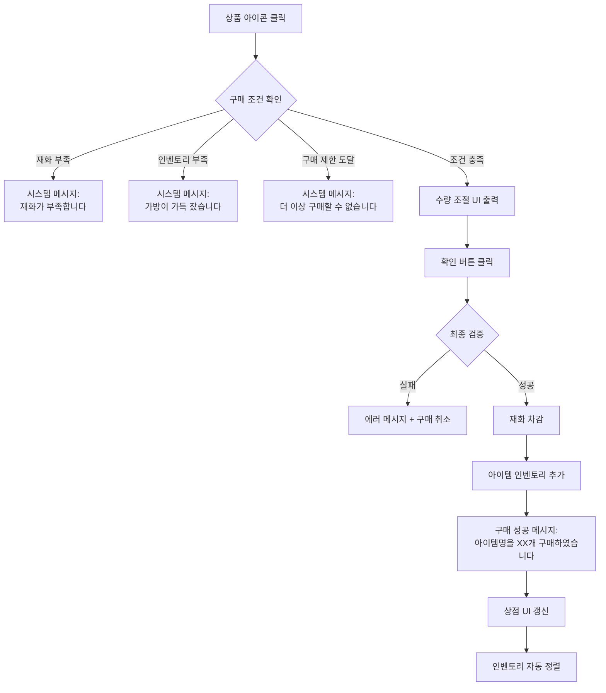
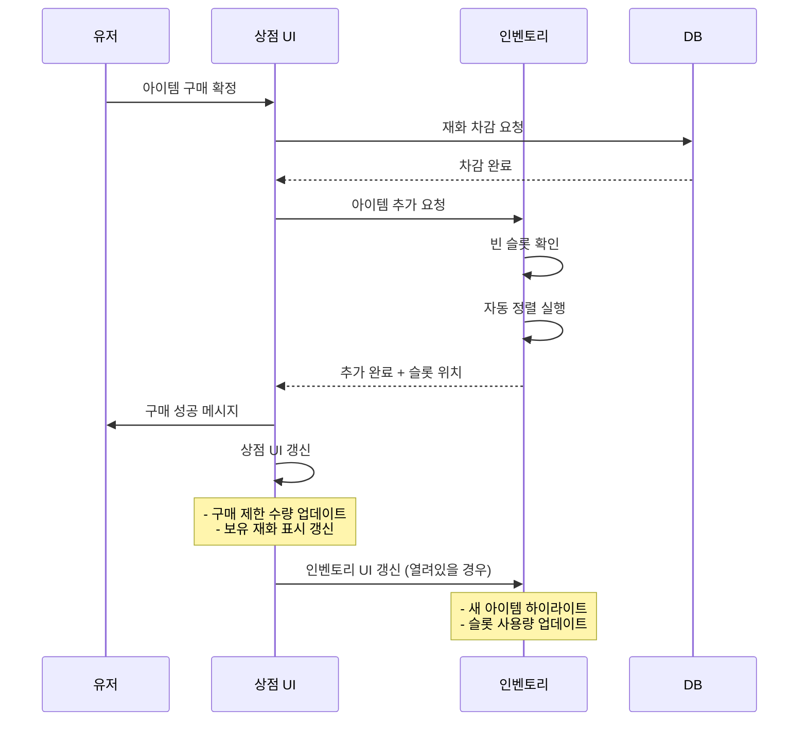
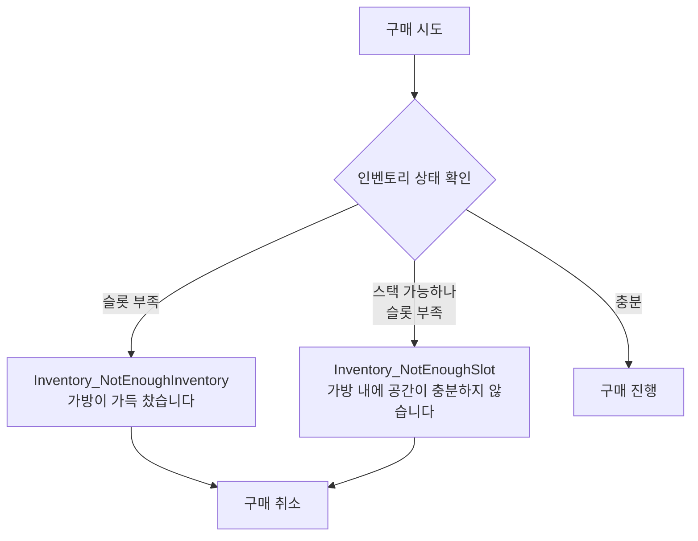

# 컨텐츠 재화 상인 상점 UI/UX 설계 가이드

> **출처**: PK_인벤토리 시스템 / 아이템창&슬롯, PK_NPC 시스템 / 상인 NPC, 길드 컨텐츠 시스템

---

## 1. 상점-인벤토리 통합 설계 개요

### 1.1 기본 구조
컨텐츠 재화 상인 4종은 **독립된 상점 UI**를 가지되, 구매 후 아이템은 **인벤토리 시스템의 자동 정렬 규칙**을 따릅니다.

| 상인 종류 | 거래 재화 | 주요 판매 품목 | 출처 문서 |
|---------|---------|--------------|----------|
| 길드 상인 | 길드 주화 (GuildCoin) | 강화주문서, 소환권, 스킬북, 성장/제작 재료 | 길드 컨텐츠 > 4.2 |
| 일일미션 상인 | 성장의 증표 | PVE 소모품, 강화주문서, 성장 재료 | 재화 시스템 > 2-2 |
| 무한의 탑 상인 | 정령의 증표 | 희귀 재료, 스킬북, 성장 재료 | 재화 시스템 > 2-2 |
| 레이드 상인 | 승리의 훈장 | 경험치 복구권, 고급 재료, 특수 장비 | 재화 시스템 > 2-2 |

---

## 2. 상점 UI 설계 포인트

### 2.1 공통 상점 UI 구조
**출처**: PK_NPC 시스템 / 상인 NPC > 5) 상점 UI 및 시스템

```
┌─────────────────────────────────────┐
│ ① 상점 구분명 (NPC 아이콘 + 이름)      │
├─────────────────────────────────────┤
│ ② 상품 진열부 (스크롤 가능)            │
│   - 아이템 아이콘 (등급별 테두리)      │
│   - 가격 정보 (재화 아이콘 + 수량)     │
│   - 구매 제한 정보 (있을 경우)         │
│   - 갱신 조건 표시 (시간/횟수)         │
├─────────────────────────────────────┤
│ ③ 인벤토리부 (구매 후 실시간 갱신)     │
│   - 현재 보유 슬롯: XX/100            │
│   - 최근 구매 아이템 하이라이트        │
├─────────────────────────────────────┤
│ ④ 하단 정보                           │
│   - 보유 재화: [아이콘] 9,999         │
│   - [판매] [닫기] 버튼                │
└─────────────────────────────────────┘
```

### 2.2 재화별 차별화 요소

#### A. 아이콘 시스템
**출처**: 재화 시스템 > 3. UI

각 재화는 **고유 아이콘**과 **색상 테마**를 가져야 합니다:

| 재화 | 아이콘 컨셉 | 색상 테마 | 비고 |
|-----|-----------|----------|------|
| 길드 주화 | 길드 문장 + 코인 | 금색/보라색 | Currency 테이블 IconResourceSmall 참조 |
| 성장의 증표 | 메달 형태 | 청록색 | 일일 미션 달성 상징 |
| 정령의 증표 | 크리스탈 | 하늘색 | 무한의 탑 테마 |
| 승리의 훈장 | 방패 + 검 | 붉은색/금색 | PVP 승리 상징 |

#### B. 상점 배경 테마
각 상인 NPC는 **컨텐츠 테마에 맞는 배경**을 사용:
- 길드 상인: 길드 홀 내부 분위기
- 일일미션 상인: 업적 게시판 느낌
- 무한의 탑 상인: 신비로운 탑 내부
- 레이드 상인: 전투 준비실 분위기

---

## 3. 구매 플로우 및 인벤토리 연동

### 3.1 구매 프로세스
**출처**: PK_NPC 시스템 / 상인 NPC > 상점 – 구매/판매 Flow



### 3.2 수량 조절 규칙
**출처**: PK_NPC 시스템 / 상인 NPC > 구매 수량 조절

| 아이템 타입 | 최대 구매 수량 계산 |
|-----------|------------------|
| CanStack=True | min(MaxStack - 현재보유량, 보유재화/가격, 구매제한) |
| CanStack=False | min(여유슬롯, 보유재화/가격, 구매제한) |
| Potion | min(포션한도 - 현재보유량, 보유재화/가격) |

**예시**:
```
[길드 상인 - 강화주문서 구매]
- 가격: 길드 주화 20개
- 보유 재화: 500개
- 구매 제한: 주간 10개
- 이미 구매: 3개
- MaxStack: 999

→ 최대 구매 가능: min(999-현재보유, 500/20, 10-3) = 7개
```

---

## 4. 인벤토리 자동 분류 로직

### 4.1 인벤토리 탭 구조
**출처**: PK_인벤토리 시스템 / 인벤토리 > ② 인벤토리_탭 메뉴

| 탭 | 필터 조건 | 정렬 우선순위 |
|----|---------|-------------|
| **전체 (All)** | 모든 아이템 | 장비 → 소모품 → 재료 → 퀘스트 → 기타 |
| **장비** | ItemTypeEnum = Equip | 착용중 → 무기 → 방어구 → 액세서리 → 등급 → 강화 |
| **소모품** | ItemTypeEnum = Consume | 물약 → 요리 → 주문서 → 상자 → 시간충전 |
| **재료** | ItemTypeEnum = Material | 등급 → 수량 → 획득순 |

### 4.2 구매 후 자동 정렬 규칙
**출처**: PK_인벤토리 시스템 / 인벤토리 > ④ 인벤토리_기능

#### 메인 정렬 규칙
```
ItemTypeEnum 우선순위:
Equip(1) > Consume(2) > Material(3) > Quest(4) > Dummy(5)
```

#### 세부 정렬 규칙 (장비)
```
1순위: 착용 중 > 미착용
2순위: 무기 > 방어구 > 액세서리
3순위: 등급 (신화 > 전설 > 영웅 > 희귀 > 고급 > 일반)
4순위: 강화 단계 (높은 것 우선)
5순위: 가나다순
6순위: 랜덤
```

#### 세부 정렬 규칙 (소모품)
```
1순위: ConsumeTypeEnum
  - Potion > Cook > Teleport > EnchantWeapon > 
    EnchantArmor > EnchantAccessory > ItemRandomBox > 
    ItemChoiceBox > RechargeTime
2순위: 등급 (높은 것 우선)
3순위: 스택 수량 (많은 것 우선)
4순위: 가나다순
5순위: 랜덤
```

### 4.3 구매 후 처리 시퀀스



---

## 5. 특수 케이스 처리

### 5.1 구매 제한 및 갱신
**출처**: PK_NPC 시스템 / 상인 NPC > 구매 조건의 갱신

| 갱신 유형 | 표시 방식 | 예시 |
|---------|---------|------|
| **ResetTimeFromInit** | "N시간 N분 후 갱신" | 1개 구매 후 24시간 |
| **RoutineTime** | "매주 월요일 05:00 갱신" | 주간 제한 |
| **ExactTime** | "2025년 12월 31일까지" | 이벤트 상품 |

**UI 표시 예시**:
```
┌─────────────────────────┐
│ [아이콘] 강화주문서       │
│ 가격: [길드주화] 20      │
│ 구매 제한: 3/10 (주간)   │
│ 갱신: 매주 월 05:00     │
└─────────────────────────┘
```

### 5.2 인벤토리 부족 시 처리
**출처**: PK_인벤토리 시스템 / 인벤토리 > 5. 시스템 메시지



**예시 시나리오**:
```
상황: 강화주문서 10개 구매 시도
- 현재 인벤토리: 98/100 (빈 슬롯 2개)
- 강화주문서 MaxStack: 999
- 현재 보유: 990개

문제: 990 + 10 = 1000 > 999
→ 새 슬롯 1개 필요하지만 빈 슬롯 2개 있음
→ 구매 가능

하지만:
- 현재 인벤토리: 100/100 (빈 슬롯 0개)
- 현재 보유: 990개
→ 새 슬롯 필요하나 공간 없음
→ "가방이 가득 찼습니다" 메시지
```

---

## 6. 실전 UI/UX 권장사항

### 6.1 시각적 피드백
**출처**: PK_인벤토리 시스템 / 아이템창&슬롯 > (2) 슬롯 정보_공통

1. **구매 성공 시**:
   - 상점 UI: 구매한 아이템 슬롯 짧은 점멸 효과
   - 인벤토리: 새 아이템 1초간 하이라이트 + 테두리 강조
   - 재화 표시: 차감된 수량만큼 빨간색으로 깜빡임

2. **구매 실패 시**:
   - 부족한 재화 아이콘 흔들림 효과
   - 에러 메시지 토스트 (1.5초 유지)

3. **구매 제한 도달 시**:
   - 해당 상품 슬롯 딤드 처리
   - 갱신 시간 노란색 폰트로 강조

### 6.2 편의 기능

#### A. 빠른 구매 모드
```
[설정] 메뉴에서 활성화 가능:
☑ 수량 1개 구매 시 확인창 생략
☑ 구매 후 상점 UI 자동 닫기
```

#### B. 위시리스트 기능
```
상점 아이템 롱터치 → "관심 등록"
→ 재화 충분 시 알림 표시
```

#### C. 일괄 구매
```
[Shift + 클릭] (PC) / [롱터치] (모바일)
→ 다중 선택 모드 진입
→ 선택 완료 후 일괄 구매
```

### 6.3 접근성 고려사항

1. **색맹 모드**:
   - 재화 아이콘에 고유 심볼 추가
   - 등급 테두리에 패턴 적용

2. **폰트 크기 조절**:
   - 상점 UI 내 가격/수량 정보 확대 옵션

3. **음성 안내**:
   - 구매 성공/실패 시 효과음 재생
   - 재화 부족 시 경고음

---

## 7. 테이블 연동 구조

### 7.1 관련 테이블
**출처**: PK_NPC 시스템 / 상인 NPC > 4) 상점 관련 테이블

```
NpcClass (상인 NPC 정의)
    ↓ FunctionId
SellItem (판매 아이템 목록)
    ↓ ItemId
ItemConsumeClass / ItemEquipClass / ItemEtcClass
    ↓ 
CurrencyClass (재화 정의)
```

### 7.2 구매 검증 쿼리 예시
```sql
-- 구매 가능 여부 확인
SELECT 
    si.ItemId,
    si.Price,
    si.CurrencyType,
    pc.Amount AS PlayerCurrency,
    sl.CurrentCount AS PurchaseCount,
    sl.MaxCount AS PurchaseLimit,
    CASE 
        WHEN pc.Amount >= si.Price 
         AND (sl.MaxCount IS NULL OR sl.CurrentCount < sl.MaxCount)
         AND inv.FreeSlots > 0
        THEN 1 ELSE 0 
    END AS CanPurchase
FROM SellItem si
JOIN PlayerCurrency pc ON si.CurrencyType = pc.Type
LEFT JOIN SellLimit sl ON si.Id = sl.SellItemId
JOIN PlayerInventory inv ON inv.PlayerId = @PlayerId
WHERE si.Id = @ItemId;
```

---

## 8. 체크리스트

### 개발 단계별 확인사항

#### Phase 1: 기본 상점 UI
- [ ] 4종 상인 NPC 고유 아이콘 제작
- [ ] 재화별 아이콘 및 색상 테마 적용
- [ ] 상품 진열부 스크롤 구현
- [ ] 가격 정보 표시 (재화 아이콘 + 수량)
- [ ] 보유 재화 실시간 표시

#### Phase 2: 구매 로직
- [ ] 재화 부족 검증
- [ ] 인벤토리 공간 검증
- [ ] 구매 제한 검증
- [ ] 수량 조절 UI 구현
- [ ] 구매 성공/실패 메시지

#### Phase 3: 인벤토리 연동
- [ ] 구매 후 자동 정렬 적용
- [ ] 새 아이템 하이라이트 효과
- [ ] 슬롯 사용량 실시간 갱신
- [ ] 탭별 필터링 동작 확인

#### Phase 4: 고급 기능
- [ ] 구매 제한 갱신 시스템
- [ ] 빠른 구매 모드
- [ ] 위시리스트 기능
- [ ] 일괄 구매 기능

#### Phase 5: 최적화
- [ ] 상점 UI 로딩 속도 개선
- [ ] 인벤토리 정렬 성능 테스트
- [ ] 메모리 누수 확인
- [ ] 네트워크 지연 처리

---

## 9. 참고 자료

### 관련 문서
1. **PK_인벤토리 시스템 / 아이템창&슬롯**
   - 슬롯 정보 출력 규칙
   - 자동 정렬 로직
   - 시스템 메시지

2. **PK_NPC 시스템 / 상인 NPC**
   - 상점 UI 구조
   - 구매/판매 플로우
   - 구매 제한 및 갱신

3. **길드 컨텐츠 시스템**
   - 길드 재화 정의
   - 길드 상점 아이템 리스트

4. **재화 시스템**
   - 재화 종류 및 흐름
   - UI 표시 규칙
   - 테이블 구조

### 구현 우선순위
```
1순위: 기본 상점 UI + 구매 로직 (Phase 1-2)
2순위: 인벤토리 자동 정렬 연동 (Phase 3)
3순위: 구매 제한 시스템 (Phase 4 일부)
4순위: 편의 기능 (Phase 4 나머지)
5순위: 최적화 (Phase 5)
```

---

**최종 업데이트**: 2025년 기준  
**문서 버전**: 1.0  
**작성 기준**: 제공된 기획 문서 통합 분석