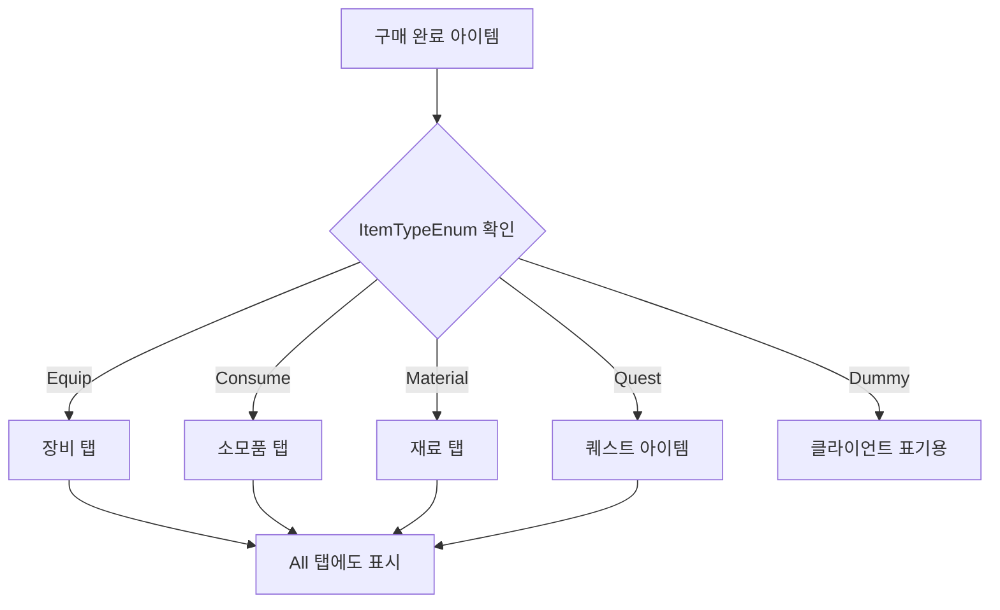
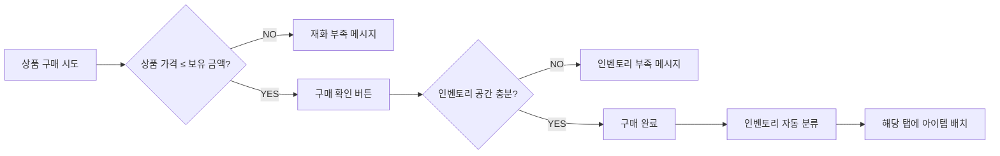

# 컨텐츠 재화 상인 상점 UI와 인벤토리 시스템 통합 설계

## 1. 시스템 개요

### 1.1 컨텐츠 재화 상인 4종 현황

| 상인 종류 | 거래 재화 | 재화명 | NpcSubCategory | 관련 콘텐츠 |
|-----------|-----------|--------|----------------|-------------|
| 컨텐츠 재화1 상인 | 성장의 증표 | Achievement | 일일 미션, 업적 |
| 컨텐츠 재화2 상인 | 정령의 증표 | InfinityTower | 무한의 탑 |
| 컨텐츠 재화3 상인 | 승리의 훈장 | Raid | 레이드, 공성전, 인터서버 던전 |
| 길드 상인 | 길드 주화 | Guild | 길드 활동 |

> **출처**: [PK_NPC 시스템 / Beta3 NPC 개선], [Confluence/Design/시스템 디자인/재화 / 재화 종류 및 흐름]

### 1.2 각 상인별 판매 품목 특성

| 상인 | 주요 판매 품목 | 아이템 타입 분포 |
|------|---------------|-----------------|
| 길드 상인 | 강화주문서, 소환권, 스킬북, 성장 재료, 제작 재료 | 소모품 + 재료 |
| 컨텐츠 재화1 상인 | 강화주문서, 소환권, 스킬북, 성장 재료, 제작 재료 | 소모품 + 재료 |
| 컨텐츠 재화2 상인 | 희귀 재료, 스킬북, 성장 재료, 제작 재료 | 소모품 + 재료 |
| 컨텐츠 재화3 상인 | 강화제, 보구류, 고급 재료, 특수 장비 | 장비 + 소모품 + 재료 |

> **출처**: [Confluence/Design/시스템 디자인/재화 / 재화 종류 및 흐름]

---

## 2. 상점 UI 설계 포인트

### 2.1 상점 기본 UI 구성

기획서에 정의된 상점 UI 구성 요소:

| 번호 | 항목 | 설명 |
|------|------|------|
| ① | 상점 구분명 | NpcClass의 Category_Desc 내부 Text 출력 |
| ② | 상품 진열부 | 해당 상인 NPC의 "모든" 판매 물품을 Order에 따라 표기 |
| ③ | 인벤토리부 | 구매 완료 시 갱신만 사용 |
| ④ | 판매 버튼 | 인벤토리 아이템 판매 기능 |

> **출처**: [PK_NPC 시스템 / 상인 NPC]

### 2.2 컨텐츠 재화별 상점 UI 차별화 요소

#### 2.2.1 재화 표시 영역 설계

```
┌─────────────────────────────────────────────────┐
│  [상점명: 길드 상점]                    [X 닫기] │
├─────────────────────────────────────────────────┤
│  보유 재화: 🪙 길드 주화 12,500                  │
├─────────────────────────────────────────────────┤
│  [상품 진열부]              │  [인벤토리부]      │
│                            │                    │
└─────────────────────────────────────────────────┘
```

**설계 포인트**:
- 각 상점 진입 시 해당 컨텐츠 재화만 상단에 표시
- 재화 아이콘은 `Currency 테이블의 IconResourceSmall` 참조
- 보유량 실시간 갱신 필요

> **출처**: [Confluence/Design/시스템 디자인/재화 / 재화 시스템] - "CurrencyClass 테이블"

#### 2.2.2 구매 조건 표시 규칙

기획서에 정의된 Default 규칙:

| 조건 | 표시 방식 |
|------|----------|
| 구매 제한 조건 존재 시 | 구매 조건 부분 Text는 **적색 폰트**로 출력 |
| 구매 요구 조건 미달성 시 | 구매 불가 및 요구 조건 **적색 폰트** 출력 |
| 구매 제한 도달 + 갱신 조건 존재 시 | 갱신 조건을 **노란색 폰트** 출력 |
| 구매 제한 도달 + 갱신 조건 미존재 시 | "구매 제한 도달" 출력 |

> **출처**: [PK_NPC 시스템 / 상인 NPC] - "Default 룰"

### 2.3 길드 상점 특수 조건

길드 상점은 추가적인 구매 제한 조건이 존재:

| 제한 조건 | 설명 |
|-----------|------|
| 길드 레벨 | 특정 길드 레벨 달성 시 상품 해금 |
| 길드 계급 | 길드장/관리자 등 직책별 구매 가능 상품 차등 |
| 기간 및 수량 제한 | 일일/주간/월간 구매 제한 |

> **출처**: [Confluence/Design/시스템 디자인/길드 / 길드 컨텐츠] - "4. 길드 상점"

**PlayerConditionEnum 활용**:

| Name | Value | Comment |
|------|-------|---------|
| GuildLevel | 8 | 가입한 길드 레벨 체크(GE) |
| GuildPosition | 9 | 길드 내에서 등급 체크(or) |

> **출처**: [PK_NPC 시스템 / Beta3 NPC 개선] - "PlayerConditionEnum"

---

## 3. 인벤토리 탭 구조와 연동

### 3.1 인벤토리 탭 메뉴 구조

기획서에 정의된 인벤토리 탭 구조:

| 탭 번호 | 탭 명칭 | 대상 데이터 | 설명 |
|---------|---------|-------------|------|
| 2-1 | X (닫기) | - | 인벤토리 UI 닫기 |
| 2-2 | All | 전체 | 인벤토리에 획득한 모든 아이템 출력 |
| 2-3 | 장비 | ItemEquipClass | 캐릭터가 장착 가능한 장비 아이템만 출력 |
| 2-4 | 소모품 | ItemConsumeClass | 캐릭터가 직접 사용하여 소모가 가능한 아이템만 출력 |
| 2-5 | 재료 | ItemEtcClass | 장착 및 직접 사용은 불가하며 제작 시스템에서 사용될 아이템만 출력 |
| 2-6 | 자동 사용 | CanAutoUse=TRUE | 소모품 아이템 중 자동 사용이 가능한 아이템만 출력 |

> **출처**: [PK_인벤토리 시스템 / 인벤토리] - "② 인벤토리_탭 메뉴"

### 3.2 아이템 타입별 분류 기준



> **출처**: [PK_인벤토리 시스템 / 인벤토리] - "④ 인벤토리_기능"

### 3.3 상점 구매 후 인벤토리 자동 분류 로직

#### 3.3.1 분류 우선순위 (정렬 규칙)

**메인 정렬 규칙**:
```
장비 → 소모품 → 재료 → 퀘스트 → 기타
(ItemTypeEnum = Equip > Consume > Material > Quest > Dummy)
```

**장비 세부 정렬 규칙**:
1. 착용 중 장비 > 미착용 장비
2. 무기 → 방어구 → 액세서리 순
3. 등급 높은 것 → 등급 낮은 것 (신화>전설>영웅>희귀>고급>일반)
4. 강화 단계 높은 것 → 강화 단계 낮은 것
5. 가나다순
6. 랜덤

**소모품 세부 정렬 규칙**:
```
물약 → 요리 → 순간이동 주문서 → 강화 재료(무기/방어구/액세서리) 
→ 상자(랜덤/선택) → 시간 충전 상품 순
```

> **출처**: [PK_인벤토리 시스템 / 인벤토리] - "[세부 정렬 규칙]"

#### 3.3.2 구매 완료 시 처리 플로우



> **출처**: [PK_NPC 시스템 / 상인 NPC] - "<구매/판매 Flow>"

#### 3.3.3 인벤토리 슬롯 배치 규칙

| 규칙 | 설명 |
|------|------|
| 획득 순서 저장 | 좌상 → 우하 순서로 저장 |
| 빈슬롯 불가 | 아이템과 아이템 사이에 빈슬롯은 존재할 수 없음 |
| 자동 정렬 | 중간 아이템 삭제/소모 시 자동으로 이후 아이템이 빈슬롯을 채움 |
| 인벤토리 풀 시 | 더 이상 아이템 획득 불가 |

> **출처**: [PK_인벤토리 시스템 / 인벤토리] - "③ 인벤토리_슬롯"

---

## 4. 상점-인벤토리 통합 시 UI/UX 설계 포인트

### 4.1 상점 UI 내 인벤토리부 연동

**기획서 정의**:
> "③ 인벤토리부 = 구매 완료 시 갱신만 사용"

**설계 포인트**:
1. 상점 UI 우측에 인벤토리 슬롯 표시
2. 구매 완료 시 실시간으로 인벤토리부 갱신
3. 인벤토리 아이템 클릭 시 판매 버튼 활성화

### 4.2 구매 수량 조절 UI

**아이템 타입별 최대 구매량 규칙**:

| 아이템 타입 | CanStack | 최대 구매 수량 |
|-------------|----------|----------------|
| Potion | - | 포션 최대 보유량 - 현 보유량 중 보유 금액 허용한도 |
| CanStack = False | False | 현재 인벤토리 여유 슬롯 중 보유 금액 허용한도 |
| CanStack = True | True | MaxStack - 현재 보유량의 나머지 = 최대 수량 중 보유 금액 허용한도 |
| SellLimit 존재 시 | True | SellLimit의 최대수 - 현 구매량 (양 모두 금액 허용한도) |

> **출처**: [PK_NPC 시스템 / 상인 NPC] - "아이템 타입별 구매 수량 조절 규칙"

### 4.3 재화 부족 시 처리

**시스템 메시지**:

| 상황 | 메시지 |
|------|--------|
| 재화 부족 | "보유 재화가 부족합니다." |
| 인벤토리 부족 | "인벤토리의 공간이 부족합니다." |
| 구매 제한 도달 | "해당 아이템을 더 구매할 수 없습니다." |

> **출처**: [PK_NPC 시스템 / 상인 NPC] - "<구매 시의 예외 조건>"

### 4.4 상점 인터랙션 중 갱신 규칙

**중요 설계 포인트**:
> "상점 인터랙션 중 '보유아이템 판매'로 보유금이 갱신되어 구매 불가 → 구매 가능으로 변경될 수 있으므로, 유저의 아이템 판매 후, 상점 판매 물품을 갱신하도록 개선"

> **출처**: [PK_NPC 시스템 / 상인 NPC] - "다음에 대한 해결을 위해 갱신 주기를 추가"

---

## 5. 컨텐츠 재화 상인별 특수 고려사항

### 5.1 길드 상점 특수 UI

| 요소 | 설명 |
|------|------|
| 길드 레벨 표시 | 상품별 필요 길드 레벨 표시 |
| 직책 제한 표시 | 길드장/관리자 전용 상품 구분 |
| 갱신 시간 표시 | 일일/주간 갱신 상품의 남은 시간 표시 |

**길드 상점 아이템 예시**:

| 아이템 | 길드 레벨 | 갱신 시간 | 제한 수량 | 필요 길드 코인 |
|--------|----------|----------|----------|---------------|
| 장비 강화석 | 1 | 매일 오전 5시 | 10 | 20 |
| 패시브 스킬북(일반) | 3 | - | 1 | 15000 |
| 소환 포탈 | 2 | 매주 오전 5시 | 1 | 1000 |

> **출처**: [Confluence/Design/시스템 디자인/길드 / 길드 컨텐츠] - "4.2 길드 상점 아이템 리스트"

### 5.2 구매 제한 갱신 조건 유형

| 갱신 유형 | 설명 |
|-----------|------|
| None | 이벤트로 1회성 판매되는 물품 |
| ResetTimeFromInit | 구매 제한 물품을 "1개"라도 구매했을 때부터 일정 시간 후 갱신 |
| ResetTimeFromFull | 구매 제한 물품을 "구매한도까지" 구매했을 때부터 일정 시간 후 갱신 |
| RoutineTime | 특정 요일, 시각에 갱신 |
| ExactTime | 정확히 지정된 시각에 갱신 |

> **출처**: [PK_NPC 시스템 / 상인 NPC] - "<구매 조건의 갱신>"

### 5.3 갱신 주기별 표기 TextKey

| 갱신 유형 | TextKey |
|-----------|---------|
| 시간 단위 (1시간 이상) | Merchant_ResetTime_Hour |
| 분 단위 (1분~59분) | Merchant_ResetTime_Min |
| 초 단위 (1분 미만) | Merchant_ResetTime_Sec |
| 요일별 | Merchant_RoutineTime_Sun~Sat |
| 동일년도 특정 시각 | Merchant_ExactTime_SameYear |
| 다년도 특정 시각 | Merchant_ExactTime_OtherYear |

> **출처**: [PK_NPC 시스템 / 상인 NPC]

---

## 6. 아이템 자동 정렬 시스템 연동

### 6.1 정렬 우선순위 (기본)

| 우선순위 | 항목 | 정렬 기준 |
|----------|------|----------|
| 1 | 장착한 장비 | 타입별 우선순위를 따름 |
| 2 | 타입 | ItemTypeEnum 인덱스 순서 |
| 3 | 등급 | GradeEnum 숫자가 높을수록 우선 |
| 4 | 티어 | 숫자가 높을수록 우선 |
| 5 | 인덱스 | 낮을수록 우선 |
| 6 | 획득 시각 | 오래될수록 우선 |

> **출처**: [Confluence/Design/시스템 디자인/아이템/인벤토리 / 아이템 자동 정렬]

### 6.2 정렬 갱신 시점

- 정렬 버튼을 눌렀을 때
- 아이템을 장착했을 때
- 인벤토리를 닫을 때
- **신규 아이템 획득 시**: 해당 아이템은 최하순위로 순차적으로 정렬

> **출처**: [Confluence/Design/시스템 디자인/아이템/인벤토리 / 아이템 자동 정렬] - "2.3 정렬 갱신 시점"

### 6.3 정렬 방식 선택

| 정렬 방식 | 우선순위 |
|-----------|----------|
| 타입 | 장착한 장비 → 타입 → 등급 → 티어 → 인덱스 → 획득 시각 |
| 등급 | 장착한 장비 → 등급 → 티어 → 타입 → 인덱스 → 획득 시각 |
| 획득 | 장착한 장비 → 획득 시각 → 타입 → 등급 → 티어 → 인덱스 |

> **출처**: [Confluence/Design/시스템 디자인/아이템/인벤토리 / 아이템 자동 정렬] - "2.3 정렬 방식"

---

## 7. 시스템 메시지 정리

### 7.1 인벤토리 관련

| Keyword | 메시지 (koKR) | 상황 |
|---------|--------------|------|
| Inventory_NotEnoughInventory | 가방이 가득 찼습니다. | 아이템 획득 실패 |
| Inventory_MaxExtendInventory | 확장 최대 단계에 도달하여 더 이상 확장할 수 없습니다. | 가방 슬롯 확장 실패 |
| Inventory_NotEnoughCurrency | 재화가 부족합니다. | 가방 슬롯 확장 실패 |
| Inventory_NotEnoughSlot | 가방 내에 공간이 충분하지 않습니다. | 아이템 획득 실패 |
| Inventory_ExtendInventory | 가방이 {0}칸 확장되었습니다. | 가방 슬롯 성공 |

> **출처**: [PK_인벤토리 시스템 / 인벤토리] - "5. 시스템 메시지"

### 7.2 정렬 관련

| Keyword | 메시지 (koKR) |
|---------|--------------|
| ItemSort_CoolTime | 정렬 재사용 대기 시간이 남아 있습니다. |

> **출처**: [Confluence/Design/시스템 디자인/아이템/인벤토리 / 아이템 자동 정렬]

---

## 8. 요약: 핵심 설계 포인트

### 8.1 상점 UI 설계

1. **재화 표시**: 각 상점별 해당 컨텐츠 재화만 상단에 표시
2. **구매 조건 표시**: 적색(미달성)/노란색(갱신 조건) 폰트 규칙 준수
3. **길드 상점 특수 조건**: 길드 레벨, 직책 제한 UI 추가
4. **갱신 시간 표시**: 일일/주간 갱신 상품의 남은 시간 표시

### 8.2 인벤토리 연동 설계

1. **실시간 갱신**: 구매 완료 시 인벤토리부 즉시 갱신
2. **자동 분류**: ItemTypeEnum 기준으로 해당 탭에 자동 배치
3. **정렬 규칙**: 메인 정렬(타입) + 세부 정렬(등급/강화/가나다) 적용
4. **슬롯 관리**: 빈슬롯 자동 채움, 인벤토리 풀 시 구매 불가

### 8.3 예외 처리

1. **재화 부족**: 시스템 메시지 출력
2. **인벤토리 부족**: 시스템 메시지 출력 + 구매 미처리
3. **구매 제한 도달**: 갱신 조건 표시 또는 "구매 제한 도달" 출력
4. **판매 후 갱신**: 아이템 판매 후 상점 물품 목록 갱신